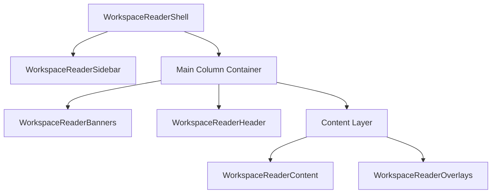
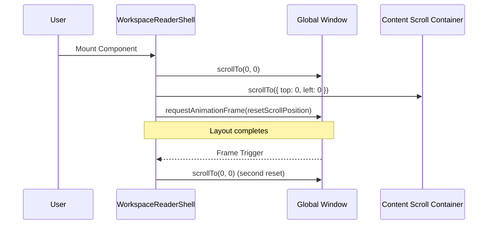
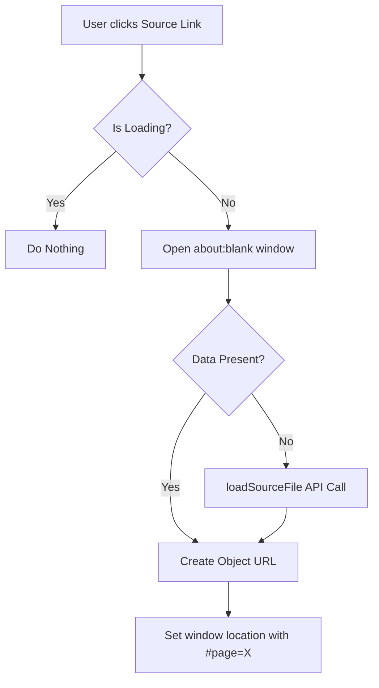

Relevant source files

The following files were used as context for generating this wiki page:

- [apps/web/components/workspace/WorkspaceReaderShell.tsx](apps/web/components/workspace/WorkspaceReaderShell.tsx)
- [apps/web/components/workspace/shell/WorkspaceReaderContent.tsx](apps/web/components/workspace/shell/WorkspaceReaderContent.tsx)
- [apps/web/components/workspace/shell/types.ts](apps/web/components/workspace/shell/types.ts)
- [apps/web/components/workspace/ReadingScreenContainer.tsx](apps/web/components/workspace/ReadingScreenContainer.tsx)
- [apps/web/components/workspace/shell/LessonDocumentSources.tsx](apps/web/components/workspace/shell/LessonDocumentSources.tsx)
- [apps/web/tests/components/workspace/WorkspaceReaderShell.test.tsx](apps/web/tests/components/workspace/WorkspaceReaderShell.test.tsx)

# Workspace Reader Shell Interface

The Workspace Reader Shell Interface serves as the primary structural orchestrator for the Nous Reader learning environment. It manages the high-level layout, viewport constraints, and coordination between major UI modules including the sidebar, header, content area, and interactive overlays. The interface is designed to support both a full-screen application mode and an "embedded" mode for integration within other containers.

Within the project's architecture, the shell acts as a layout boundary that enforces specific scrolling behaviors and visual consistency across different device types. It ensures that the learning experience remains focused by managing document-level overflow and coordinating the transition between global document scrolling and internal container scrolling.

Sources: `[apps/web/components/workspace/WorkspaceReaderShell.tsx:11-17](apps/web/components/workspace/WorkspaceReaderShell.tsx#L11-L17)`, `[apps/web/components/workspace/ReadingScreenContainer.tsx:90-101](apps/web/components/workspace/ReadingScreenContainer.tsx#L90-L101)`

## Core Architecture

The shell is implemented as a memoized functional component that accepts a highly structured set of models for its sub-components. This decoupling allows the `ReadingScreenContainer` to manage complex logic (like study time tracking and file actions) while the shell focuses on presentation and layout integrity.

### Component Structure and Hierarchy

The following diagram illustrates the component composition within the shell:

The shell utilizes a "Main Column" layout where the `WorkspaceReaderSidebar` is positioned alongside a flexible column containing the header and content. The sidebar's spacing is controlled by the `shouldUseDesktopSidebar` flag, which applies a left margin equal to `READER_SIDEBAR_WIDTH_PX`.

Sources: `[apps/web/components/workspace/WorkspaceReaderShell.tsx:75-104](apps/web/components/workspace/WorkspaceReaderShell.tsx#L75-L104)`, `[apps/web/components/workspace/shell/types.ts:259-267](apps/web/components/workspace/shell/types.ts#L259-L267)`

## Display Modes and Viewport Management

The shell supports two primary display modes, determined by the `displayMode` prop:

| Mode | Behavior | Use Case |
| :--- | :--- | :--- |
| `application` | Locks document overflow (`hidden`), sets `overscroll-behavior: none`, and enforces `100dvh` height. | Standard full-screen reader experience. |
| `embedded` | Allows document overflow (`visible`), uses `scrollMode: document`, and a minimum height of `34rem`. | Inline display within other pages or portals. |

### Viewport Height and Keyboard Handling
The shell integrates with `useMobileKeyboardOffset` to dynamically calculate `viewportHeight`. This prevents UI breakage on mobile devices when the virtual keyboard is active, ensuring the reader fits exactly within the visible area.

Sources: `[apps/web/components/workspace/WorkspaceReaderShell.tsx:21-72](apps/web/components/workspace/WorkspaceReaderShell.tsx#L21-L72)`, `[apps/web/tests/components/workspace/WorkspaceReaderShell.test.tsx:220-229](apps/web/tests/components/workspace/WorkspaceReaderShell.test.tsx#L220-L229)`

### Scroll Synchronization Logic
When mounting in application mode, the shell performs a double-reset of scroll positions (immediate and via `requestAnimationFrame`) to prevent legacy viewport positions from leaking into the lesson view.

Sources: `[apps/web/components/workspace/WorkspaceReaderShell.tsx:43-61](apps/web/components/workspace/WorkspaceReaderShell.tsx#L43-L61)`

## Content and Resource Orchestration

The `WorkspaceReaderContent` component acts as the primary viewing engine for lessons and exercises. It handles complex rendering tasks including Markdown processing, interactive quiz injection, and source attribution.

### Feature Summary
- **Markdown Rendering:** Processes lesson content with integrated support for KaTeX formulas and LaTeX.
- **Active Pauses:** Injects `WorkspaceReaderInlineQuestion` blocks directly into the content flow.
- **Source Attribution:** Utilizes `LessonDocumentSources` to list original materials (PDFs/Archives) used in the lesson.
- **Artifact Rendering:** Displays generated visuals and user notes in a dedicated "Artefatti" section.

Sources: `[apps/web/components/workspace/shell/WorkspaceReaderContent.tsx:704-850](apps/web/components/workspace/shell/WorkspaceReaderContent.tsx#L704-L850)`, `[apps/web/components/workspace/shell/LessonDocumentSources.tsx:112-140](apps/web/components/workspace/shell/LessonDocumentSources.tsx#L112-L140)`

### Document Source Management
The shell provides specific logic for opening original source files. It handles both local `FileData` and detached files requiring asynchronous loading.

Sources: `[apps/web/components/workspace/shell/LessonDocumentSources.tsx:42-75](apps/web/components/workspace/shell/LessonDocumentSources.tsx#L42-L75)`

## Data Structures and Models

The shell interface relies on a set of TypeScript interfaces defined in `types.ts` to ensure strict typing across the layout components.

### WorkspaceReaderShellProps
Defines the aggregate configuration for the entire interface.

| Property | Type | Description |
| :--- | :--- | :--- |
| `banners` | `WorkspaceReaderBannersModel` | Controls warnings (e.g., PDF mapping) and storage errors. |
| `content` | `WorkspaceReaderContentModel` | Manages lesson blocks, quiz state, and assets. |
| `header` | `WorkspaceReaderHeaderModel` | Contains navigation, dark mode, and TTS controls. |
| `sidebar` | `WorkspaceReaderSidebarModel` | Manages modules, exercises, and mobile sidebar state. |
| `displayMode` | `'application' \| 'embedded'` | Structural display strategy. |

Sources: `[apps/web/components/workspace/shell/types.ts:259-267](apps/web/components/workspace/shell/types.ts#L259-L267)`

### WorkspaceReaderTtsModel
Manages Text-to-Speech integration within the shell.
- **Fields:** `availableVoices`, `isPlaying`, `currentChunkIndex`, `playbackRate`.
- **Actions:** `onPlayPause`, `onSeek`, `onVoiceChange`.

Sources: `[apps/web/components/workspace/shell/types.ts:145-163](apps/web/components/workspace/shell/types.ts#L145-L163)`

## Technical Summary

The Workspace Reader Shell Interface provides a robust, mobile-responsive frame that isolates the complexities of lesson navigation, AI-generated content rendering, and source file management. By enforcing strict viewport height controls and providing dedicated layers for overlays and banners, it creates a stable environment for pedagogical activities. Its separation of concerns between the logic-heavy `ReadingScreenContainer` and the presentation-focused `WorkspaceReaderShell` facilitates maintainability and supports the project's multi-modal display requirements.

Sources: `[apps/web/components/workspace/ReadingScreenContainer.tsx:40-80](apps/web/components/workspace/ReadingScreenContainer.tsx#L40-L80)`, `[apps/web/components/workspace/WorkspaceReaderShell.tsx:75-110](apps/web/components/workspace/WorkspaceReaderShell.tsx#L75-L110)`
