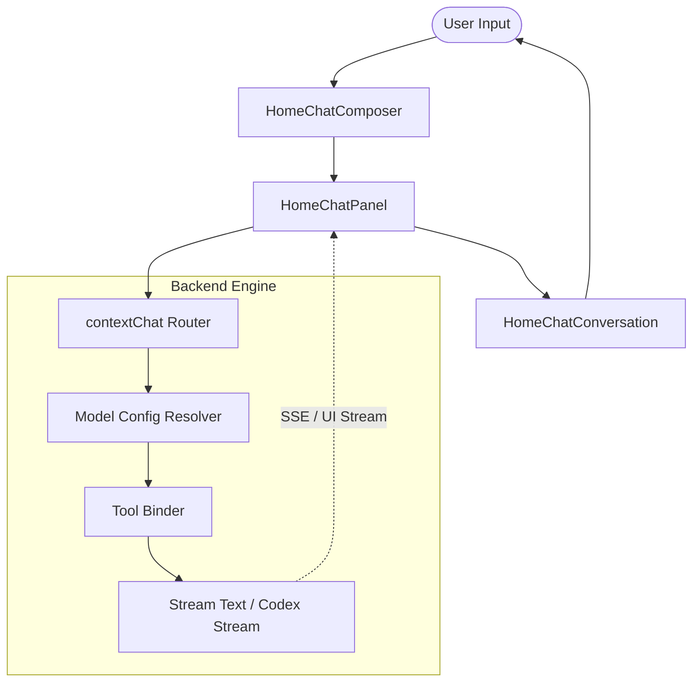
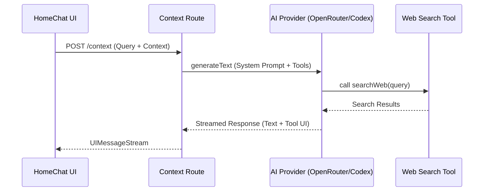

Relevant source files

The following files were used as context for generating this wiki page:

- [apps/web/components/library/HomeChatConversation.tsx](apps/web/components/library/HomeChatConversation.tsx)
- [apps/web/components/library/HomeChatComposer.tsx](apps/web/components/library/HomeChatComposer.tsx)
- [apps/web/components/library/HomeChatPanel.tsx](apps/web/components/library/HomeChatPanel.tsx)
- [apps/backend/src/routes/contextChat.ts](apps/backend/src/routes/contextChat.ts)
- [apps/backend/src/services/codexChatStream.ts](apps/backend/src/services/codexChatStream.ts)
- [apps/backend/src/routes/openRouterProxy.ts](apps/backend/src/routes/openRouterProxy.ts)

# Chat UI & AI Context Assistant

The Chat UI & AI Context Assistant is a specialized subsystem within Lumina-Reader designed to provide context-aware pedagogical support. It serves two primary modes: "New Course" for onboarding and initial assessment, and "Library Query" for interrogating existing course materials, notes, and highlights. The system integrates real-time AI streaming with a tool-based architecture to perform web searches, generate visual artifacts, and manage study notes.

This module bridges the gap between static reading materials and active learning by allowing users to ask questions about specific selections, annotations, or entire lessons. It leverages a backend proxy system to handle multi-provider AI requests, ensuring that the assistant remains grounded in the user's specific learning context while providing external verification via web tools.

Sources: [apps/web/components/library/HomeChatPanel.tsx:55-70](apps/web/components/library/HomeChatPanel.tsx#L55-L70), [apps/backend/src/routes/contextChat.ts:15-30](apps/backend/src/routes/contextChat.ts#L15-L30)

## Architecture and Data Flow

The system follows a client-server architecture where the frontend manages the UI state (mode switching, draft handling, and streaming display) while the backend orchestrates the AI logic, tool execution, and provider proxying.

### Interaction Flow
When a user submits a query, the `HomeChatComposer` sends the message along with current context (selected text, lesson content, or library scope) to the `/context` backend endpoint. The backend resolves the appropriate AI model, attaches pedagogical tools, and streams the response back to the UI.

Sources: [apps/web/components/library/HomeChatComposer.tsx:364-375](apps/web/components/library/HomeChatComposer.tsx#L364-L375), [apps/backend/src/routes/contextChat.ts:241-260](apps/backend/src/routes/contextChat.ts#L241-L260)

### Component Hierarchy
The UI is structured to handle both empty states and active conversations dynamically:
*  **HomeChatPanel**: The primary container managing mode state (`new-course` vs `library-query`) and layout for mobile/desktop viewports.
*  **HomeChatHeader**: Displays context-specific descriptions and the mode selector.
*  **HomeChatConversation**: Responsible for rendering the message history, including specialized blocks like "Thinking" states, tool results, and artifacts.
*  **HomeChatComposer**: A complex input field supporting text, attachments, speech-to-text, and tool preference toggles.

Sources: [apps/web/components/library/HomeChatPanel.tsx:162-200](apps/web/components/library/HomeChatPanel.tsx#L162-L200), [apps/web/components/library/HomeChatComposer.tsx:40-66](apps/web/components/library/HomeChatComposer.tsx#L40-L66)

## Backend Context Handling

The backend route `/context` is the core of the AI Context Assistant. It processes requests based on a `contextScope` that determines the AI's focus.

### Context Scopes
| Scope | Description | Requirement |
| :--- | :--- | :--- |
| `selection` | Focused on a specific text passage highlighted by the user. | `selectedText` must be present. |
| `annotation` | Focused on an existing note or highlight. | `attachedAnnotationText` should be present. |
| `lesson` | Focused on the entire current lesson content. | `lessonContent` must be present. |

Sources: [apps/backend/src/routes/contextChat.ts:40-41](apps/backend/src/routes/contextChat.ts#L40-L41), [apps/backend/src/routes/contextChat.ts:265-285](apps/backend/src/routes/contextChat.ts#L265-L285)

### Tool Orchestration
The assistant is not limited to text generation; it uses a set of functional tools to interact with the system and external data:
*  **Web Search**: Performs a cross-check for accuracy or updated information related to the pedagogy.
*  **Artifact Generation**: Creates visual aids like Mermaid diagrams, SVG structures, or interactive HTML widgets.
*  **Note Management**: Proposes saving or updating study notes based on the conversation.

Sources: [apps/backend/src/routes/contextChat.ts:133-180](apps/backend/src/routes/contextChat.ts#L133-L180), [apps/backend/src/services/codexChatStream.ts:88-120](apps/backend/src/services/codexChatStream.ts#L88-L120)

## AI Provider Proxying

Lumina-Reader uses an internal proxy to abstract interactions with different AI providers (OpenRouter, OpenAI, and a custom Codex service). This allows for centralized management of reasoning effort, service tiers, and tool-calling protocols.

### Model Slot Resolution
The system assigns specific model configurations to "slots" to optimize for cost and performance:
*  **Context Slot**: Used for immediate follow-up chat.
*  **Research Slot**: Used for deep-dives and web-searching.
*  **Artifact Slot**: Used for generating visual representations.

Sources: [apps/backend/src/routes/openRouterProxy.ts:58-75](apps/backend/src/routes/openRouterProxy.ts#L58-L75), [apps/backend/src/routes/contextChat.ts:296-305](apps/backend/src/routes/contextChat.ts#L296-L305)

### Codex Integration
For high-security or specific pedagogical tasks, the `codexChatStream` service provides a specialized streaming adapter. It handles "developer instructions" and ensures that client-side tool calls (like saving a note) are correctly signaled to the UI without premature narration.
Sources: [apps/backend/src/services/codexChatStream.ts:15-30](apps/backend/src/services/codexChatStream.ts#L15-L30), [apps/backend/src/services/codexChatStream.ts:95-105](apps/backend/src/services/codexChatStream.ts#L95-L105)

## UI Components and Interaction Patterns

### HomeChatComposer
The composer manages multi-modal input and floating menus for tool preferences.
*  **Speech Input**: Integrated via `SpeechInputButton` for hands-free queries.
*  **Floating Menus**: Dynamically positioned (`above` or `below`) based on viewport space to avoid clipping.
*  **Draft Persistence**: Maintains separate drafts for `new-course` and `library-query` modes.

Sources: [apps/web/components/library/HomeChatComposer.tsx:285-300](apps/web/components/library/HomeChatComposer.tsx#L285-L300), [apps/web/components/library/HomeChatComposer.tsx:420-435](apps/web/components/library/HomeChatComposer.tsx#L420-L435)

### HomeChatConversation
This component handles the rendering logic for the assistant's multi-part responses.
*  **Thinking Stream**: Visualizes the AI's internal reasoning process before the final answer.
*  **Tool Results**: Renders specialized UI for search results and artifact previews.
*  **Avatar Logic**: Changes owl logos based on dark/light mode themes.

Sources: [apps/web/components/library/HomeChatConversation.tsx](apps/web/components/library/HomeChatConversation.tsx), [apps/web/components/library/HomeChatPanel.tsx:210-230](apps/web/components/library/HomeChatPanel.tsx#L210-L230)

## Summary
The Chat UI & AI Context Assistant represents the interactive core of the Nous Reader experience. By combining strict context-awareness (via scopes like `selection` and `lesson`) with dynamic tool execution (web search, artifact generation), it provides a responsive learning environment that transcends simple document reading. The modular architecture, supported by the backend OpenRouter proxy and Codex streaming service, allows the platform to utilize diverse AI capabilities while maintaining a consistent pedagogical tone.
