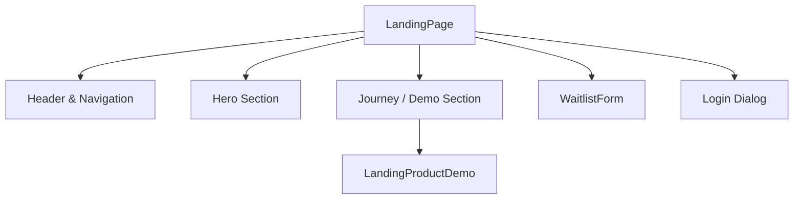
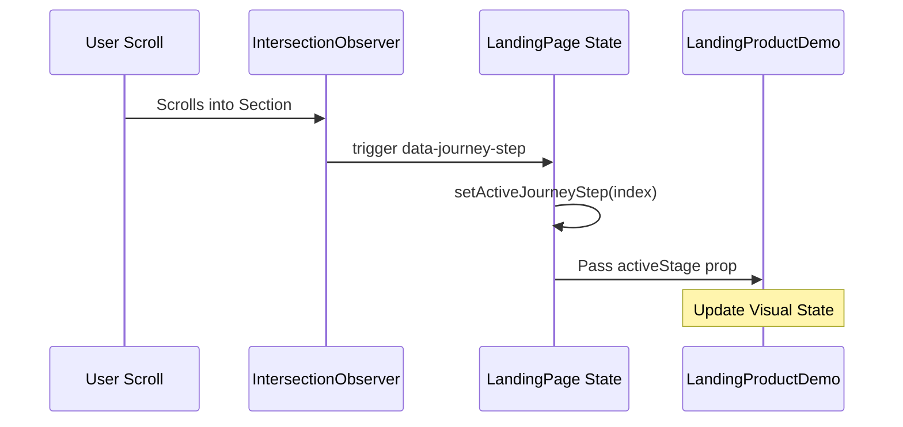
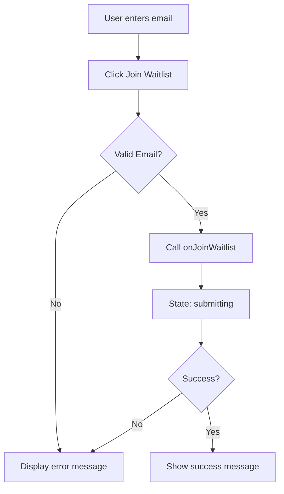
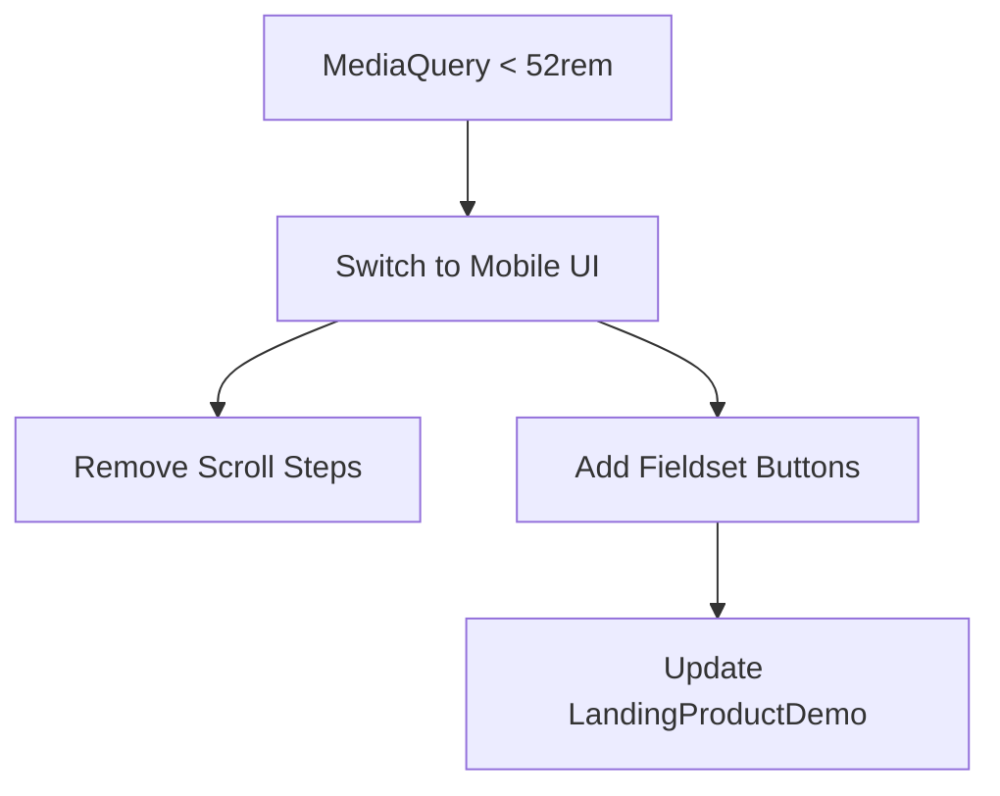

Relevant source files

The following files were used as context for generating this wiki page:

- [apps/web/components/marketing/LandingPage.tsx](../../../apps/web/components/marketing/LandingPage.tsx)
- [apps/web/components/marketing/LandingProductDemo.tsx](../../../apps/web/components/marketing/LandingProductDemo.tsx)
- [apps/web/components/marketing/LandingProductComposition.tsx](../../../apps/web/components/marketing/LandingProductComposition.tsx)
- [apps/web/components/marketing/LandingDemoCursor.tsx](../../../apps/web/components/marketing/LandingDemoCursor.tsx)
- [apps/web/components/marketing/WaitlistForm.tsx](../../../apps/web/components/marketing/WaitlistForm.tsx)
- [apps/web/components/marketing/marketing.css](../../../apps/web/components/marketing/marketing.css)
- [AGENTS.md](../../../AGENTS.md)

# Marketing Landing & Waitlist Views

The Marketing Landing & Waitlist Views module represents the public-facing entry point for the Nous application. It is designed to provide a comprehensive overview of the platform's ADHD-friendly learning environment, allowing users to understand the "Deep Research" capabilities, view interactive product demos, and join the waitlist for beta access. Sources: [LandingPage.tsx](../../../apps/web/components/marketing/LandingPage.tsx), [AGENTS.md](../../../AGENTS.md)

This module encapsulates the branding, value proposition, and user acquisition flow, transitioning users from marketing discovery to a gated waitlist or a login interface for existing testers. It utilizes high-fidelity CSS for typography and layout, alongside React components that manage complex scroll-based interactions for product demonstrations. Sources: [marketing.css](../../../apps/web/components/marketing/marketing.css), [LandingPage.tsx:142-156](../../../apps/web/components/marketing/LandingPage.tsx#L142-L156)

## Architecture and Component Structure

The marketing interface is built as a single-page layout within `LandingPage.tsx`, divided into several semantic sections: Header, Hero, Journey (Demo), and Footer. It employs a responsive design that adapts between desktop and mobile viewports, specifically targeting a mobile breakpoint of `52rem`. Sources: [LandingPage.tsx:28](../../../apps/web/components/marketing/LandingPage.tsx#L28), [marketing.css:662](../../../apps/web/components/marketing/marketing.css#L662)

### Component Hierarchy

The following diagram illustrates the relationship between the main landing page and its specialized sub-components.

Sources: [LandingPage.tsx:75-199](../../../apps/web/components/marketing/LandingPage.tsx#L75-L199)

### Remotion composition boundary

The exported Remotion composition keeps its frame-driven scene state, DOM target measurements, and artifact portal in the same rendering tree. Unlike the interactive home chat, it does not own a user conversation, request lifecycle, or mutable attachment state. Splitting those timeline-coupled values into the home-chat state modules would create an artificial shared contract and make deterministic video rendering depend on interactive UI behavior. The composition may still extract stable visual helpers such as the cursor, but its frame coordination remains local to the Remotion tree.

Sources: [LandingProductComposition.tsx](../../../apps/web/components/marketing/LandingProductComposition.tsx), [LandingDemoCursor.tsx:270-344](../../../apps/web/components/marketing/LandingDemoCursor.tsx#L270-L344)

### Component Descriptions

| Component | Responsibility | Key Properties |
| :--- | :--- | :--- |
| `LandingPage` | Root container managing global marketing state (login visibility, menu state, and active journey step). | `loginPanel`, `onJoinWaitlist` |
| `LandingProductDemo` | Orchestrates visual states (plan, generation, lesson, library) representing the product lifecycle. | `activeStage` |
| `WaitlistForm` | Handles user email submission and validation for access requests. | `onJoinWaitlist` |
| `Login Dialog` | A `dialog` element based overlay for existing users to access the platform. | `loginInitiallyOpen` |

Sources: [LandingPage.tsx:18-26](../../../apps/web/components/marketing/LandingPage.tsx#L18-L26), [LandingProductDemo.tsx](../../../apps/web/components/marketing/LandingProductDemo.tsx)

## The Journey Interaction Model

The "Journey" section serves as a multi-stage product walkthrough. On desktop, it utilizes an `IntersectionObserver` to detect which textual step is currently in the viewport, automatically syncing the `LandingProductDemo` visual to the corresponding stage. Sources: [LandingPage.tsx:55-79](../../../apps/web/components/marketing/LandingPage.tsx#L55-L79)

Sources: [LandingPage.tsx:55-83](../../../apps/web/components/marketing/LandingPage.tsx#L55-L83)

### Journey Stages
The demo cycles through four distinct stages defined in the `JOURNEY_STAGES` constant:
1. **plan**: Conceptualizes the learning path from sources.
2. **generation**: Shows the AI-driven course creation process.
3. **lesson**: Displays the final interactive learning content.
4. **library**: Represents the collection of research and materials.

Sources: [LandingPage.tsx:27](../../../apps/web/components/marketing/LandingPage.tsx#L27), [LandingProductDemo.tsx](../../../apps/web/components/marketing/LandingProductDemo.tsx)

## Waitlist Acquisition Flow

The waitlist is the primary conversion point for anonymous users. The `WaitlistForm` provides a specialized input field that interfaces with the backend to record interest. Sources: [WaitlistForm.tsx](../../../apps/web/components/marketing/WaitlistForm.tsx), [LandingPage.tsx:143-145](../../../apps/web/components/marketing/LandingPage.tsx#L143-L145)

### Data Handling and State
The form manages several local states to provide immediate feedback:
- **Email Input**: Captures the raw string.
- **Status**: Tracks `idle`, `submitting`, `success`, and `error`.
- **Error Message**: Displays validation or server-side failure reasons.

Sources: [WaitlistForm.tsx:10-15](../../../apps/web/components/marketing/WaitlistForm.tsx#L10-L15)

Sources: [WaitlistForm.tsx:21-45](../../../apps/web/components/marketing/WaitlistForm.tsx#L21-L45)

## Design Tokens & Styling

The marketing views use a dedicated CSS variable system defined in `marketing.css` to ensure visual consistency and ADHD-friendly readability (prioritizing high-quality typography and balanced spacing). Sources: [AGENTS.md:143-149](../../../AGENTS.md#L143-L149), [marketing.css:21-34](../../../apps/web/components/marketing/marketing.css#L21-L34)

| Variable | Value/Purpose | Source |
| :--- | :--- | :--- |
| `--marketing-paper` | `#fcfaf7` (Off-white background) | [marketing.css:21](../../../apps/web/components/marketing/marketing.css#L21) |
| `--marketing-ink` | `#1a1917` (High contrast text) | [marketing.css:23](../../../apps/web/components/marketing/marketing.css#L23) |
| `--marketing-accent` | `#c4622a` (Brand orange) | [marketing.css:27](../../../apps/web/components/marketing/marketing.css#L27) |
| `--marketing-serif` | Playfair Display, Merriweather | [marketing.css:29](../../../apps/web/components/marketing/marketing.css#L29) |
| `--marketing-reading-width` | `76rem` (Optimized line length) | [marketing.css:32](../../../apps/web/components/marketing/marketing.css#L32) |

### Interactive Cursors and Animations
The product demo includes simulated user interactions using CSS keyframe animations. The `marketing-demo-cursor-path` and `marketing-demo-question` animations simulate an active user querying the knowledge graph, providing a dynamic preview of the platform's capabilities without requiring actual backend calls during the landing phase. Sources: [marketing.css:571-610](../../../apps/web/components/marketing/marketing.css#L571-L610)

## Mobile Adaptation

The marketing view implements a "Mobile Journey" mode when the viewport is narrower than `52rem`. In this mode, the scroll-based `IntersectionObserver` is disabled in favor of a button-controlled stage selector. Sources: [LandingPage.tsx:85-91](../../../apps/web/components/marketing/LandingPage.tsx#L85-L91), [marketing.css:738-755](../../../apps/web/components/marketing/marketing.css#L738-L755)

Sources: [LandingPage.tsx:109-124](../../../apps/web/components/marketing/LandingPage.tsx#L109-L124)

## Summary
The Marketing Landing & Waitlist Views module provides a high-fidelity, interactive introduction to the Nous platform. By combining scroll-synchronized demos, a responsive waitlist conversion funnel, and a robust design system, it serves as the bridge between public marketing and the authenticated learning experience. Sources: [LandingPage.tsx](../../../apps/web/components/marketing/LandingPage.tsx), [marketing.css](../../../apps/web/components/marketing/marketing.css)
