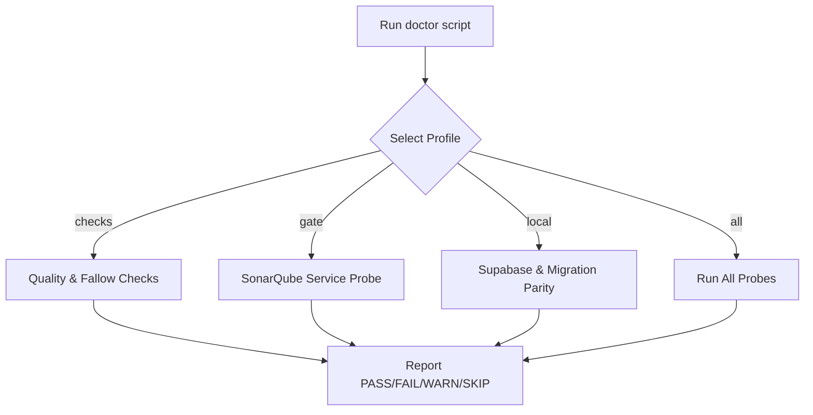
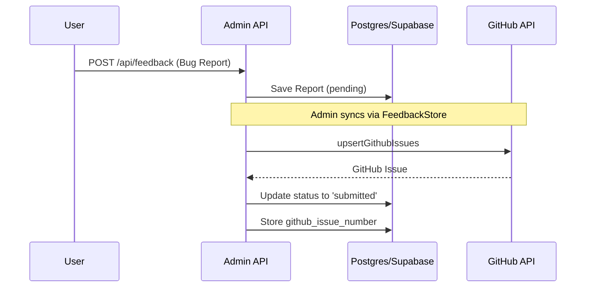
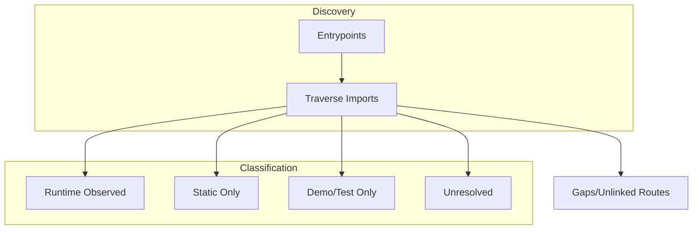

Relevant source files

The following files were used as context for generating this wiki page:

- [apps/backend/tests/integration/supabaseLocal.integration.test.ts](apps/backend/tests/integration/supabaseLocal.integration.test.ts)
- [apps/backend/tests/routes/projects.test.ts](apps/backend/tests/routes/projects.test.ts)
- [scripts/doctor.ts](scripts/doctor.ts)
- [scripts/feature-map.ts](scripts/feature-map.ts)
- [AGENTS.md](AGENTS.md)
- [README.md](README.md)

# Admin Panels & Tools

The Admin Panels and Tools in Nous provide essential infrastructure for managing the platform's AI behavior, user feedback, system health, and development workflows. These tools bridge the gap between frontend user interactions and backend persistence, allowing administrators to monitor system performance, manage user roles, and fine-tune the pedagogical models that drive course generation.

Central to this module is a set of specialized API endpoints and CLI tools designed to ensure technical accuracy and system stability. This includes diagnostic utilities like `doctor.ts` for environment validation and administrative routes within the backend for handling sensitive operations such as model configuration and user management.

## System Diagnostics and Health Checks

The project utilizes a comprehensive diagnostic script, `bun run doctor`, to perform read-only health reports across different environment profiles. This tool ensures that the local development environment, Supabase services, and quality gates are correctly configured before deployment or testing.

The `doctor` script is observational and does not modify service state, providing a safe way to verify environment readiness.
Sources: [scripts/doctor.ts:88-115](scripts/doctor.ts#L88-L115), [AGENTS.md:124-138](AGENTS.md#L124-L138)

### Diagnostic Profiles
| Profile | Scope | Intended Use |
| :--- | :--- | :--- |
| `checks` | Biome linting, type checks, fallow regression | Default local health report |
| `gate` | SonarQube availability and token validation | Pre-merge quality gate verification |
| `local` | Supabase Auth, Storage, and Database API health | Local infrastructure debugging |
| `all` | Combines all available diagnostic stages | Full system health audit |

Sources: [scripts/doctor.ts:47-51](scripts/doctor.ts#L47-L51)

## User and Feedback Management

Administrators have access to specialized endpoints for managing user accounts and processing feedback submitted by students. Feedback management is integrated with GitHub, allowing reports to be synchronized with repository issues for tracking.

### Admin User Operations
The system supports administrative creation and management of users, particularly useful for self-hosted instances utilizing the `codex app-server` mode where users share a central AI account.

*  **Endpoint:** `POST /api/admin/users`
*  **Functionality:** Creates a new user with specified email, password, and role.
*  **Security:** Requires an Authorization header with a token containing the `admin` role.

Sources: [apps/backend/tests/integration/supabaseLocal.integration.test.ts:133-149](apps/backend/tests/integration/supabaseLocal.integration.test.ts#L133-L149), [README.md:23-28](README.md#L23-L28)

### Feedback System Flow
Feedback is persisted in a private storage layer and synchronized with GitHub issues. Administrators can list these reports to monitor user-reported bugs or suggestions.

Admin views consolidate metadata like `github_issue_state` (e.g., "closed", "missing") to track the resolution status of user feedback.
Sources: [apps/backend/tests/integration/supabaseLocal.integration.test.ts:470-555](apps/backend/tests/integration/supabaseLocal.integration.test.ts#L470-L555)

## Model Configuration

The platform allows for global adjustment of AI model parameters through the `model_config` table. This provides a centralized way to define which LLMs are used for specific tasks like lesson generation or research dossiers.

### Configuration Fields
Administrators can read and update the following settings via the `GET /api/admin/model-config` endpoint:
*  `contextModel`: The model used for document indexing and context retrieval.
*  `courseModel`: The model responsible for structural course planning.
*  `lessonModel`: The model generating individual lesson content.
*  `artifactVisualReviewMaxRounds`: Limits the number of self-correction loops during visual artifact generation.

Sources: [apps/backend/tests/integration/supabaseLocal.integration.test.ts:446-468](apps/backend/tests/integration/supabaseLocal.integration.test.ts#L446-L468)

## Feature Reachability and Mapping

For architectural analysis, the `scripts/feature-map.ts` tool generates a static reachability graph. It scans entrypoints (Production, Admin, and Demo) to identify which modules are active and which are potentially legacy code.

This tool classifies modules based on their reachability from the `production-shell` (index.html), admin routes defined in `App.tsx`, or test suites.
Sources: [scripts/feature-map.ts:258-305](scripts/feature-map.ts#L258-L305)

## Summary
Admin Panels and Tools in the Nous ecosystem provide the necessary levers for maintaining system integrity and pedagogical quality. By combining automated diagnostics (`doctor`), detailed module mapping (`feature-map`), and specialized administrative APIs for user and model management, the project ensures a robust environment for both developers and platform maintainers. These tools are strictly governed by role-based access control, ensuring that sensitive configuration and user data remain protected.
