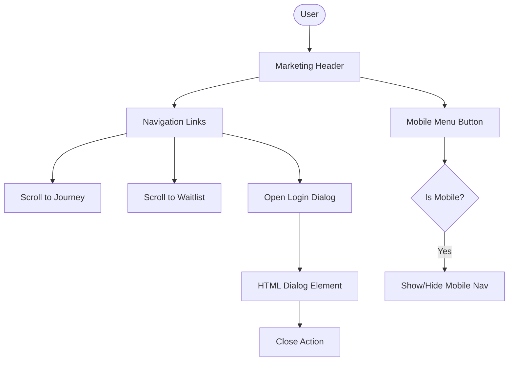
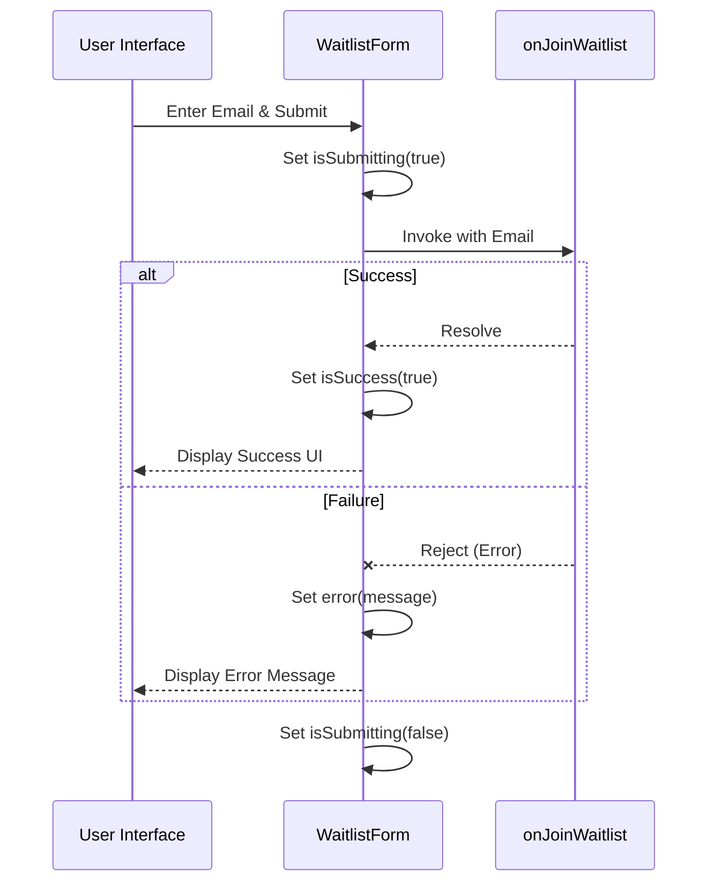

Relevant source files

The following files were used as context for generating this wiki page:

- [apps/web/components/marketing/LandingPage.tsx](apps/web/components/marketing/LandingPage.tsx)
- [apps/web/components/marketing/WaitlistForm.tsx](apps/web/components/marketing/WaitlistForm.tsx)
- [apps/web/components/marketing/marketing.css](apps/web/components/marketing/marketing.css)
- [apps/web/components/newHome/NewHomeView.tsx](apps/web/components/newHome/NewHomeView.tsx)
- [scripts/feature-map.ts](scripts/feature-map.ts)

# Marketing & Waitlist Views

The Marketing & Waitlist Views represent the public-facing entry points of the Lumina Reader (Nous Reader) application. These views are designed to introduce users to the product's value proposition—transforming dense study materials into manageable lessons—and provide a mechanism for prospective users to join an invite-only preview via a waitlist system.

The system is built using React and styled with a custom CSS framework defined in `marketing.css`. It features a responsive landing page with interactive product demos, intersection-observer-driven animations for desktop users, and a dedicated waitlist form that handles user subscriptions.

## Landing Page Architecture

The `LandingPage` component serves as the primary container for the marketing site. It manages global UI states such as the mobile navigation menu, the authentication dialog, and the active stage of the product journey demonstration.

### Key Components & Logic
*  **Intersection Observer:** On desktop viewports, the page uses an `IntersectionObserver` to track the user's scroll progress through the "Journey" section, automatically updating the active demo stage based on which step is most visible.
*  **Responsive Layout:** The view switches between a scroll-linked desktop experience and a manual button-controlled mobile experience when the viewport width is below `52rem`.
*  **Authentication Integration:** Provides a `loginPanel` slot and manages an accessible HTML `<dialog>` for invite-only access.

Sources: [apps/web/components/marketing/LandingPage.tsx:32-108](apps/web/components/marketing/LandingPage.tsx#L32-L108), [apps/web/components/marketing/marketing.css:662-730](apps/web/components/marketing/marketing.css#L662-L730)

### Navigation and Interaction Flow

The following diagram illustrates the interaction between the user, the landing page navigation, and the waitlist/login modals.

Sources: [apps/web/components/marketing/LandingPage.tsx:123-176](apps/web/components/marketing/LandingPage.tsx#L123-L176), [apps/web/components/marketing/marketing.css:88-100](apps/web/components/marketing/marketing.css#L88-L100)

## Waitlist Management System

The waitlist system is the primary conversion point for new users. It is implemented via the `WaitlistForm` component, which handles email validation and asynchronous submission.

### Waitlist Form Properties

| Property | Type | Description |
| :--- | :--- | :--- |
| `onJoinWaitlist` | `(email: string) => Promise<void>` | Optional callback invoked when the form is submitted. |

Sources: [apps/web/components/marketing/WaitlistForm.tsx:5-9](apps/web/components/marketing/WaitlistForm.tsx#L5-L9)

### Submission Logic
1.  **Validation:** The form ensures the input is not empty before submission.
2.  **State Management:** Tracks `isSubmitting`, `isSuccess`, and `error` states to provide immediate visual feedback.
3.  **Feedback:** Displays a success message or technical error based on the result of the `onJoinWaitlist` promise.

Sources: [apps/web/components/marketing/WaitlistForm.tsx:12-52](apps/web/components/marketing/WaitlistForm.tsx#L12-L52)

## Product Journey Demos

The "Journey" section uses the `LandingProductDemo` component to visualize the application's core workflow. The demonstration is divided into four distinct stages.

### Demo Stages
| Stage | Identifier | Description |
| :--- | :--- | :--- |
| **Plan** | `plan` | Visualizes the initial study plan creation from sources. |
| **Generation** | `generation` | Shows the AI-driven lesson generation process. |
| **Lesson** | `lesson` | Displays the interactive lesson interface. |
| **Library** | `library` | Shows the organization of materials in the user's library. |

Sources: [apps/web/components/marketing/LandingPage.tsx:28](apps/web/components/marketing/LandingPage.tsx#L28), [apps/web/components/marketing/marketing.css:150-250](apps/web/components/marketing/marketing.css#L150-L250)

## Aesthetic and Design System

The marketing views utilize a distinct design language defined by CSS variables in `marketing.css`. This system prioritizes a "paper" aesthetic to reflect the educational nature of the tool.

### Primary Color Palette
*  **Paper Background:** `#fcfaf7` (`--marketing-paper`)
*  **Ink (Text):** `#1a1917` (`--marketing-ink`)
*  **Accent (Primary Action):** `#c4622a` (`--marketing-accent`)
*  **Muted Text:** `#66615b` (`--marketing-muted`)

### Typography
The site uses a combination of serif and sans-serif fonts:
*  **Serif:** "Playfair Display", "Merriweather" (Used for headings and branding).
*  **Sans:** "Inter" (Used for body text and navigation).

Sources: [apps/web/components/marketing/marketing.css:20-40](apps/web/components/marketing/marketing.css#L20-L40)

## Visual Transitions and Animations

The marketing experience is enhanced with CSS-based animations to guide user attention.

*  **Journey Transitions:** Step articles in the journey section transition their opacity from `0.42` to `1` when they become active.
*  **Interactive Demo Elements:** Keyframes like `marketing-demo-cursor-path` and `marketing-demo-question` simulate user interaction within the demo windows, showing how questions are asked and answered.
*  **Responsive Adjustments:** The layout heavily utilizes `clamp()` for fluid typography and spacing across different screen sizes.

Sources: [apps/web/components/marketing/marketing.css:168-180](apps/web/components/marketing/marketing.css#L168-L180), [apps/web/components/marketing/marketing.css:502-535](apps/web/components/marketing/marketing.css#L502-L535)

## Feature Mapping and Entrypoints

The project uses a `feature-map` script to track reachable modules from these public entrypoints. The `LandingPage` and associated demos (e.g., `landingDemos.entry.tsx`) are categorized as production or demo entrypoints.

*  **Production Entrypoint:** The main Vite module entrypoint.
*  **Demo Entrypoints:** Located in `apps/web/remotion`, these are used for generating marketing assets and video demonstrations.

Sources: [scripts/feature-map.ts:168-185](scripts/feature-map.ts#L168-L185), [apps/web/components/newHome/NewHomeView.tsx:82-95](apps/web/components/newHome/NewHomeView.tsx#L82-L95)

## Conclusion

The Marketing & Waitlist Views provide a high-fidelity introduction to Lumina Reader. By utilizing modern web APIs like `IntersectionObserver` and a robust CSS variable system, the project delivers a performant and aesthetically cohesive experience that transitions prospective users from initial interest to waitlist signup and eventually to the authenticated product home.
