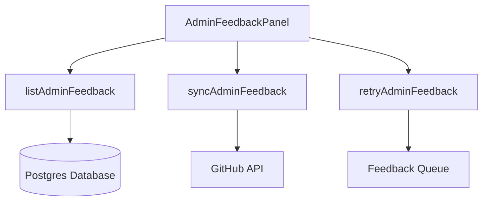
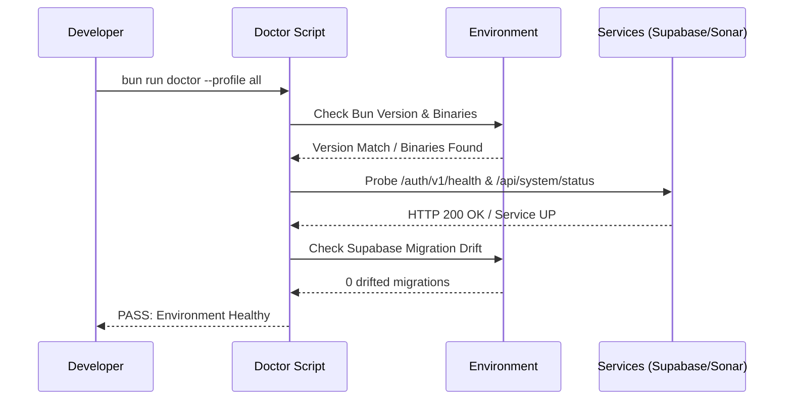

<details>
<summary>Relevant source files</summary>

The following files were used as context for generating this wiki page:

- [apps/web/components/admin/AdminFeedbackPanel.tsx](../../../apps/web/components/admin/AdminFeedbackPanel.tsx)
- [scripts/doctor.ts](../../../scripts/doctor.ts)
- [README.md](../../../README.md)
- [AGENTS.md](../../../AGENTS.md)
- [apps/backend/tests/routes/projects.test.ts](../../../apps/backend/tests/routes/projects.test.ts)
- [apps/web/components/library/HomeChatComposer.tsx](../../../apps/web/components/library/HomeChatComposer.tsx)
</details>

# Admin Panels & Tools

Admin Panels and Tools in Lumina-Reader provide essential infrastructure for project maintenance, user feedback management, and system health monitoring. These tools range from frontend administrative interfaces for managing user-reported issues to backend diagnostic scripts that ensure environmental parity across development and production.

The administrative ecosystem is divided between web-based components for managing high-level application state and CLI-based "Doctor" utilities for deep-system inspection. These tools ensure that the ADHD-friendly learning environment remains stable and that developers can quickly triage integration issues with external services like Supabase, OpenRouter, and GitHub.
Sources: [README.md:1-15](../../../README.md#L1-L15), [AGENTS.md:112-118](../../../AGENTS.md#L112-L118), [apps/web/components/admin/AdminFeedbackPanel.tsx:18-30](../../../apps/web/components/admin/AdminFeedbackPanel.tsx#L18-L30)

## User Feedback Management
The `AdminFeedbackPanel` serves as the primary interface for administrators to manage user reports. It integrates with backend APIs to list, retry, and synchronize feedback items with external platforms like GitHub.

### Feedback Architecture
The system uses a paginated list view (`AdminFeedbackList`) paired with a detail view (`AdminFeedbackDetail`). Administrators can trigger a synchronization process that pulls issues from GitHub into the local database for triaging.



The feedback flow allows administrators to observe user voices, monitor synchronization timestamps, and re-queue failed reporting attempts.
Sources: [apps/web/components/admin/AdminFeedbackPanel.tsx:10-25](../../../apps/web/components/admin/AdminFeedbackPanel.tsx#L10-L25), [apps/web/components/admin/AdminFeedbackPanel.tsx:78-95](../../../apps/web/components/admin/AdminFeedbackPanel.tsx#L78-L95)

### Key Admin API Operations
| Operation | Function | Description |
| :--- | :--- | :--- |
| **List** | `listAdminFeedback` | Retrieves a paginated list of `AdminFeedbackReport` objects. |
| **Sync** | `syncAdminFeedback` | Synchronizes local feedback reports with GitHub issues. |
| **Retry** | `retryAdminFeedback` | Attempts to re-process a failed feedback submission. |

Sources: [apps/web/components/admin/AdminFeedbackPanel.tsx:8-13](../../../apps/web/components/admin/AdminFeedbackPanel.tsx#L8-L13), [apps/web/components/admin/AdminFeedbackPanel.tsx:32-45](../../../apps/web/components/admin/AdminFeedbackPanel.tsx#L32-L45)

## System Diagnostics: The Doctor Utility
The `doctor.ts` script is a comprehensive diagnostic tool used to verify the health of the Lumina-Reader environment. It supports multiple profiles to check different layers of the stack.

### Diagnostic Profiles
The utility categorizes checks into specific profiles to minimize overhead during routine development while allowing deep inspection when needed.
Sources: [scripts/doctor.ts:39-44](../../../scripts/doctor.ts#L39-L44), [scripts/doctor.ts:275-285](../../../scripts/doctor.ts#L275-L285)

| Profile | Target | Scope |
| :--- | :--- | :--- |
| `checks` | Quality & Tests | Runs Biome lints, Semgrep scans, Fallow regressions, and Vitest. |
| `gate` | SonarQube | Probes local Sonar service status and authentication token validity. |
| `local` | Supabase | Checks Auth, REST, Storage, and Realtime health plus migration drift. |
| `all` | Full Stack | Combines all profiles for a complete system health report. |

### Diagnostic Execution Flow
The `Doctor` script performs pre-flight checks on runtime versions (Bun) and workspace binaries before proceeding to service-specific probes.
Sources: [scripts/doctor.ts:16-25](../../../scripts/doctor.ts#L16-L25), [scripts/doctor.ts:335-350](../../../scripts/doctor.ts#L335-L350)



Sources: [scripts/doctor.ts:182-205](../../../scripts/doctor.ts#L182-L205), [scripts/doctor.ts:250-270](../../../scripts/doctor.ts#L250-L270), [scripts/doctor.ts:358-375](../../../scripts/doctor.ts#L358-L375)

## Project & Source Administration
Lumina-Reader includes administrative logic for managing projects and their underlying source materials (PDFs, ZIP archives, and text).

### Import Diagnostics
The system records sanitized library import diagnostics to help administrators identify why certain backups or source archives fail to load. These diagnostics are restricted to users with the `admin` role.
Sources: [apps/backend/tests/routes/projects.test.ts:743-760](../../../apps/backend/tests/routes/projects.test.ts#L743-L760)

```typescript
// Example of recording an import diagnostic
await store.recordProjectImportDiagnostic('user-123', {
  correlationId: '550e8400-e29b-41d4-a716-446655440000',
  code: 'LIBRARY_ARCHIVE_INVALID',
  stage: 'manifest-read',
});
```

Sources: [apps/backend/tests/routes/projects.test.ts:762-766](../../../apps/backend/tests/routes/projects.test.ts#L762-L766)

### Project Security & Isolation
Administrative boundaries are enforced at the backend level. While the frontend may offer UI for project management, the backend ensures that:
*  Users remain isolated via `auth.uid()`.
*  Import diagnostic lists are restricted via JWT role verification (e.g., `role: 'admin'`).
*  Database errors (like connection strings) are never leaked in diagnostic responses, returning generic 500 errors instead.

Sources: [apps/backend/tests/routes/projects.test.ts:713-720](../../../apps/backend/tests/routes/projects.test.ts#L713-L720), [apps/backend/tests/routes/projects.test.ts:770-790](../../../apps/backend/tests/routes/projects.test.ts#L770-L790)

## Summary
Admin Panels and Tools facilitate the operational stability of Lumina-Reader. By combining frontend feedback triaging with rigorous backend environment validation via the `doctor` utility, the system maintains high reliability for its pedagogical workflows. These tools ensure that service integrations—critical for AI-driven lesson generation—are correctly configured and that user-reported issues are effectively tracked through GitHub synchronization.
Sources: [AGENTS.md:75-90](../../../AGENTS.md#L75-L90), [apps/web/components/admin/AdminFeedbackPanel.tsx:115-125](../../../apps/web/components/admin/AdminFeedbackPanel.tsx#L115-L125)
