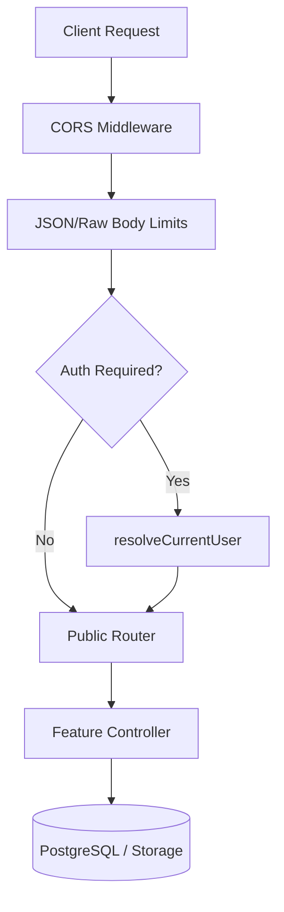
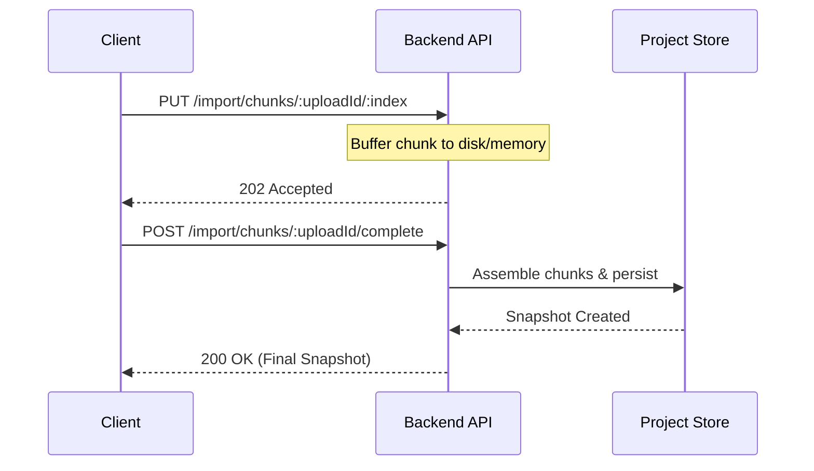

Relevant source files

The following files were used as context for generating this wiki page:

- [apps/backend/src/index.ts](apps/backend/src/index.ts)
- [apps/backend/tests/routes/projects.test.ts](apps/backend/tests/routes/projects.test.ts)
- [apps/backend/tests/routes/authProtection.test.ts](apps/backend/tests/routes/authProtection.test.ts)
- [scripts/feature-map.ts](scripts/feature-map.ts)
- [apps/backend/tests/integration/supabaseLocal.integration.test.ts](apps/backend/tests/integration/supabaseLocal.integration.test.ts)
- [README.md](README.md)

# Backend REST Endpoints

The Nous backend is an Express-based API server that facilitates project management, AI-driven course generation, and authenticated storage. It serves as the bridge between the Vite-powered frontend and persistent storage layers including PostgreSQL and Supabase. The API handles complex workflows such as multi-source document processing, chunked binary imports, and integration with various AI services like OpenRouter and Codex.

Authentication is primarily managed via Supabase, ensuring that project data and assets are isolated per user. The backend also exposes public health and status endpoints for deployment monitoring and administrative routes for system configuration and user management.

Sources: [README.md:16-24](README.md#L16-L24), [apps/backend/src/index.ts:184-216](apps/backend/src/index.ts#L184-L216), [apps/backend/tests/integration/supabaseLocal.integration.test.ts:166-210](apps/backend/tests/integration/supabaseLocal.integration.test.ts#L166-L210)

## API Architecture and Middleware

The backend uses a modular routing structure where specific features (projects, chat, workflows) are encapsulated in separate routers. Global middleware handles CORS, request logging, and payload limits, which are tailored per endpoint group to accommodate large document transfers.

### Request Flow and Security
Authentication is enforced at the router level. Most `/api/*` routes require a valid user session resolved via `resolveCurrentUser`. Administrative routes under `/api/admin` require additional role-based checks.

The request flow ensures that payload size limits and authentication are verified before any business logic is executed.
Sources: [apps/backend/src/index.ts:133-170](apps/backend/src/index.ts#L133-L170), [apps/backend/tests/routes/authProtection.test.ts:25-45](apps/backend/tests/routes/authProtection.test.ts#L25-L45)

### Configured Payload Limits
To support large PDF uploads and complex project snapshots, the backend defines specific memory limits for incoming JSON and raw data.

| Endpoint Prefix | Limit | Purpose |
| :--- | :--- | :--- |
| `/api/projects` | 300MB | Project snapshots and metadata |
| `/api/pdf` | 160MB | PDF document processing |
| `/api/openrouter` | 80MB | Large AI context windows |
| `/api/stt` | 20MB | Audio data for speech-to-text |
| `Default` | 50MB | General API requests |

Sources: [apps/backend/src/index.ts:58-65](apps/backend/src/index.ts#L58-L65), [apps/backend/src/index.ts:153-162](apps/backend/src/index.ts#L153-L162)

## Project Management Endpoints

The core of the Nous API resides in the `/api/projects` path. It supports the full lifecycle of a learning project, from document upload to metadata patching and deletion.

### Core Project CRUD
These endpoints interact with the `ProjectStore` (implemented as `PostgresProjectStore` in production) to persist course snapshots.

*  **GET `/api/projects/projects`**: Lists all projects belonging to the authenticated user.
*  **PUT `/api/projects/projects/:projectId`**: Saves or updates a full project snapshot. It supports multipart requests when attaching source archives.
*  **PATCH `/api/projects/projects/:projectId`**: Applies partial updates to a project, such as marking a section as completed or updating the active section.
*  **DELETE `/api/projects/projects/:projectId`**: Permanently removes a project and its associated assets (covers, sources).

Sources: [apps/backend/tests/routes/projects.test.ts:137-160](apps/backend/tests/routes/projects.test.ts#L137-L160), [apps/backend/src/index.ts:209-216](apps/backend/src/index.ts#L209-L216)

### Project Source and Import
The backend implements a chunked upload mechanism for large source files and backups, preventing memory exhaustion on the server.

Sources: [apps/backend/src/index.ts:154-162](apps/backend/src/index.ts#L154-L162), [apps/backend/tests/routes/projects.test.ts:246-302](apps/backend/tests/routes/projects.test.ts#L246-L302)

## Specialized Service Endpoints

Beyond project management, the backend provides specialized endpoints for AI features and content processing.

### Workflow and AI Orchestration
Nous uses a workflow-based approach for generating lessons and course plans.
*  **Lesson Workflows**: Managed via `/api/lesson-workflows`, responsible for AI-driven lesson generation.
*  **Course Interviews**: Found at `/api/course-interviews`, handling the initial pedagogical assessment.
*  **Artifact Drafts**: Routed through `/api/artifact-drafts`, allowing for the iterative creation of visual aids.

Sources: [apps/backend/src/index.ts:184-205](apps/backend/src/index.ts#L184-L205)

### Multimedia and External Integrations
| Endpoint | Method | Description |
| :--- | :--- | :--- |
| `/api/pdf/extract-text` | POST | Extracts usable text from PDF uploads for indexing. |
| `/api/youtube/research-context` | POST | Fetches context from YouTube videos for course enrichment. |
| `/api/tts` | POST | Generates speech from text (Text-to-Speech). |
| `/api/stt` | POST | Transcribes audio data (Speech-to-Text). |
| `/api/images/generate` | POST | Generates AI images based on lesson prompts. |

Sources: [apps/backend/src/index.ts:175-183](apps/backend/src/index.ts#L175-L183), [apps/backend/tests/routes/authProtection.test.ts:25-45](apps/backend/tests/routes/authProtection.test.ts#L25-L45)

## Administrative and Health Routes

Administrative endpoints provide visibility into system health and diagnostic data.

### System Diagnostics
*  **GET `/health`**: Public endpoint returning the server status and an ISO timestamp.
*  **GET `/api/status`**: Returns basic service availability info.
*  **GET `/api/projects/import-diagnostics`**: Admin-only route for inspecting failed project imports, filtered by `correlationId`.

Sources: [apps/backend/src/index.ts:223-225](apps/backend/src/index.ts#L223-L225), [apps/backend/tests/routes/projects.test.ts:602-630](apps/backend/tests/routes/projects.test.ts#L602-L630)

### User Management
Under `/api/admin`, the backend allows administrators to:
*  **POST `/api/admin/users`**: Manually create new users with specific roles.
*  **POST `/api/admin/users/:userId/magic-link`**: Generate and send Supabase magic links for password-less entry.
*  **GET `/api/admin/model-config`**: Retrieve the current global AI model settings (e.g., `lessonModel`, `courseModel`).

Sources: [apps/backend/tests/integration/supabaseLocal.integration.test.ts:133-145](apps/backend/tests/integration/supabaseLocal.integration.test.ts#L133-L145), [apps/backend/tests/integration/supabaseLocal.integration.test.ts:579-586](apps/backend/tests/integration/supabaseLocal.integration.test.ts#L579-L586)

## Summary
The Backend REST Endpoints form a robust API that manages high-volume data and complex AI workflows. By utilizing specific payload limits and chunked transfers, the system remains performant while handling large educational documents. The architecture prioritizes security through Supabase integration and role-based access control, ensuring that user data remains private and the system remains manageable via administrative interfaces.
