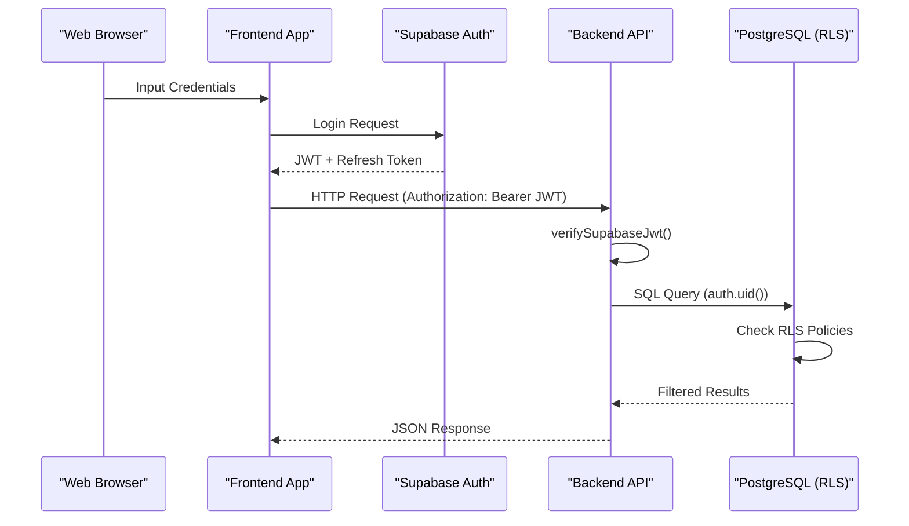
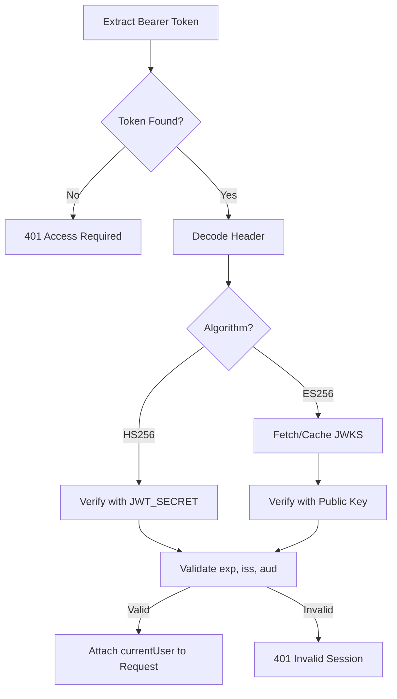

<details>
<summary>Relevant source files</summary>

The following files were used as context for generating this wiki page:

- [apps/backend/src/auth/currentUser.ts](apps/backend/src/auth/currentUser.ts)
- [apps/web/services/auth/supabaseAuth.ts](apps/web/services/auth/supabaseAuth.ts)
- [scripts/sync-supabase-auth-emails.ts](scripts/sync-supabase-auth-emails.ts)
- [supabase/migrations/202607070001_initial_user_backend.sql](supabase/migrations/202607070001_initial_user_backend.sql)
- [apps/backend/tests/integration/supabaseLocal.integration.test.ts](apps/backend/tests/integration/supabaseLocal.integration.test.ts)
- [apps/web/tests/services/auth/supabaseAuth.test.ts](apps/web/tests/services/auth/supabaseAuth.test.ts)
- [scripts/supabaseAuthTemplates.ts](scripts/supabaseAuthTemplates.ts)

</details>

# Authentication & Access Control

Authentication and access control in Nous are primarily managed through **Supabase Auth**, providing a secure identity layer for both the Vite frontend and the Express backend. The system supports JSON Web Token (JWT) verification using both symmetric (HS256) and asymmetric (ES256) algorithms. Access control is enforced at multiple levels: via backend middleware that resolves the current user from Bearer tokens and via PostgreSQL Row Level Security (RLS) policies that ensure data isolation between users.

The system also includes a developer-friendly "local-bypass" mode for testing and local development, allowing the backend to skip external token verification when specific environment flags are set.

Sources: [apps/backend/src/auth/currentUser.ts:1-25](apps/backend/src/auth/currentUser.ts#L1-L25), [apps/web/services/auth/supabaseAuth.ts:1-30](apps/web/services/auth/supabaseAuth.ts#L1-L30), [supabase/migrations/202607070001_initial_user_backend.sql:65-90](supabase/migrations/202607070001_initial_user_backend.sql#L65-L90)

## System Architecture

The authentication architecture involves a frontend service managing sessions and token rotation, and a backend middleware verifying these tokens to populate user context.

### Authentication Flow
The following sequence diagram illustrates the typical authentication flow when a user interacts with the system, including token verification and RLS enforcement.



Sources: [apps/web/services/auth/supabaseAuth.ts:180-210](apps/web/services/auth/supabaseAuth.ts#L180-L210), [apps/backend/src/auth/currentUser.ts:190-220](apps/backend/src/auth/currentUser.ts#L190-L220), [supabase/migrations/202607070001_initial_user_backend.sql:75-100](supabase/migrations/202607070001_initial_user_backend.sql#L75-L100)

## Backend User Resolution

The backend identifies users through the `resolveAuthenticatedUser` middleware. It determines the `AuthMode` based on environment variables like `AUTH_MODE`, `LOCAL_AUTH_BYPASS`, and `NODE_ENV`.

### Authentication Modes
| Mode | Condition | Description |
| :--- | :--- | :--- |
| `local-bypass` | `LOCAL_AUTH_BYPASS=true` or `NODE_ENV=test` | Skips JWT verification; uses a static `local-user` ID. |
| `supabase` | Default | Requires a valid Bearer token signed by Supabase. |

Sources: [apps/backend/src/auth/currentUser.ts:38-56](apps/backend/src/auth/currentUser.ts#L38-L56)

### JWT Verification Logic
The backend supports two primary signature verification methods:
1.  **HS256**: Uses a shared secret (`SUPABASE_JWT_SECRET`).
2.  **ES256**: Uses asymmetric keys fetched from the Supabase JSON Web Key Set (JWKS) endpoint.

The system caches JWKS keys for 5 minutes (`JWKS_CACHE_MS`) to minimize network latency during verification.



Sources: [apps/backend/src/auth/currentUser.ts:80-160](apps/backend/src/auth/currentUser.ts#L80-L160)

## Access Control & Data Isolation

Data security is primarily enforced within the PostgreSQL database using **Row Level Security (RLS)**.

### RLS Policies
The database schema defines specific policies for every table to ensure users can only access their own records. A helper function `is_admin()` is used to grant broader access to administrative users.

| Table | Policy Name | Logic |
| :--- | :--- | :--- |
| `profiles` | owner or admin | `auth.uid() = id OR is_admin()` |
| `projects` | isolated by owner | `auth.uid() = user_id` |
| `project_snapshots` | isolated by owner | `auth.uid() = user_id` |
| `library_folders` | isolated by owner | `auth.uid() = user_id` |

Sources: [supabase/migrations/202607070001_initial_user_backend.sql:65-98](supabase/migrations/202607070001_initial_user_backend.sql#L65-L98)

### User Identity Data Structure
The `CurrentUser` interface in the backend represents the authenticated principal:

```typescript
export interface CurrentUser {
  aiProvider?: AiProvider;
  aiProviderOverrides?: ModelProviderOverrides;
  email?: string;
  id: string;
  passwordSetupRequired: boolean;
  role?: string;
}
```

Sources: [apps/backend/src/auth/currentUser.ts:25-32](apps/backend/src/auth/currentUser.ts#L25-L32)

## Frontend Session Management

The frontend (`supabaseAuth.ts`) manages the lifecycle of the user session, including token storage in `localStorage` and proactive token refreshing.

### Key Service Functions
*  **`getValidSupabaseSession()`**: Retrieves the current session, automatically attempting a refresh if the token is expired but a refresh token is available.
*  **`fetchWithSupabaseAuth()`**: A wrapper around the native `fetch` API that automatically injects the `Authorization` header and retries once if the backend returns a 403 due to an expired session.
*  **`scheduleSupabaseSessionRefresh()`**: Sets up a timer to refresh the token before it expires.

Sources: [apps/web/services/auth/supabaseAuth.ts:135-170](apps/web/services/auth/supabaseAuth.ts#L135-L170), [apps/web/tests/services/auth/supabaseAuth.test.ts:220-250](apps/web/tests/services/auth/supabaseAuth.test.ts#L220-L250)

## Email Branding & Templates

Nous utilizes custom Supabase email templates for invites, magic links, and password recovery. These are managed locally and synchronized with the Supabase project using the Management API.

### Template Synchronization Process
1.  Templates are loaded from `supabase/templates/` as HTML files.
2.  A patch object is built mapping local content to Supabase configuration keys (e.g., `mailer_templates_invite_content`).
3.  The `sync-supabase-auth-emails.ts` script compares the local patch with the hosted configuration and applies changes if the `--apply` flag is provided.

Sources: [scripts/supabaseAuthTemplates.ts:35-55](scripts/supabaseAuthTemplates.ts#L35-L55), [scripts/sync-supabase-auth-emails.ts:70-95](scripts/sync-supabase-auth-emails.ts#L70-L95)

### Auth Template Types
| Kind | Subject (Default) | File |
| :--- | :--- | :--- |
| `confirmation` | Conferma il tuo account Nous | `confirmation.html` |
| `invite` | Il tuo invito a Nous | `invite.html` |
| `magic_link` | Accedi a Nous | `magic-link.html` |
| `recovery` | Scegli una password per Nous | `recovery.html` |

Sources: [scripts/supabaseAuthTemplates.ts:18-30](scripts/supabaseAuthTemplates.ts#L18-L30)

## Conclusion

The Authentication & Access Control system provides a robust foundation for user security by combining industry-standard JWT verification with deep database-level isolation. By offloading identity management to Supabase while maintaining granular control through RLS and custom backend resolution, the project ensures that user data remains private and secure across all service boundaries.
