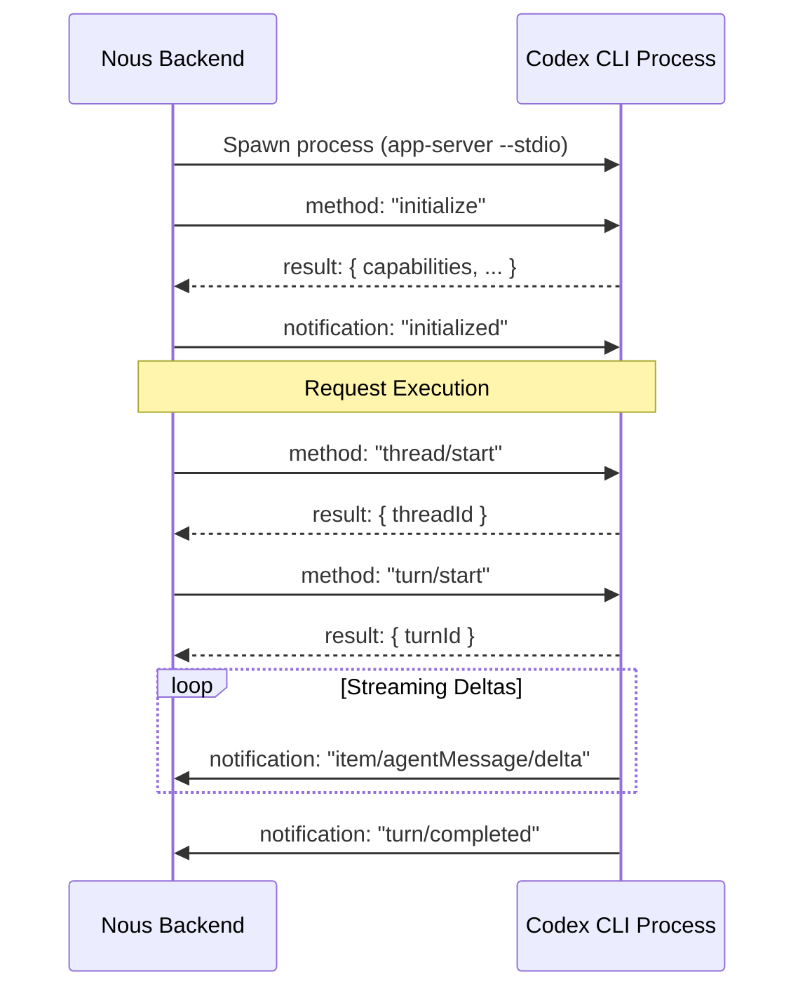
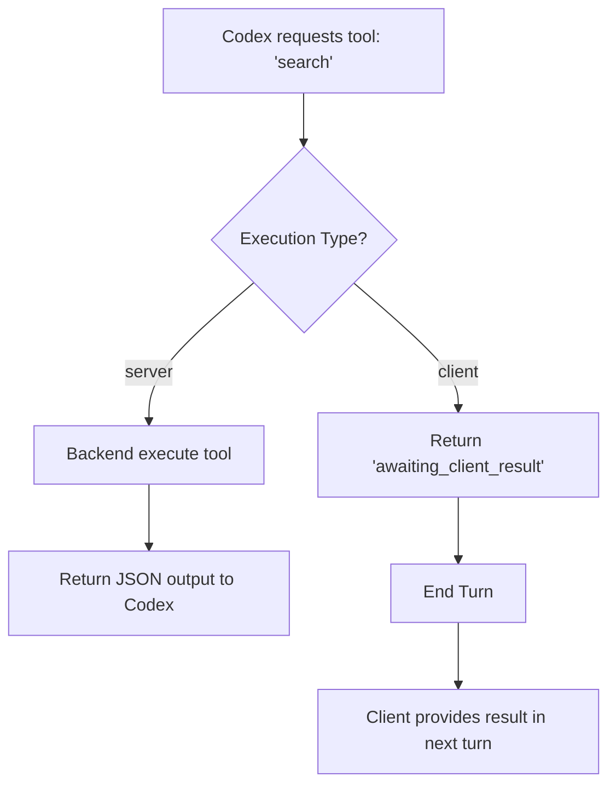

<details>
<summary>Relevant source files</summary>

The following files were used as context for generating this wiki page:

- [apps/backend/src/services/codexAppServer.ts](apps/backend/src/services/codexAppServer.ts)
- [apps/backend/src/services/codexChatStream.ts](apps/backend/src/services/codexChatStream.ts)
- [apps/backend/src/routes/openRouterProxy.ts](apps/backend/src/routes/openRouterProxy.ts)
- [apps/backend/tests/services/codexAppServer.test.ts](apps/backend/tests/services/codexAppServer.test.ts)
- [README.md](README.md)
- [apps/backend/tests/workflows/courseGenerationModel.test.ts](apps/backend/tests/workflows/courseGenerationModel.test.ts)
</details>

# Codex App Server Mode

Codex App Server Mode is a specialized integration within the Nous Reader backend that allows the application to utilize a local ChatGPT/Codex account for AI processing. This mode enables self-hosted instances to leverage AI capabilities without requiring credentials to be stored directly within the Nous environment, instead interfacing with the `codex` CLI as a sub-process.

When enabled via the `CODEX_APP_SERVER_ENABLED=true` environment variable, the backend spawns a private `codex app-server` process. This process serves authenticated administrators and specific users, facilitating tasks such as course generation, lesson writing, and interactive chat while maintaining architectural boundaries through a JSON-RPC over stdio protocol.

Sources: [README.md:23-28](README.md#L23-L28), [apps/backend/src/services/codexAppServer.ts:246-248](apps/backend/src/services/codexAppServer.ts#L246-L248)

## Architecture and Protocol

The integration relies on a robust JSON-RPC 2.0-like protocol communicating over standard input and output streams. The `CodexJsonRpcClient` class manages this communication, handling requests, notifications, and timeouts.

### Core Components

| Component | Responsibility |
| :--- | :--- |
| `CodexJsonRpcClient` | Orchestrates the exchange of JSON messages with the spawned process. |
| `FakeCodexProcess` | Used in testing to simulate the Codex CLI behavior. |
| `CodexAppServerError` | Custom error class for handling protocol, timeout, and authentication failures. |
| `spawnCodexAppServer` | Utility that uses `Bun.spawn` to launch the binary with a restricted environment. |

Sources: [apps/backend/src/services/codexAppServer.ts:133-145](apps/backend/src/services/codexAppServer.ts#L133-L145), [apps/backend/tests/services/codexAppServer.test.ts:26-50](apps/backend/tests/services/codexAppServer.test.ts#L26-L50)

### Interaction Flow
The following diagram illustrates the sequence from initializing the server to executing a chat turn.



The backend ensures security by passing only a "safe" subset of host environment variables (like `PATH`, `TEMP`, and `HOME`) to the sub-process to prevent credential leakage or unauthorized file access.

Sources: [apps/backend/src/services/codexAppServer.ts:11-45](apps/backend/src/services/codexAppServer.ts#L11-L45), [apps/backend/src/services/codexAppServer.ts:223-238](apps/backend/src/services/codexAppServer.ts#L223-L238), [apps/backend/tests/services/codexAppServer.test.ts:98-154](apps/backend/tests/services/codexAppServer.test.ts#L98-L154)

## Security and Sandboxing

Security is a primary concern in App Server Mode. The system enforces strict sandboxing policies and instruction-level constraints to ensure the AI engine does not exceed its pedagogical scope.

### Feature Disabling
The system explicitly disables several built-in Codex capabilities that are deemed unsafe or unnecessary for the Nous Reader environment:
*  **Disabled Features:** `shell_tool`, `browser_use`, `computer_use`, `apps`, `plugins`, `unified_exec`, and `workspace_dependencies`.
*  **Environment Policy:** Set to `inherit=none` to prevent the sub-process from accessing arbitrary environment variables.
*  **Sandbox Policy:** Turns are started with a `read-only` sandbox policy.

Sources: [apps/backend/src/services/codexAppServer.ts:17-45](apps/backend/src/services/codexAppServer.ts#L17-L45), [apps/backend/src/services/codexAppServer.ts:210-221](apps/backend/src/services/codexAppServer.ts#L210-L221), [apps/backend/tests/services/codexAppServer.test.ts:77-96](apps/backend/tests/services/codexAppServer.test.ts#L77-L96)

### System Instructions
The engine is initialized with `CODEX_BASE_INSTRUCTIONS`, which mandate that it:
1.  Use only capabilities explicitly supplied by Nous.
2.  Never inspect the host filesystem, environment, or browser.
3.  End turns immediately if a tool returns `awaiting_client_result`.

Sources: [apps/backend/src/services/codexAppServer.ts:8-12](apps/backend/src/services/codexAppServer.ts#L8-L12), [apps/backend/src/routes/openRouterProxy.ts:31-33](apps/backend/src/routes/openRouterProxy.ts#L31-L33)

## Tool Execution and Extensibility

Codex App Server Mode supports "dynamic tools," which allow the AI to perform actions beyond text generation. These tools are categorized based on where they execute.

### Execution Tiers
*  **Server Tools:** Handled directly within the backend. Examples include searching the internal library or reading source files.
*  **Client Tools:** Delegated to the frontend/UI. The backend returns a status of `awaiting_client_result`, signaling the AI to pause until the user provides the necessary data.

Sources: [apps/backend/src/services/codexAppServer.ts:112-120](apps/backend/src/services/codexAppServer.ts#L112-L120), [apps/backend/src/services/codexChatStream.ts:15-17](apps/backend/src/services/codexChatStream.ts#L15-L17), [apps/backend/tests/workflows/courseGenerationModel.test.ts:251-285](apps/backend/tests/workflows/courseGenerationModel.test.ts#L251-L285)

### Tool Call Sequence



Sources: [apps/backend/src/services/codexAppServer.ts:474-500](apps/backend/src/services/codexAppServer.ts#L474-L500), [apps/backend/src/services/codexChatStream.ts:15-17](apps/backend/src/services/codexChatStream.ts#L15-L17)

## Implementation Details

### Turn Management
Turns are ephemeral by default (`ephemeral: true`). The system tracks token usage (`thread/tokenUsage/updated`) to meter AI consumption, recording input, output, reasoning, and cached tokens.

```typescript
// apps/backend/src/services/codexAppServer.ts:586-591
const outcome = await turnCompleted.then(
  result => ({ result }),
  error => ({ error })
);
const usage = usageByTurnId.get(turnId);
if (usage) {
  await recordWorkflowAiUsage({ ...usage, model: turn.model, provider: 'codex' });
}
```

Sources: [apps/backend/src/services/codexAppServer.ts:585-592](apps/backend/src/services/codexAppServer.ts#L585-L592), [apps/backend/tests/services/codexAppServer.test.ts:199-210](apps/backend/tests/services/codexAppServer.test.ts#L199-L210)

### Reasoning Effort
Reasoning models in Codex use specific effort levels. The backend normalizes these to ensure compatibility:
*  `none` or `minimal` are mapped to `low`.
*  `medium` and `high` are passed directly.

Sources: [apps/backend/src/services/codexAppServer.ts:98-101](apps/backend/src/services/codexAppServer.ts#L98-L101), [apps/backend/tests/services/codexAppServer.test.ts:70-75](apps/backend/tests/services/codexAppServer.test.ts#L70-L75)

## Summary
Codex App Server Mode transforms a standard ChatGPT/Codex account into a controlled pedagogical engine. By combining restricted process spawning, a robust JSON-RPC protocol, and specific tool delegation, it provides a powerful yet secure AI backend for self-hosted Nous Reader instances. It prioritizes data privacy and architectural integrity by ensuring the AI never interacts directly with the host system.

Sources: [README.md:23-28](README.md#L23-L28), [apps/backend/src/services/codexAppServer.ts:8-12](apps/backend/src/services/codexAppServer.ts#L8-L12)
