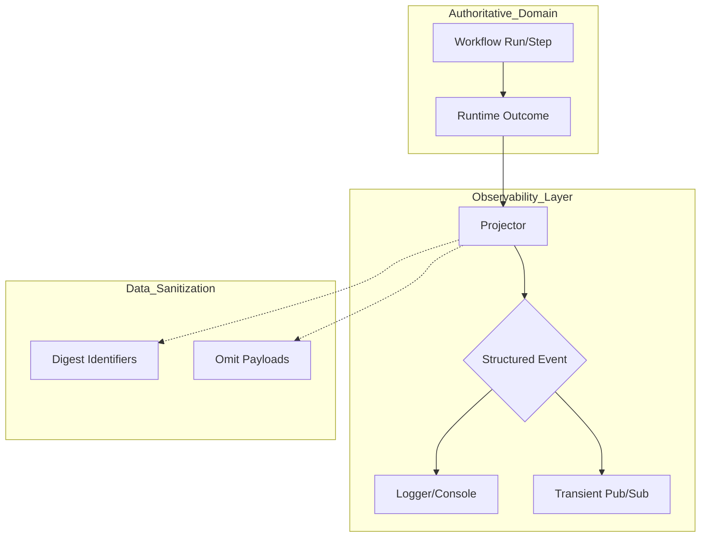
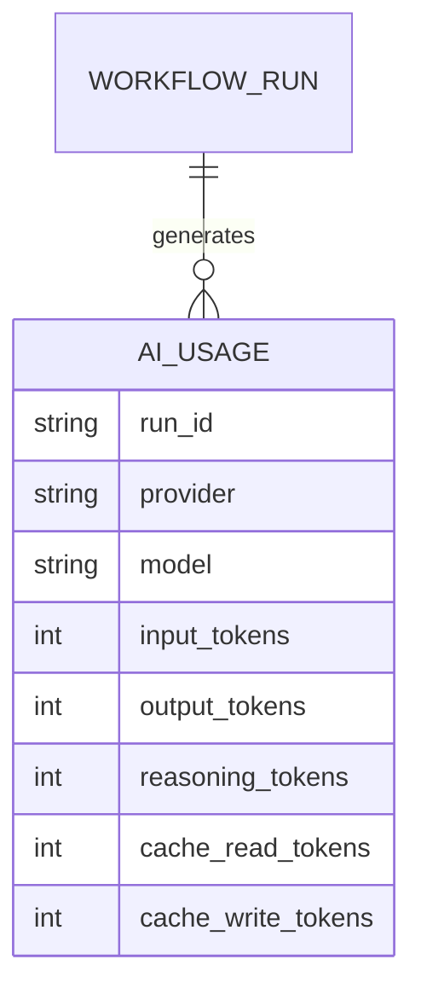
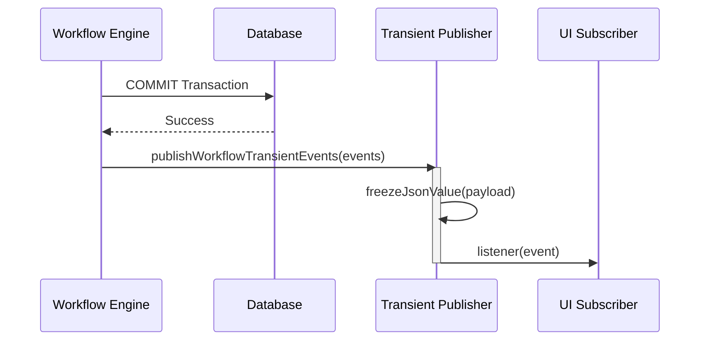

<details>
<summary>Relevant source files</summary>

The following files were used as context for generating this wiki page:

- [apps/backend/src/workflows/workflowAiMetering.ts](apps/backend/src/workflows/workflowAiMetering.ts)
- [apps/backend/src/workflows/workflowObservability.ts](apps/backend/src/workflows/workflowObservability.ts)
- [apps/backend/src/workflows/workflowErrorDiagnostics.ts](apps/backend/src/workflows/workflowErrorDiagnostics.ts)
- [apps/backend/src/workflows/courseGenerationWorkflow.ts](apps/backend/src/workflows/courseGenerationWorkflow.ts)
- [apps/backend/tests/workflows/workflowObservability.test.ts](apps/backend/tests/workflows/workflowObservability.test.ts)
- [scripts/run-real-workflow-provider-tests.ts](https://github.com/immagiov4/Lumina-Reader/blob/09d39de84e3ec6de12fa4cb218ecfcd31773aab9/scripts/run-real-workflow-provider-tests.ts)

</details>

# Workflow Observability & AI Metering

The Workflow Observability and AI Metering systems provide a robust framework for monitoring, logging, and accounting for the execution of durable workflows within the Nous platform. These systems ensure that every step of a complex process—such as course generation or artifact drafting—is traceable, debuggable, and measured for resource consumption.

The observability layer handles structured logging and transient event publishing, while AI metering specifically tracks token usage and model costs associated with Large Language Model (LLM) providers. Together, they form a "best-effort" diagnostic layer that operates alongside the authoritative durable state maintained in the database.
Sources: [apps/backend/src/workflows/workflowObservability.ts:1-20](apps/backend/src/workflows/workflowObservability.ts#L1-L20), [apps/backend/src/workflows/workflowAiMetering.ts:1-10](apps/backend/src/workflows/workflowAiMetering.ts#L1-L10)

## Architecture and Data Flow

The observability system is designed to be non-intrusive. It projects authoritative runtime outcomes into content-free structured events to prevent leaking sensitive user data or internal prompts into logs.

### Event Projection Flow

Authoritative workflow operations (like step claims, completions, or failures) are passed to a projector that strips private data and hashes identifiers before the resulting event is sent to a logger.



The diagram shows the transition from authoritative database operations to sanitized log events.
Sources: [apps/backend/src/workflows/workflowObservability.ts:320-336](apps/backend/src/workflows/workflowObservability.ts#L320-L336), [apps/backend/tests/workflows/workflowObservability.test.ts:100-120](apps/backend/tests/workflows/workflowObservability.test.ts#L100-L120)

## Structured Logging

The system defines several categories of log events, each tailored to a specific aspect of the workflow lifecycle. All events share a common `level` (error, info, or warn) and `event` type.

### Log Event Categories

| Event Type | Purpose | Key Fields |
| :--- | :--- | :--- |
| `workflow.run` | Tracks the lifecycle of a full workflow run. | `runId`, `runStatus`, `failureCode` |
| `workflow.attempt` | Logs individual step or undo execution attempts. | `attemptNumber`, `operation`, `nodeInstanceIdDigest` |
| `workflow.wait` | Monitors signal consumption and expiry. | `waitId`, `signalType`, `nodeInstanceIdDigest` |
| `workflow.notification` | Tracks durable event delivery via the outbox. | `notificationId`, `eventType`, `sequence` |
| `workflow.definition` | Logs deployment and compatibility decisions. | `definitionHash`, `supportedDefinitionCount` |

Sources: [apps/backend/src/workflows/workflowObservability.ts:89-166](apps/backend/src/workflows/workflowObservability.ts#L89-L166)

### Sanitization and Security
To maintain security, the `projectWorkflowLogEvent` function hashes sensitive strings like `workerId` and `nodeInstanceId` using SHA-256. It specifically excludes internal payloads, input prompts, and API keys.
Sources: [apps/backend/src/workflows/workflowObservability.ts:227-228](apps/backend/src/workflows/workflowObservability.ts#L227-L228), [apps/backend/tests/workflows/workflowObservability.test.ts:153-158](apps/backend/tests/workflows/workflowObservability.test.ts#L153-L158)

## AI Metering and Usage Tracking

AI Metering captures token consumption data provided by LLM interfaces. This data is critical for cost analysis and quota management.

### Metering Data Structure
The system tracks several token metrics across different providers (e.g., Codex/OpenRouter):
*  **Input Tokens**: Tokens sent in the prompt.
*  **Output Tokens**: Tokens generated by the model.
*  **Reasoning Tokens**: Internal tokens used by reasoning models (like GPT-o1).
*  **Cache Metrics**: Tokens read from or written to the provider's cache.



This diagram represents the relationship between a workflow run and its recorded AI resource consumption.
Sources: [scripts/run-real-workflow-provider-tests.ts:63-72](scripts/run-real-workflow-provider-tests.ts#L63-L72), [apps/backend/src/workflows/workflowAiMetering.ts](apps/backend/src/workflows/workflowAiMetering.ts)

## Error Diagnostics

When a workflow step fails, the system captures a `WorkflowErrorDiagnostic` to assist in troubleshooting without persisting the entire raw error object.

### Diagnostic Components
Diagnostics are categorized by type, such as `ProviderTransientError`, `ProviderTerminalError`, or `ModelLogicError`. They often include:
*  **Failure Code**: A stable string identifying the error type (e.g., `rate_limit_exceeded`).
*  **Model Context**: Metadata about the model used (provider, model name, service tier).
*  **Diagnostic Details**: Sanitized status codes and error types from the external provider.

Sources: [apps/backend/src/workflows/workflowErrorDiagnostics.ts:1-30](apps/backend/src/workflows/workflowErrorDiagnostics.ts#L1-L30), [apps/backend/src/workflows/workflowObservability.ts:211-222](apps/backend/src/workflows/workflowObservability.ts#L211-L222)

### Implementation Example: Diagnostic Creation

```typescript
// apps/backend/src/workflows/courseGenerationWorkflow.ts:68-80
const runStage = async <Input, Output, Services extends CourseGenerationWorkflowServices>(
  context: StepExecutionContext<Input, CourseGenerationWorkflowConfig, Services>,
  failure: StageFailure,
  operation: (stage: CourseGenerationStageContext<Input>) => Promise<Output>
): Promise<Output> => {
  return runWorkflowStage({
    failure: {
      code: failure.code,
      message: failure.message,
      ...(failure.modelSlot
        ? {
            details: {
              model: createWorkflowModelDiagnostic(
                context.config.models as GlobalModelConfig,
                failure.modelSlot
              ),
            },
          }
        : {}),
    },
    operation: () => operation(context),
    signal: context.signal,
  });
};
```

Sources: [apps/backend/src/workflows/courseGenerationWorkflow.ts:68-80](apps/backend/src/workflows/courseGenerationWorkflow.ts#L68-L80)

## Transient Event Publishing

For real-time UI updates (like progress bars), the system uses a transient event publisher. Unlike durable events, these are process-local and lossy; if a subscriber fails, it does not impact the workflow's progression.

### Delivery Sequence
1.  Authoritative transaction commits in the database.
2.  `publishWorkflowTransientEvents` is called with the list of materialized events.
3.  Each event is frozen and dispatched to registered listeners.



The sequence ensures that transient updates only occur after the durable state is successfully persisted.
Sources: [apps/backend/src/workflows/workflowObservability.ts:40-75](apps/backend/src/workflows/workflowObservability.ts#L40-L75), [apps/backend/tests/workflows/workflowObservability.test.ts:60-80](apps/backend/tests/workflows/workflowObservability.test.ts#L60-L80)

## Summary

Workflow Observability and AI Metering provide the necessary transparency for the Nous durable execution engine. By separating authoritative state from diagnostic information, the system maintains a high degree of technical accuracy and security while giving developers and operators the tools needed to monitor system health and LLM costs. The use of projection and hashing ensures that logs remain useful for debugging without becoming a liability for user privacy.
Sources: [apps/backend/src/workflows/workflowObservability.ts:348-356](apps/backend/src/workflows/workflowObservability.ts#L348-L356)
