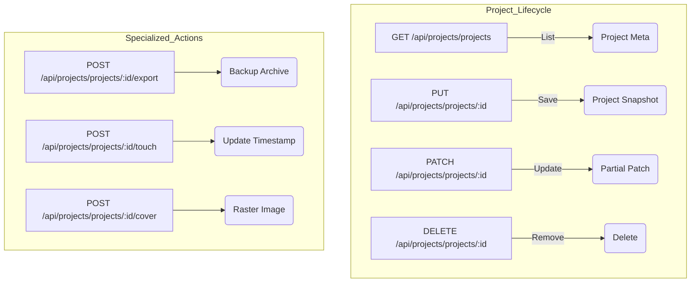
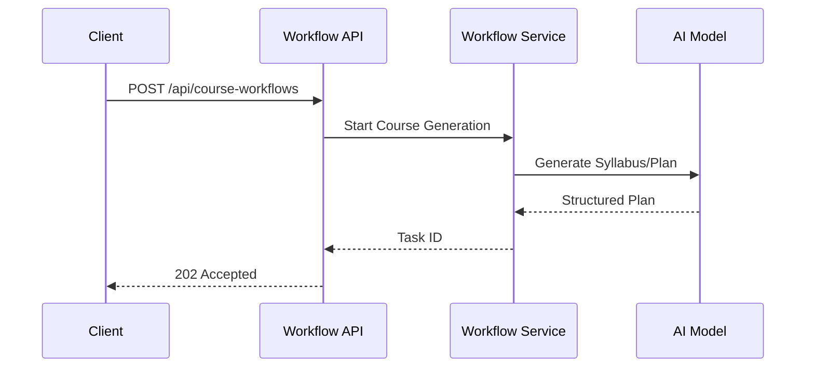

Relevant source files

The following files were used as context for generating this wiki page:

- [apps/backend/src/index.ts](apps/backend/src/index.ts)
- [apps/backend/tests/routes/projects.test.ts](apps/backend/tests/routes/projects.test.ts)
- [apps/backend/tests/integration/supabaseLocal.integration.test.ts](apps/backend/tests/integration/supabaseLocal.integration.test.ts)
- [scripts/feature-map.ts](scripts/feature-map.ts)
- [apps/backend/src/workflows/courseSourceFinalization.ts](apps/backend/src/workflows/courseSourceFinalization.ts)

# Backend REST Endpoints

## Introduction

The Lumina-Reader backend is built using Express and provides a comprehensive set of REST endpoints to manage AI-driven learning paths, document processing, and user interactions. The API serves as the orchestration layer between the Vite-based frontend, a PostgreSQL database (often managed via Supabase), and various AI services for lesson generation and research.

The architecture emphasizes secure access via Supabase Auth and robust data handling for large payloads, such as PDF documents and codebase archives. Endpoints are organized into specialized routers covering projects, workflows, chat, feedback, and administrative tasks.
Sources: [apps/backend/src/index.ts:7-60](apps/backend/src/index.ts#L7-L60), [README.md](README.md)

## Core API Architecture

The backend application is initialized through the `createApp` function, which configures global middleware including CORS, JSON body limits, and authentication resolvers. The API uses a layered routing structure where the main application mounts specific feature routers under the `/api` prefix.

### Request Pipeline and Middleware

Every request passing through the backend undergoes a standardized pipeline:
1.  **CORS Validation**: Restricts origins based on environment configuration or defaults (`localhost:5173`).
2.  **Authentication**: The `resolveCurrentUser` middleware identifies the user via Supabase JWTs.
3.  **Payload Parsing**: Specialized limits are applied to different routes (e.g., 300MB for projects, 160MB for PDFs).
4.  **Logging**: Synchronous logging of method, path, and status code.

Sources: [apps/backend/src/index.ts:133-186](apps/backend/src/index.ts#L133-L186), [apps/backend/src/index.ts:192-200](apps/backend/src/index.ts#L192-L200)

### Payload Limits

| Endpoint Group | JSON Body Limit | Purpose |
| :--- | :--- | :--- |
| `/api/openrouter` | 80mb | AI model proxy requests |
| `/api/pdf` | 160mb | Document processing |
| `/api/projects` | 300mb | Full project snapshots and imports |
| `/api/stt` | 20mb | Speech-to-text processing |
| `/api/feedback` | 2mb | User reports |

Sources: [apps/backend/src/index.ts:75-79](apps/backend/src/index.ts#L75-L79)

## Project Management Endpoints

The Project API is the most complex subsystem, handling the lifecycle of courses created from user documents. It supports standard CRUD operations alongside specialized binary transfers for source files.

### Endpoint Overview

The diagram shows the logical separation between standard CRUD and specialized project actions like exporting or updating cover images.
Sources: [apps/backend/tests/routes/projects.test.ts:114-150](apps/backend/tests/routes/projects.test.ts#L114-L150), [apps/backend/tests/routes/projects.test.ts:607-620](apps/backend/tests/routes/projects.test.ts#L607-L620)

### Binary Import and Chunking

To handle large codebase archives or high-resolution PDFs, the backend implements a chunked upload protocol. This prevents memory exhaustion and allows for resumable transfers.

*  **PUT `/api/projects/import/chunks/:uploadId/:chunkIndex`**: Receives a specific slice of data. Supported types are `application/octet-stream` and `text/plain`.
*  **POST `/api/projects/import/chunks/:uploadId/complete`**: Triggers the reassembly of chunks and finalizes the project creation.

Sources: [apps/backend/src/index.ts:173-181](apps/backend/src/index.ts#L173-L181), [apps/backend/tests/routes/projects.test.ts:241-310](apps/backend/tests/routes/projects.test.ts#L241-L310)

## Workflow and AI Endpoints

The backend coordinates long-running AI tasks through workflow routers. These endpoints trigger and monitor the generation of learning plans, lessons, and visual artifacts.

### Course Generation Sequence

The sequence illustrates the asynchronous nature of course generation triggered via REST endpoints.
Sources: [apps/backend/src/index.ts:228-251](apps/backend/src/index.ts#L228-L251), [apps/backend/src/workflows/courseSourceFinalization.ts:245-290](apps/backend/src/workflows/courseSourceFinalization.ts#L245-L290)

### Specialized Workflow Routes
*  **`/api/artifact-drafts`**: Manages temporary drafts of AI-generated interactive content.
*  **`/api/lesson-workflows`**: Specifically handles the iterative generation of lesson content and quizzes.
*  **`/api/course-interviews`**: Manages the initial interactive session used to define course scope.

Sources: [apps/backend/src/index.ts:219-242](apps/backend/src/index.ts#L219-L242)

## Administrative and System Endpoints

Administrative routes are restricted to users with the `admin` role in their Supabase JWT `app_metadata`.

| Path | Method | Description |
| :--- | :--- | :--- |
| `/api/admin/users` | POST | Creates a new user with specific roles |
| `/api/admin/model-config` | GET | Retrieves current AI model configurations (e.g., context model) |
| `/api/admin/users/:id/magic-link` | POST | Manually triggers a magic link email via Supabase |
| `/api/projects/import-diagnostics` | GET | Admin-only view of failed project imports for debugging |
| `/health` | GET | Public health check returning system status and timestamp |

Sources: [apps/backend/src/index.ts:275-277](apps/backend/src/index.ts#L275-L277), [apps/backend/tests/integration/supabaseLocal.integration.test.ts:115-130](apps/backend/tests/integration/supabaseLocal.integration.test.ts#L115-L130), [apps/backend/tests/integration/supabaseLocal.integration.test.ts:504-515](apps/backend/tests/integration/supabaseLocal.integration.test.ts#L504-L515)

## Conclusion

The Backend REST API provides the critical infrastructure for Lumina-Reader, managing everything from user authentication to complex AI workflows. By utilizing a modular router structure and strict payload limits, it maintains stability while processing large educational datasets. The integration with Supabase ensures that data isolation and security are maintained at the endpoint level, while specialized workflow routes enable the asynchronous generation of personalized learning experiences.
Sources: [apps/backend/src/index.ts:200-260](apps/backend/src/index.ts#L200-L260), [README.md](README.md)
