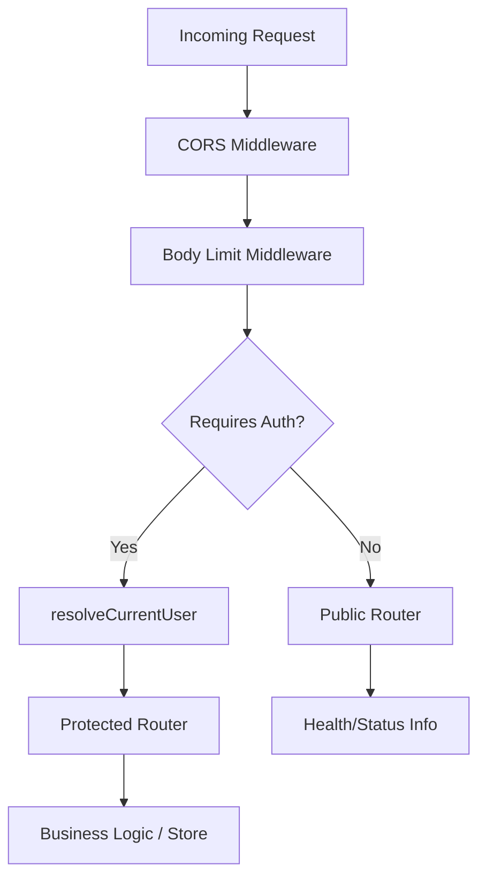
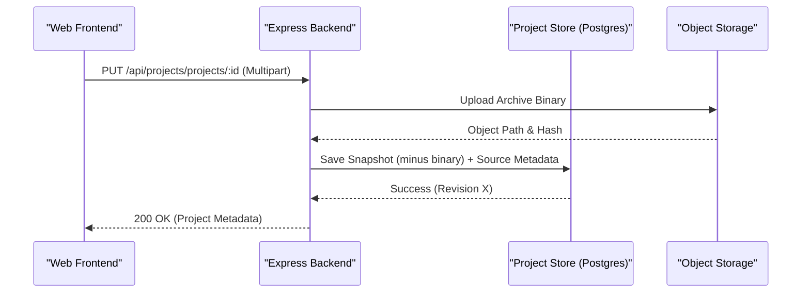

Relevant source files

The following files were used as context for generating this wiki page:

- [apps/backend/src/index.ts](../../../apps/backend/src/index.ts)
- [apps/backend/tests/routes/projects.test.ts](../../../apps/backend/tests/routes/projects.test.ts)
- [apps/backend/tests/integration/supabaseLocal.integration.test.ts](../../../apps/backend/tests/integration/supabaseLocal.integration.test.ts)
- [apps/backend/tests/routes/authProtection.test.ts](../../../apps/backend/tests/routes/authProtection.test.ts)
- [scripts/feature-map.ts](../../../scripts/feature-map.ts)
- [README.md](../../../README.md)

# Backend REST Endpoints

The Nous backend is an Express-based API server that facilitates document processing, AI-driven course generation, and project management. It serves as the bridge between the React frontend and various services including Supabase for authentication/persistence, PostgreSQL for metadata storage, and AI providers like OpenRouter or OpenAI.

The API is structured around functional domains such as `projects`, `workflows`, `auth`, and `feedback`. Most endpoints require authentication via Supabase JWTs, managed through a central middleware that resolves the current user context before passing requests to specific routers. Sources: [apps/backend/src/index.ts:1-70](../../../apps/backend/src/index.ts#L1-L70), [README.md:15-25](../../../README.md#L15-L25)

## API Architecture and Middleware

The backend application is initialized via the `createApp` function, which configures global middleware for CORS, JSON body parsing with specific limits per route, and request logging. Sources: [apps/backend/src/index.ts:109-150](../../../apps/backend/src/index.ts#L109-L150)

### Request Flow and Security
Authentication is enforced at the router level using `resolveCurrentUser`. However, certain utility endpoints remain public to support deployment health checks and environment status monitoring. Sources: [apps/backend/tests/routes/authProtection.test.ts:38-50](../../../apps/backend/tests/routes/authProtection.test.ts#L38-L50)

Every request receives a canonical lowercase UUID correlation ID before CORS and route handling. A valid incoming `x-request-id` is reused, otherwise the backend creates one; the same value is exposed in the response header and attached to content-free lifecycle records for completion, failure, cancellation, and disconnect diagnosis. Backend exception details remain internal, while client-facing error messages stay stable. Sources: [apps/backend/src/index.ts](apps/backend/src/index.ts), [apps/backend/src/workflows/requestObservability.ts](apps/backend/src/workflows/requestObservability.ts), [apps/backend/tests/index.test.ts](apps/backend/tests/index.test.ts)

*The request flow ensures that sensitive data operations are protected by identity resolution while maintaining accessibility for infrastructure monitoring.* Sources: [apps/backend/src/index.ts:152-200](../../../apps/backend/src/index.ts#L152-L200)

### Payload Limits
To accommodate large document uploads (e.g., PDFs and ZIP archives) while protecting the server, Nous implements tiered JSON body limits:

| Route Prefix | Limit | Purpose |
| :--- | :--- | :--- |
| `/api/projects` | 300mb | Project snapshots and metadata |
| `/api/pdf` | 160mb | PDF extraction data |
| `/api/openrouter` | 80mb | AI model interaction |
| `/api/stt` | 20mb | Speech-to-text audio data |
| `/api/feedback` | 2mb | User feedback reports |
| Default | 50mb | General API interactions |

Sources: [apps/backend/src/index.ts:72-80](../../../apps/backend/src/index.ts#L72-L80)

## Project Management Endpoints

The `/api/projects` router manages the lifecycle of courses, including creation, updates, favorites, and source file handling. Sources: [apps/backend/tests/routes/projects.test.ts:98-130](../../../apps/backend/tests/routes/projects.test.ts#L98-L130)

### Core Operations
*  **GET `/api/projects/projects`**: Lists metadata for all projects owned by the authenticated user.
*  **PUT `/api/projects/projects/:id`**: Saves or updates a full project snapshot. It handles both JSON and multipart/form-data for binary source attachments.
*  **PATCH `/api/projects/projects/:id`**: Performs partial updates, such as renaming a title or updating the active section, while maintaining revision consistency to prevent stale overwrites.
*  **DELETE `/api/projects/projects/:id`**: Removes a project and its associated storage artifacts.

Sources: [apps/backend/tests/routes/projects.test.ts:104-140](../../../apps/backend/tests/routes/projects.test.ts#L104-L140), [apps/backend/src/index.ts:203-210](../../../apps/backend/src/index.ts#L203-L210)

### Source and Archive Handling
Nous uses a specialized flow for importing codebase archives and PDFs. Binary data is often stored in immutable object storage (Supabase Storage) rather than the main database, with the REST API providing access to these "detached" sources. Sources: [apps/backend/tests/integration/supabaseLocal.integration.test.ts:275-300](../../../apps/backend/tests/integration/supabaseLocal.integration.test.ts#L275-L300)

*Sequence for handling binary project sources, separating metadata from heavy binary payloads.* Sources: [apps/backend/tests/routes/projects.test.ts:316-340](../../../apps/backend/tests/routes/projects.test.ts#L316-L340)

## Workflow and AI Endpoints

Workflows represent long-running asynchronous processes, such as generating a course plan or writing individual lessons. Sources: [apps/backend/src/index.ts:213-230](../../../apps/backend/src/index.ts#L213-L230)

### Specialized Routers
*  **`/api/course-workflows`**: Manages the generation of course structures from sources.
*  **`/api/lesson-workflows`**: Handles the iterative writing and refining of lesson content.
*  **`/api/course-interviews`**: Manages interactive AI "interviews" to refine course topics.
*  **`/api/artifact-drafts`**: Handles drafts for visual or interactive components within lessons.

Sources: [apps/backend/src/index.ts:214-228](../../../apps/backend/src/index.ts#L214-L228)

### AI Proxying
The `/api/openrouter` and `/api/codex` endpoints act as authenticated proxies to external AI providers. This allows the frontend to interact with models without exposing sensitive API keys directly in the browser. Sources: [apps/backend/src/index.ts:231-235](../../../apps/backend/src/index.ts#L231-L235), [README.md:27-35](../../../README.md#L27-L35)

## Administrative and System Endpoints

Administrative features are restricted to users with the `admin` role in their Supabase JWT. Sources: [apps/backend/tests/integration/supabaseLocal.integration.test.ts:150-165](../../../apps/backend/tests/integration/supabaseLocal.integration.test.ts#L150-L165)

*  **`/api/admin/users`**: (POST) Allows creating new users with specific roles, used for initial setup and invitation flows.
*  **`/api/admin/model-config`**: (GET) Retrieves global model settings, such as which AI models are used for drafting vs. structure generation.
*  **`/api/admin/workflow-outbox`**: Provides visibility into the background task queue and outbox state.
*  **`/api/status`**: A public endpoint returning the current server status and configuration flags.

Sources: [apps/backend/src/index.ts:238-245](../../../apps/backend/src/index.ts#L238-L245), [apps/backend/tests/integration/supabaseLocal.integration.test.ts:470-485](../../../apps/backend/tests/integration/supabaseLocal.integration.test.ts#L470-L485)

## Conclusion

The Backend REST API provides a multi-layered interface for the Nous application. Express routes apply authentication and body-limit middleware before delegating to the project, workflow, and provider routers. Sources: [apps/backend/src/index.ts:176-265](../../../apps/backend/src/index.ts#L176-L265)
