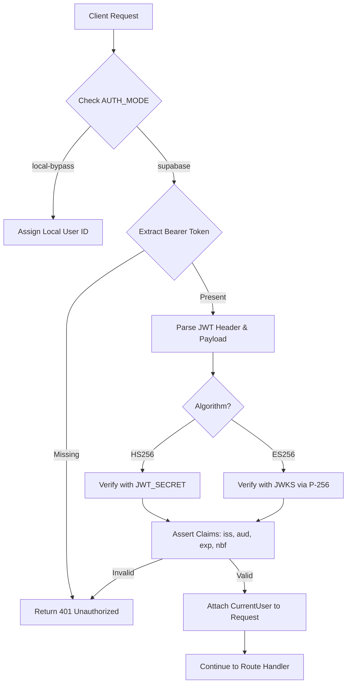
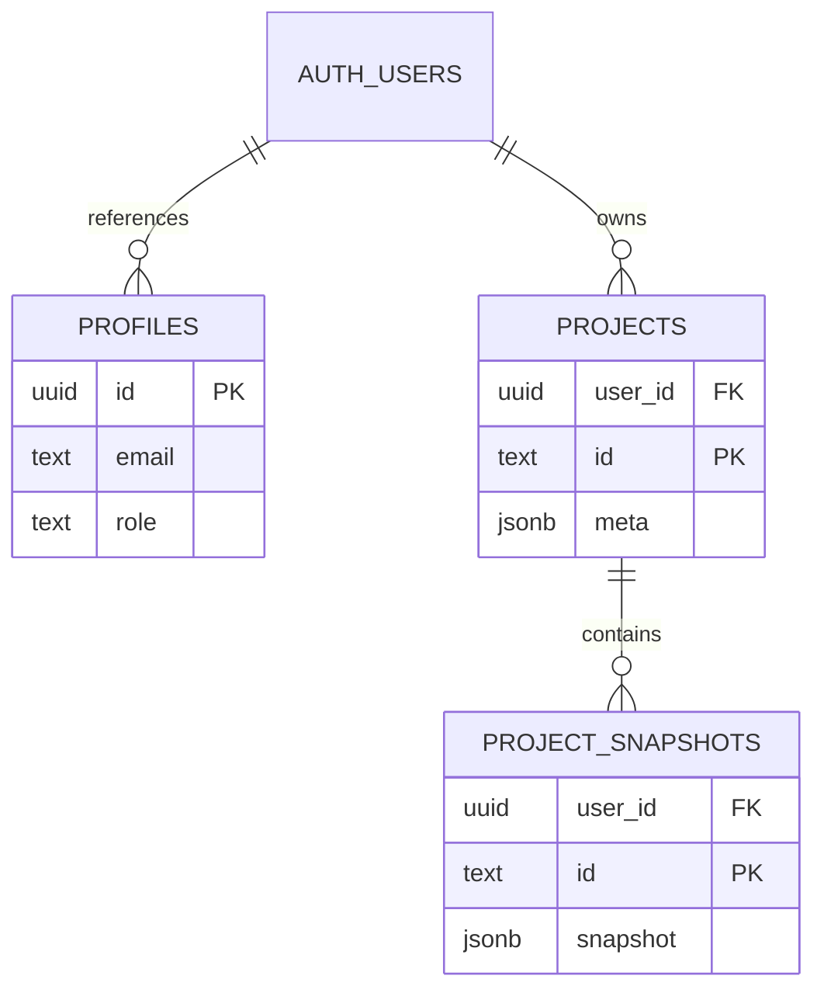

<details>
<summary>Relevant source files</summary>

The following files were used as context for generating this wiki page:

- [apps/backend/src/auth/currentUser.ts](../../../apps/backend/src/auth/currentUser.ts)
- [supabase/migrations/202607070001_initial_user_backend.sql](../../../supabase/migrations/202607070001_initial_user_backend.sql)
- [apps/backend/tests/integration/supabaseLocal.integration.test.ts](../../../apps/backend/tests/integration/supabaseLocal.integration.test.ts)
- [README.md](../../../README.md)
- [scripts/sync-supabase-auth-emails.ts](../../../scripts/sync-supabase-auth-emails.ts)
- [apps/backend/tests/routes/projects.test.ts](../../../apps/backend/tests/routes/projects.test.ts)

</details>

# Authentication & Access Control

Authentication and Access Control in Nous Reader is built upon a hybrid architecture utilizing Supabase Auth for identity management and PostgreSQL Row Level Security (RLS) for data isolation. The system supports multiple operational modes, including a production-ready Supabase JWT integration and a local development bypass for testing. Access control is enforced at both the API layer via Express middleware and the database layer via RLS policies, ensuring that users can only access projects, profiles, and configurations relevant to their account.

Sources: [README.md:46-55](../../../README.md#L46-L55), [apps/backend/src/auth/currentUser.ts:12-22](../../../apps/backend/src/auth/currentUser.ts#L12-L22)

## Authentication Architecture

The system utilizes an Express-based backend that resolves users through JWT validation. The primary identity provider is Supabase, which issues tokens that the backend verifies using either HS256 (symmetric) or ES256 (asymmetric) algorithms. 

### Identity Resolution Flow

When a request reaches the backend, the `resolveCurrentUser` middleware extracts the Bearer token and validates its claims against the configured Supabase issuer.



The diagram shows the logic flow for identifying a user from an incoming HTTP request, including support for both standard Supabase auth and developer bypass modes.
Sources: [apps/backend/src/auth/currentUser.ts:182-297](../../../apps/backend/src/auth/currentUser.ts#L182-L297)

### Authentication Modes

The system dynamically selects an authentication strategy based on environment variables.

| Mode | Trigger Condition | Behavior |
| :--- | :--- | :--- |
| `supabase` | Default / Production | Full JWT validation against Supabase issuer. |
| `local-bypass` | `LOCAL_AUTH_BYPASS=true` & `LOCAL_DEV_PROFILE=true` | Injects a static `local-user` ID for rapid development. |
| `test` | `NODE_ENV=test` | Automatically defaults to `local-bypass` unless RLS tests are explicitly run. |

Sources: [apps/backend/src/auth/currentUser.ts:42-53](../../../apps/backend/src/auth/currentUser.ts#L42-L53), [README.md:50-55](../../../README.md#L50-L55)

## Database Security and RLS

Access control is strictly enforced at the database level using PostgreSQL Row Level Security. This ensures that even if API-level checks are bypassed, the database itself prevents cross-tenant data access.

### RLS Policy Definitions

The database schema defines specific policies for each table to isolate data by `user_id`.



The ER diagram illustrates the relationship between the central Supabase Auth table and the public application tables, which are isolated by the `user_id` foreign key.
Sources: [supabase/migrations/202607070001_initial_user_backend.sql:1-40](../../../supabase/migrations/202607070001_initial_user_backend.sql#L1-L40)

| Table | Policy Name | Access Logic |
| :--- | :--- | :--- |
| `public.profiles` | `profiles readable by owner or admin` | `auth.uid() = id OR is_admin()` |
| `public.projects` | `projects isolated by owner` | `auth.uid() = user_id` |
| `public.project_snapshots` | `project snapshots isolated by owner` | `auth.uid() = user_id` |
| `public.model_config` | `readable by authenticated` | `auth.role() = 'authenticated'` |

Sources: [supabase/migrations/202607070001_initial_user_backend.sql:63-107](../../../supabase/migrations/202607070001_initial_user_backend.sql#L63-L107)

### Role-Based Access Control (RBAC)

Nous Reader implements administrative overrides using custom JWT claims stored in `app_metadata`. A SQL helper function `is_admin()` checks the `role` claim within the JWT to grant elevated permissions for global configurations and user management.

```sql
create or replace function public.is_admin()
returns boolean
language sql
stable
as $$
  select coalesce(auth.jwt() -> 'app_metadata' ->> 'role', '') = 'admin';
$$;
```

Sources: [supabase/migrations/202607070001_initial_user_backend.sql:53-61](../../../supabase/migrations/202607070001_initial_user_backend.sql#L53-L61), [apps/backend/src/auth/currentUser.ts:160-163](../../../apps/backend/src/auth/currentUser.ts#L160-L163)

## Secure Workflow for New Users

Access control includes a "Password Setup" state. When users are invited via the Admin API, they are tagged with a `password_setup_required` metadata flag.

1.  **Restricted State**: Users with the `password_setup_required` flag are blocked from standard project routes (403 Forbidden).
2.  **Auth Resolution**: The `resolveCurrentUserForPasswordSetup` middleware allows these users to access specific auth routes to complete their profile.
3.  **Credential Refresh**: Once the password is set, the user must re-authenticate to obtain a fresh JWT without the restriction flag.

Sources: [apps/backend/src/auth/currentUser.ts:303-317](../../../apps/backend/src/auth/currentUser.ts#L303-L317), [apps/backend/tests/integration/supabaseLocal.integration.test.ts:466-498](../../../apps/backend/tests/integration/supabaseLocal.integration.test.ts#L466-L498)

## Integration with External Services

### Supabase Management API
For production deployments, the project includes scripts to sync local email templates with the hosted Supabase Management API. This uses the `SUPABASE_ACCESS_TOKEN` and `SUPABASE_PROJECT_REF` to patch auth configurations.
Sources: [scripts/sync-supabase-auth-emails.ts:25-60](../../../scripts/sync-supabase-auth-emails.ts#L25-L60)

### Local Development Probe
The `bun run doctor` utility performs health checks on the local Supabase Auth stack, verifying that the Auth, REST, and Storage services are reachable and that migration parity exists between the local environment and the database.
Sources: [scripts/doctor.ts:285-325](../../../scripts/doctor.ts#L285-L325)

Authentication and Access Control in Nous Reader provides a multi-layered defense-in-depth strategy. By combining JWT-based identity resolution in the backend with granular RLS policies in the database, the system ensures data privacy and strict user isolation across all environments.
