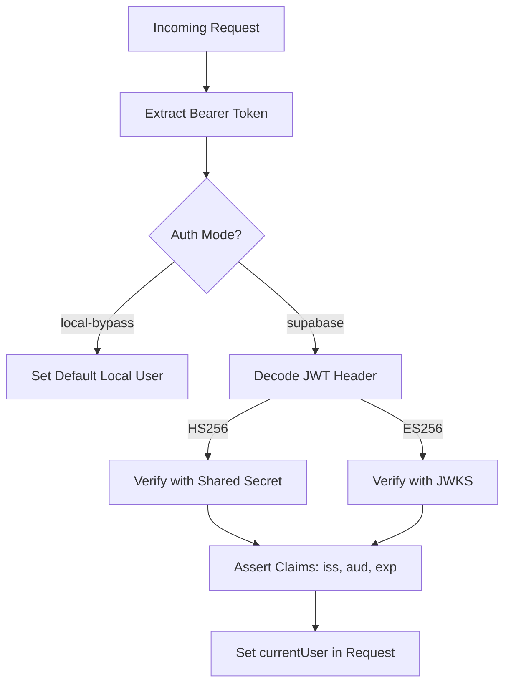
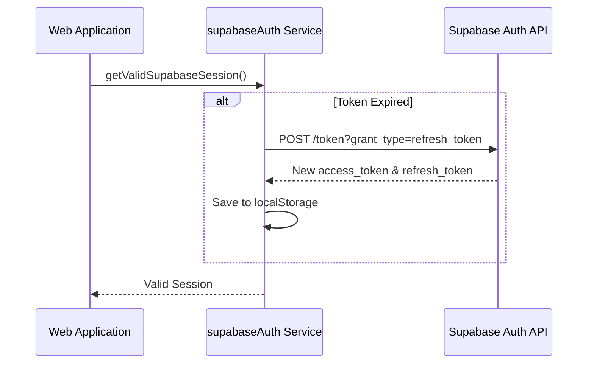

Relevant source files

The following files were used as context for generating this wiki page:

- [apps/backend/src/auth/currentUser.ts](apps/backend/src/auth/currentUser.ts)
- [apps/web/tests/services/auth/supabaseAuth.test.ts](apps/web/tests/services/auth/supabaseAuth.test.ts)
- [scripts/sync-supabase-auth-emails.ts](scripts/sync-supabase-auth-emails.ts)
- [supabase/migrations/202607070001_initial_user_backend.sql](supabase/migrations/202607070001_initial_user_backend.sql)
- [apps/backend/tests/integration/supabaseLocal.integration.test.ts](apps/backend/tests/integration/supabaseLocal.integration.test.ts)
- [scripts/supabaseAuthTemplates.ts](scripts/supabaseAuthTemplates.ts)
- [README.md](README.md)

# Authentication & Access Control

Authentication and Access Control in Nous is primarily managed through **Supabase Auth**, leveraging JSON Web Tokens (JWT) for session management and PostgreSQL **Row Level Security (RLS)** for data isolation. The system supports multiple authentication modes, including a local bypass for development and testing environments.

The architecture ensures that user data—such as projects, profiles, and library placements—is strictly isolated so that users can only access their own resources. Administrative access is granted through specific claims within the JWT `app_metadata`, allowing for elevated operations like user management and global configuration overrides.
Sources: [README.md:43-52](README.md#L43-L52), [supabase/migrations/202607070001_initial_user_backend.sql:79-110](supabase/migrations/202607070001_initial_user_backend.sql#L79-L110)

## Authentication Modes

The system determines its authentication behavior based on environment variables. It primarily operates in two modes: `supabase` and `local-bypass`.

| Mode | Description | Configuration |
| :--- | :--- | :--- |
| **Supabase** | Production-standard mode using Supabase JWTs (HS256 or ES256). | `AUTH_MODE=supabase` |
| **Local Bypass** | Development/Test mode that skips external auth and uses a static local user. | `LOCAL_AUTH_BYPASS=true` |

Sources: [apps/backend/src/auth/currentUser.ts:31-48](apps/backend/src/auth/currentUser.ts#L31-L48), [README.md:45-48](README.md#L45-L48)

### JWT Validation Logic
The backend validates incoming Bearer tokens from the `Authorization` header. It supports both symmetric (HS256) using a `SUPABASE_JWT_SECRET` and asymmetric (ES256) verification via JWKS (JSON Web Key Sets) fetched from the Supabase management endpoint.

Sources: [apps/backend/src/auth/currentUser.ts:55-75](apps/backend/src/auth/currentUser.ts#L55-L75), [apps/backend/src/auth/currentUser.ts:167-200](apps/backend/src/auth/currentUser.ts#L167-L200)

## Access Control & Data Isolation

Access control is enforced at the database layer using PostgreSQL Row Level Security (RLS). This ensures that even if application logic fails, the database prevents unauthorized cross-tenant data access.

### Row Level Security (RLS) Policies
The following table summarizes the RLS policies defined in the initial migration:

| Table | Policy Name | Logic |
| :--- | :--- | :--- |
| `profiles` | profiles readable by owner or admin | `auth.uid() = id OR is_admin()` |
| `projects` | projects isolated by owner | `auth.uid() = user_id` |
| `project_snapshots` | snapshots isolated by owner | `auth.uid() = user_id` |
| `library_folders` | folders isolated by owner | `auth.uid() = user_id` |
| `model_config` | readable by authenticated | `auth.role() = 'authenticated'` |

Sources: [supabase/migrations/202607070001_initial_user_backend.sql:85-110](supabase/migrations/202607070001_initial_user_backend.sql#L85-L110)

### Administrative Privileges
Administrative status is determined by the `is_admin()` SQL function, which checks for the `role` field inside the JWT's `app_metadata`.
Sources: [supabase/migrations/202607070001_initial_user_backend.sql:71-77](supabase/migrations/202607070001_initial_user_backend.sql#L71-L77)

## Session Management (Frontend)

The frontend manages authentication state by storing the Supabase session in `localStorage`. It handles proactive token refreshing to prevent session expiration during active use.

### Token Refresh Flow
The frontend schedules a refresh before the `access_token` expires. If a request returns a `401 Unauthorized`, the system attempts a single refresh using the `refresh_token` before failing the request.

Sources: [apps/web/tests/services/auth/supabaseAuth.test.ts:182-205](apps/web/tests/services/auth/supabaseAuth.test.ts#L182-L205), [apps/web/tests/services/auth/supabaseAuth.test.ts:246-270](apps/web/tests/services/auth/supabaseAuth.test.ts#L246-L270)

### Password Setup Flow
A specific state `password_setup_required` can be flagged in `app_metadata`. This is used for invited users who must set a password before accessing project resources. The backend middleware `resolveCurrentUser` rejects requests with a `403 password_setup_required` if this flag is present and the endpoint is not explicitly allowed for setup.
Sources: [apps/backend/src/auth/currentUser.ts:243-252](apps/backend/src/auth/currentUser.ts#L243-L252), [apps/backend/tests/integration/supabaseLocal.integration.test.ts:400-415](apps/backend/tests/integration/supabaseLocal.integration.test.ts#L400-L415)

## Email Branding & Synchronization

Nous uses branded email templates for `confirmation`, `invite`, `magic_link`, and `recovery`. These templates are stored locally in `supabase/templates/` and can be synchronized with the hosted Supabase instance using a management API script.

### Template Sync Components
1.  **Local Templates**: HTML files located in `supabase/templates/`.
2.  **Sync Script**: `scripts/sync-supabase-auth-emails.ts` compares local templates with the hosted config and applies patches.
3.  **Template Builder**: `scripts/supabaseAuthTemplates.ts` maps internal template kinds to Supabase mailer configuration keys.

| Template Kind | Supabase Configuration Key |
| :--- | :--- |
| `invite` | `mailer_subjects_invite`, `mailer_templates_invite_content` |
| `magic_link` | `mailer_subjects_magic_link`, `mailer_templates_magic_link_content` |
| `recovery` | `mailer_subjects_recovery`, `mailer_templates_recovery_content` |

Sources: [scripts/supabaseAuthTemplates.ts:20-45](scripts/supabaseAuthTemplates.ts#L20-L45), [scripts/sync-supabase-auth-emails.ts:51-70](scripts/sync-supabase-auth-emails.ts#L51-L70)

Authentication in Nous is a multi-layered system combining JWT-based identity verification, RLS-driven data isolation, and automated session maintenance. This ensures a secure, tenant-isolated environment for user projects while providing administrative oversight through metadata-driven roles.
