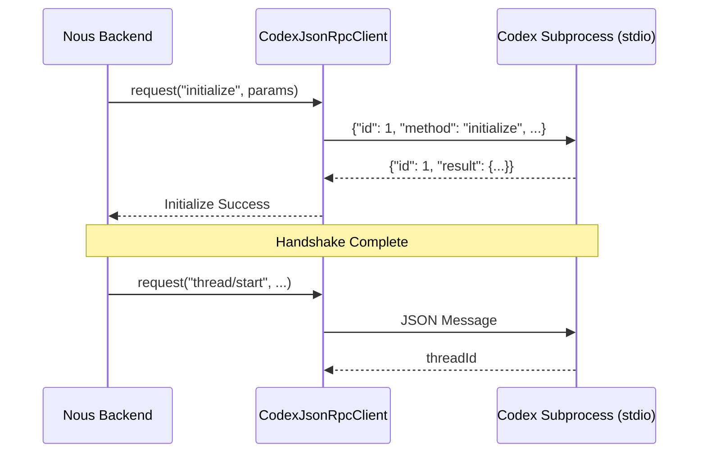
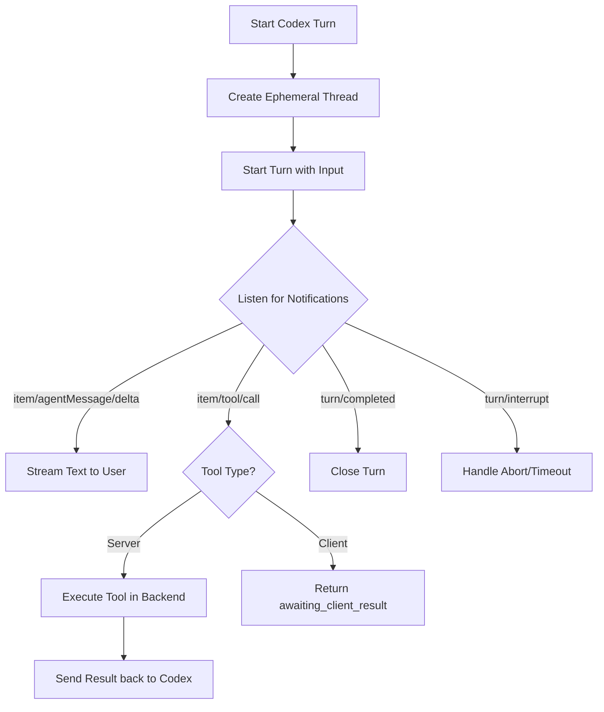

<details>
<summary>Relevant source files</summary>

The following files were used as context for generating this wiki page:

- [apps/backend/src/services/codexAppServer.ts](apps/backend/src/services/codexAppServer.ts)
- [apps/backend/tests/services/codexAppServer.test.ts](apps/backend/tests/services/codexAppServer.test.ts)
- [apps/backend/src/routes/openRouterProxy.ts](apps/backend/src/routes/openRouterProxy.ts)
- [apps/backend/src/services/codexChatStream.ts](apps/backend/src/services/codexChatStream.ts)
- [README.md](README.md)
- [apps/web/components/admin/CodexConnectionSettings.tsx](apps/web/components/admin/CodexConnectionSettings.tsx)

</details>

# Codex App Server Mode

Codex App Server Mode is a specialized integration within Nous Reader that allows the platform to utilize a private ChatGPT/Codex account via a local `codex app-server` process. This mode is designed for self-hosted instances where administrators want to provide AI capabilities to users without exposing or sharing centralized API keys (like OpenAI or OpenRouter) for every transaction. Instead, the backend manages a single authenticated Codex account and routes requests through a private JSON-RPC over stdio protocol.

When enabled via the `CODEX_APP_SERVER_ENABLED` environment variable, the Nous backend spawns a `codex` binary as a subprocess. This process serves authenticated administrators and specifically assigned users. The integration ensures that the app-server remains private to the backend, while remote users interact with Nous through its standard authenticated HTTPS API. Sources: [README.md:22-26](README.md#L22-L26), [apps/backend/src/services/codexAppServer.ts:321-322](apps/backend/src/services/codexAppServer.ts#L321-L322)

## Architecture and Protocol

The system utilizes a JSON-RPC 2.0-like protocol (without the `jsonrpc` key requirement) communicated over standard input/output (stdio) to the spawned Codex process.

### Subprocess Management
The backend manages the lifecycle of the Codex process using `Bun.spawn`. The environment provided to this process is strictly sanitized to include only safe variables (e.g., `PATH`, `TEMP`, `HOME`) to prevent sensitive backend credentials (like `OPENROUTER_API_KEY`) from reaching the AI environment. Sources: [apps/backend/src/services/codexAppServer.ts:291-320](apps/backend/src/services/codexAppServer.ts#L291-L320), [apps/backend/tests/services/codexAppServer.test.ts:98-110](apps/backend/tests/services/codexAppServer.test.ts#L98-L110)

### Communication Flow
The `CodexJsonRpcClient` class handles the low-level communication, including sending requests, receiving notifications (deltas), and managing timeouts.



The diagram shows the mandatory handshake and initial thread creation sequence. Sources: [apps/backend/src/services/codexAppServer.ts:133-149](apps/backend/src/services/codexAppServer.ts#L133-L149), [apps/backend/tests/services/codexAppServer.test.ts:131-182](apps/backend/tests/services/codexAppServer.test.ts#L131-L182)

## Key System Components

### Protocol Handshake and Account Management
Before any AI turns are executed, the client must perform an initialization handshake. The backend also supports device-code login flows to authenticate the Codex account.

| Feature | Description | File Reference |
| :--- | :--- | :--- |
| **Initialize** | Mandatory handshake sending client info (`nous_reader`) and capabilities. | `codexAppServer.ts:335-345` |
| **Account Read** | Checks if the account is authenticated and requires OpenAI Auth. | `codexAppServer.ts:397-398` |
| **Device Login** | Starts `chatgptDeviceCode` flow for account linking. | `codexAppServer.ts:377-380` |
| **Model Listing** | Paginates through available Codex models (e.g., GPT-4o). | `codexAppServer.ts:400-428` |

### Security and Sandboxing
To maintain security, the Codex process is configured with several restrictions:
*  **Disabled Features:** Built-in capabilities like `shell_tool`, `browser_use`, `computer_use`, and `plugins` are explicitly disabled. Sources: [apps/backend/src/services/codexAppServer.ts:25-45](apps/backend/src/services/codexAppServer.ts#L25-L45)
*  **Sandbox Policy:** The execution environment for threads is set to `read-only`. Sources: [apps/backend/src/services/codexAppServer.ts:499](apps/backend/src/services/codexAppServer.ts#L499), [apps/backend/src/services/codexAppServer.ts:592](apps/backend/src/services/codexAppServer.ts#L592)
*  **Base Instructions:** A system-level prompt prevents the model from inspecting the host filesystem or environment. Sources: [apps/backend/src/services/codexAppServer.ts:10-12](apps/backend/src/services/codexAppServer.ts#L10-L12)

## Execution Model: The "Turn"

A turn represents a single interaction within an ephemeral thread. The system supports streaming text, reasoning deltas, and tool execution.

### Tool Execution (Dynamic Tools)
Nous Reader can register dynamic tools that the Codex model can call. These are split into two types:
1.  **Server Tools:** Executed directly by the Nous backend (e.g., searching a local library).
2.  **Client Tools:** The backend returns a status of `awaiting_client_result`, signaling the frontend to handle the action (e.g., adding a note).



The flowchart illustrates the lifecycle of an AI turn and the handling of various notification types. Sources: [apps/backend/src/services/codexAppServer.ts:460-575](apps/backend/src/services/codexAppServer.ts#L460-L575), [apps/backend/src/services/codexChatStream.ts:89-130](apps/backend/src/services/codexChatStream.ts#L89-L130)

### Error Handling and Timeouts
The system enforces strict timeouts for both protocol requests (30s) and AI turns (10m).

```typescript
// From apps/backend/src/services/codexAppServer.ts
const CODEX_REQUEST_TIMEOUT_MS = 30_000;
const CODEX_TURN_TIMEOUT_MS = 10 * 60_000;

export class CodexAppServerError extends Error {
  constructor(
    message: string,
    readonly code: 'disabled' | 'not_authenticated' | 'process' | 'protocol' | 'timeout'
  ) {
    super(message);
    this.name = 'CodexAppServerError';
  }
}
```

Sources: [apps/backend/src/services/codexAppServer.ts:7-8](apps/backend/src/services/codexAppServer.ts#L7-L8), [apps/backend/src/services/codexAppServer.ts:114-121](apps/backend/src/services/codexAppServer.ts#L114-L121)

## Integration with OpenRouter Proxy

Nous provides an `openRouterProxy.ts` that allows the frontend to use a unified OpenAI-compatible API even when Codex App Server is the underlying provider.

*  **Model Mapping:** Requests sent to specific "slots" (e.g., `lesson`, `research`) are mapped to the configured Codex model. Sources: [apps/backend/src/routes/openRouterProxy.ts:98-120](apps/backend/src/routes/openRouterProxy.ts#L98-L120)
*  **SSE Translation:** The proxy translates JSON-RPC notifications from Codex (like `item/agentMessage/delta`) into standard OpenAI Server-Sent Events (SSE). Sources: [apps/backend/src/routes/openRouterProxy.ts:275-300](apps/backend/src/routes/openRouterProxy.ts#L275-L300)
*  **Web Search:** Live web search is enabled only when the request specifically targets the `research` slot. Sources: [apps/backend/src/routes/openRouterProxy.ts:312-314](apps/backend/src/routes/openRouterProxy.ts#L312-L314)

## Summary
Codex App Server Mode provides a secure, efficient way for self-hosted Nous Reader instances to leverage high-quality AI models via a standard ChatGPT account. By utilizing a JSON-RPC over stdio protocol with strict environment sanitization and feature disabling, it balances pedagogical power with host system security. Sources: [apps/backend/src/services/codexAppServer.ts:1-70](apps/backend/src/services/codexAppServer.ts#L1-L70), [apps/backend/src/routes/openRouterProxy.ts:30-40](apps/backend/src/routes/openRouterProxy.ts#L30-L40)
