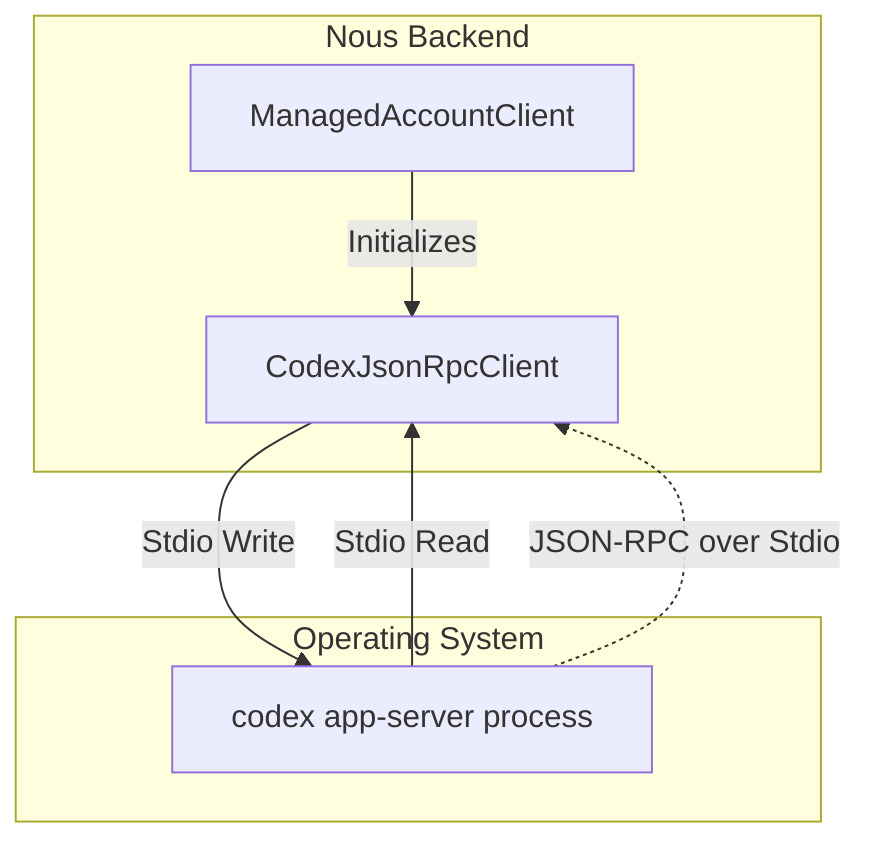
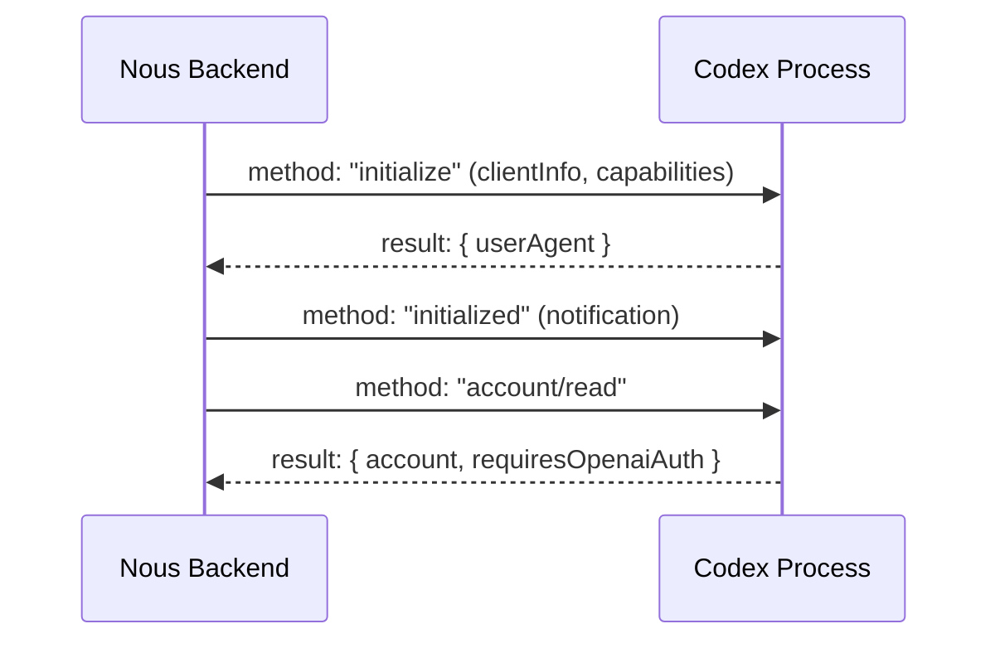

<details>
<summary>Relevant source files</summary>

The following files were used as context for generating this wiki page:

- [apps/backend/src/services/codexAppServer.ts](apps/backend/src/services/codexAppServer.ts)
- [apps/backend/tests/services/codexAppServer.test.ts](apps/backend/tests/services/codexAppServer.test.ts)
- [apps/backend/src/services/codexChatStream.ts](apps/backend/src/services/codexChatStream.ts)
- [apps/web/components/admin/CodexConnectionSettings.tsx](apps/web/components/admin/CodexConnectionSettings.tsx)
- [apps/backend/tests/routes/openRouterProxy.test.ts](apps/backend/tests/routes/openRouterProxy.test.ts)
- [README.md](README.md)
</details>

# Codex App Server Mode

Codex App Server Mode is a specialized integration within the Nous Reader backend that allows the application to utilize a local ChatGPT/Codex account via the `codex` CLI. This mode enables self-hosted instances to leverage authenticated AI capabilities without requiring the exposure of OpenAI API keys or credentials directly to the project. It functions by spawning a `codex app-server` process that handles authentication, token management, and execution of AI turns through a JSON-RPC over stdio protocol.

When enabled via the `CODEX_APP_SERVER_ENABLED=true` environment variable, a single internal process serves administrators and assigned users. This architectural choice keeps the app-server private to the backend, while remote users interact with Nous through its standard HTTPS API. This mode is primarily intended for hosted/shared deployments or local development where direct account access is preferred over standard API providers like OpenRouter or OpenAI.

Sources: [README.md:19-24](README.md#L19-L24), [apps/backend/src/services/codexAppServer.ts:258-259](apps/backend/src/services/codexAppServer.ts#L258-L259)

## System Architecture

The Codex integration is built around a JSON-RPC client-server relationship where the Nous Reader backend acts as the client and the `codex` binary acts as the server.

### Process Management
The system spawns the Codex process using `Bun.spawn` with specific security configurations. It enforces a strict environment policy by inheriting only "safe" environment variables (e.g., `PATH`, `TEMP`, `USER`) and disabling most built-in Codex capabilities to ensure a read-only, sandboxed execution environment.



The diagram shows the communication flow between the Nous backend and the underlying Codex process.
Sources: [apps/backend/src/services/codexAppServer.ts:133-145](apps/backend/src/services/codexAppServer.ts#L133-L145), [apps/backend/src/services/codexAppServer.ts:285-300](apps/backend/src/services/codexAppServer.ts#L285-L300), [apps/backend/tests/services/codexAppServer.test.ts:101-115](apps/backend/tests/services/codexAppServer.test.ts#L101-L115)

### Core Components and Classes

| Component | Description |
| :--- | :--- |
| `CodexJsonRpcClient` | Handles bidirectional JSON-RPC communication, request timeouts, and event notifications over stdio. |
| `spawnCodexAppServer` | Factory function that configures the `codex` binary arguments, working directory, and restricted environment. |
| `CodexAppServerError` | Custom error class classifying failures as `disabled`, `not_authenticated`, `process`, `protocol`, or `timeout`. |
| `ManagedAccountClient` | A singleton-pattern promise that maintains a shared connection for authenticated account operations. |

Sources: [apps/backend/src/services/codexAppServer.ts:133-255](apps/backend/src/services/codexAppServer.ts#L133-L255), [apps/backend/src/services/codexAppServer.ts:117-125](apps/backend/src/services/codexAppServer.ts#L117-L125), [apps/backend/src/services/codexAppServer.ts:333-340](apps/backend/src/services/codexAppServer.ts#L333-L340)

## Protocol Interaction Flow

The interaction with Codex follows a strict sequence: initialization, authentication verification, and turn execution.

### Connection Initialization
Before any AI tasks are performed, the client executes a mandatory handshake.
1.  **Initialize**: The client sends `initialize` with `clientInfo` (Nous Reader) and experimental API capabilities.
2.  **Initialized**: The client sends an `initialized` notification after a successful response.
3.  **Account Check**: The client verifies authentication status via `account/read`.



Sequence of the mandatory handshake during process startup.
Sources: [apps/backend/src/services/codexAppServer.ts:318-329](apps/backend/src/services/codexAppServer.ts#L318-L329), [apps/backend/tests/services/codexAppServer.test.ts:125-144](apps/backend/tests/services/codexAppServer.test.ts#L125-L144)

### Turn Execution & Tool Calling
Turn execution is asynchronous and supports streaming deltas and tool calls. A "turn" typically involves sending user input and developer instructions to a specific model.

*  **Dynamic Tools**: Nous can provide tools to Codex. If a tool has an `execute` function, it runs on the **server** (Nous backend). If not, it is treated as a **client** tool delegated back to the user interface.
*  **Deltas**: Text and reasoning deltas are streamed back via notifications (`item/agentMessage/delta`, `item/reasoning/textDelta`).
*  **Interruption**: Turns can be interrupted via `turn/interrupt` if an `AbortSignal` is triggered or a timeout (default 10 minutes) occurs.

Sources: [apps/backend/src/services/codexAppServer.ts:474-510](apps/backend/src/services/codexAppServer.ts#L474-L510), [apps/backend/src/services/codexAppServer.ts:8-9](apps/backend/src/services/codexAppServer.ts#L8-L9), [apps/backend/src/services/codexChatStream.ts:101-115](apps/backend/src/services/codexChatStream.ts#L101-L115)

## Authentication and Login

Codex App Server Mode supports a device code login flow for OpenAI/ChatGPT accounts. This allows users to authenticate the local process without sharing passwords with the application.

### Authentication State Management
The UI monitors the connection status using polling when a login is in progress.

| Function | Endpoint/Method | Purpose |
| :--- | :--- | :--- |
| `startCodexDeviceLogin` | `account/login/start` | Initiates device-code flow, returning a `userCode` and `verificationUrl`. |
| `cancelCodexLogin` | `account/login/cancel` | Aborts a pending device login attempt. |
| `logoutCodexAccount` | `account/logout` | Clears the authenticated session and resets the managed client. |
| `readCodexAccount` | `account/read` | Retrieves email and account type (e.g., 'plus', 'chatgpt'). |

Sources: [apps/backend/src/services/codexAppServer.ts:351-365](apps/backend/src/services/codexAppServer.ts#L351-L365), [apps/web/components/admin/CodexConnectionSettings.tsx:55-65](apps/web/components/admin/CodexConnectionSettings.tsx#L55-L65)

## Usage Metering

The system tracks token usage for every turn, including cached input, reasoning, and total tokens. This data is recorded via `recordWorkflowAiUsage` even if a turn is interrupted or fails, provided usage data was emitted by the server before the terminal state.

```typescript
const metering = {
  cacheReadTokens: 6,
  inputTokens: 20,
  outputTokens: 8,
  reasoningTokens: 3
};
// Recorded in apps/backend/src/services/codexAppServer.ts via 'thread/tokenUsage/updated'
```

Sources: [apps/backend/src/services/codexAppServer.ts:446-455](apps/backend/src/services/codexAppServer.ts#L446-L455), [apps/backend/tests/services/codexAppServer.test.ts:241-252](apps/backend/tests/services/codexAppServer.test.ts#L241-L252)

## Configuration and Constraints

The integration enforces several hardcoded constraints and default instructions to maintain consistency with the Nous Reader "text engine" philosophy.

*  **Base Instructions**: Codex is instructed to act as the "Nous Reader text engine" and forbidden from inspecting the host filesystem or environment.
*  **Feature Flags**: Features like `shell_tool`, `browser_use`, and `computer_use` are explicitly disabled via CLI arguments (`--disable`).
*  **Timeouts**: Request timeouts are set to 30 seconds; full turn timeouts are set to 10 minutes.
*  **Service Tiers**: Defaults to `fast` service tiers where applicable.

Sources: [apps/backend/src/services/codexAppServer.ts:8-15](apps/backend/src/services/codexAppServer.ts#L8-L15), [apps/backend/src/services/codexAppServer.ts:16-30](apps/backend/src/services/codexAppServer.ts#L16-L30), [apps/backend/tests/services/codexAppServer.test.ts:101-115](apps/backend/tests/services/codexAppServer.test.ts#L101-L115)

## Summary
Codex App Server Mode provides a robust, sandboxed bridge between Nous Reader and the `codex` CLI. By wrapping the process in a JSON-RPC client, the system achieves complex AI behaviors—such as streaming reasoning, dynamic tool execution, and secure device authentication—while maintaining strict architectural boundaries and security through environment isolation and capability white-listing.
