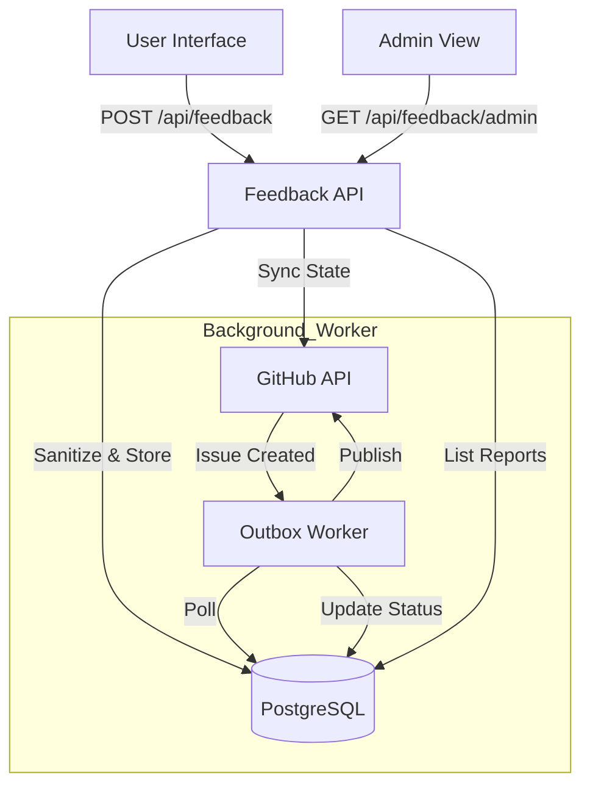
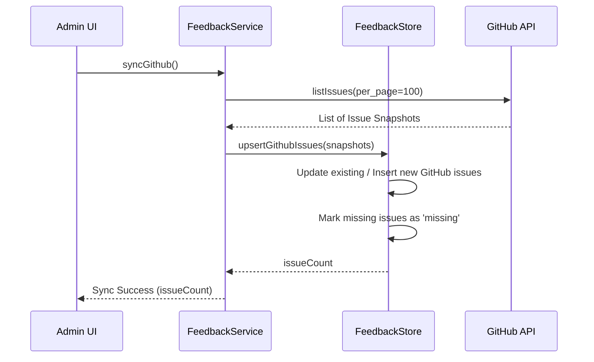

Relevant source files

The following files were used as context for generating this wiki page:

- [apps/backend/src/services/feedbackService.ts](../../../apps/backend/src/services/feedbackService.ts)
- [apps/backend/src/services/githubFeedback.ts](../../../apps/backend/src/services/githubFeedback.ts)
- [apps/backend/src/services/feedbackStore.ts](../../../apps/backend/src/services/feedbackStore.ts)
- [apps/backend/src/routes/feedback.ts](../../../apps/backend/src/routes/feedback.ts)
- [apps/web/services/feedback/browserDiagnostics.ts](../../../apps/web/services/feedback/browserDiagnostics.ts)
- [apps/web/components/feedback/FeedbackDialog.tsx](../../../apps/web/components/feedback/FeedbackDialog.tsx)
- [apps/web/components/admin/AdminFeedbackView.tsx](../../../apps/web/components/admin/AdminFeedbackView.tsx)
- [apps/backend/tests/routes/feedback.test.ts](../../../apps/backend/tests/routes/feedback.test.ts)
- [apps/backend/tests/services/githubFeedback.test.ts](../../../apps/backend/tests/services/githubFeedback.test.ts)

# User Feedback & GitHub Integration

The User Feedback & GitHub Integration module is a robust subsystem designed to capture user-reported issues (bugs) and suggestions (enhancements) directly within the Nous application. It ensures that user feedback is safely persisted, sanitized to protect privacy, and synchronized with a GitHub repository for developer triage and tracking.

This system employs a decoupled architecture where feedback is first stored in a local PostgreSQL database before being asynchronously published to GitHub. This prevents network latency or GitHub API downtime from affecting the user experience. Administrators can manage these reports through a dedicated interface, allowing for manual retries and periodic synchronization of GitHub issue states back to the application database.

Sources: [apps/backend/src/services/feedbackService.ts:1-20](../../../apps/backend/src/services/feedbackService.ts#L1-L20), [apps/backend/src/services/feedbackStore.ts:1-15](../../../apps/backend/src/services/feedbackStore.ts#L1-L15)

## Architecture and Data Flow

The feedback lifecycle begins with a user submission, which is handled by the `FeedbackService`. The process involves three primary stages: local persistence, asynchronous background delivery, and bidirectional synchronization.

### Feedback Submission Lifecycle

1.  **Ingestion & Sanitization**: User feedback (description, category, diagnostics, and optional screenshots) is sent to the `/api/feedback` endpoint. The backend sanitizes descriptions and diagnostics to remove sensitive information like emails or authentication tokens.
2.  **Local Storage**: The `PostgresFeedbackStore` saves the report with a `pending` status. It uses advisory locks and content hashing to prevent duplicate submissions and enforce rate limits (15 reports per hour per user).
3.  **Outbox Worker**: A background worker (`startFeedbackOutboxWorker`) polls the database every 30 seconds for pending reports and attempts to publish them to GitHub.
4.  **GitHub Publication**: The `GithubFeedbackPublisher` creates a GitHub issue. Upon success, the local record is updated to `submitted` with the corresponding GitHub issue number and URL.

The diagram shows the asynchronous flow from user submission to GitHub issue creation, as well as the administrator's ability to view and sync reports.
Sources: [apps/backend/src/services/feedbackService.ts:114-149](../../../apps/backend/src/services/feedbackService.ts#L114-L149), [apps/backend/src/services/feedbackStore.ts:143-200](../../../apps/backend/src/services/feedbackStore.ts#L143-L200), [apps/backend/tests/routes/feedback.test.ts:79-115](../../../apps/backend/tests/routes/feedback.test.ts#L79-L115)

## Core Components

### FeedbackStore (Postgres)
The `PostgresFeedbackStore` manages the `public.feedback_reports` table. It handles idempotency through `client_request_id` and rate limiting.

| Field | Type | Description |
| :--- | :--- | :--- |
| `id` | UUID | Unique identifier for the feedback report. |
| `status` | Enum | `pending`, `processing`, `submitted`, or `failed`. |
| `category` | Enum | `bug`, `enhancement`, or `other`. |
| `content_hash` | Text | SHA-256 hash of the content to prevent duplicates. |
| `diagnostics` | JSONB | Sanitized logs, user agent, and page URL. |
| `screenshot_data` | Bytea | Optional binary image data (stored in DB). |

Sources: [apps/backend/src/services/feedbackStore.ts:50-100](../../../apps/backend/src/services/feedbackStore.ts#L50-L100), [apps/backend/src/services/feedbackStore.ts:148-180](../../../apps/backend/src/services/feedbackStore.ts#L148-L180)

### GitHub Publisher
The `GithubFeedbackPublisher` is responsible for communicating with the GitHub REST API. It signs feedback IDs using a `markerSecret` (or Supabase service role key) to create a verifiable link between the GitHub issue and the internal database record.

- **Issue Masking**: User content is explicitly marked as "UNTRUSTED" in the GitHub issue body to alert developers.
- **Retry Logic**: If publication fails, the system calculates an exponential backoff (starting at 30 seconds up to 6 hours) before the next attempt.
- **Deduplication**: Before creating a new issue, the publisher checks if an issue with the same signed Feedback ID already exists on GitHub to prevent duplicate issues during retries.

Sources: [apps/backend/src/services/githubFeedback.ts:77-110](../../../apps/backend/src/services/githubFeedback.ts#L77-L110), [apps/backend/src/services/feedbackService.ts:89-112](../../../apps/backend/src/services/feedbackService.ts#L89-L112)

## Data Synchronization & Administration

Administrators can access a complete list of feedback through the `AdminFeedbackView`. This view allows them to:
- **Filter and View**: Browse reports with category icons and status badges.
- **Inspect Diagnostics**: View sanitized console logs and correlation IDs.
- **Screenshot Recovery**: Fetch and display screenshots stored in the backend.
- **Manual Retry**: Trigger a re-delivery attempt for reports with a `failed` status.
- **GitHub Sync**: Fetch all issues from the GitHub repository and update local states (e.g., if an issue was closed on GitHub, the local `githubIssueState` is updated to `closed`).

This sequence illustrates the bidirectional sync where GitHub becomes the source of truth for issue status (open/closed).
Sources: [apps/web/components/admin/AdminFeedbackView.tsx:180-220](../../../apps/web/components/admin/AdminFeedbackView.tsx#L180-L220), [apps/backend/src/services/feedbackStore.ts:245-350](../../../apps/backend/src/services/feedbackStore.ts#L245-L350), [apps/backend/src/services/feedbackService.ts:60-75](../../../apps/backend/src/services/feedbackService.ts#L60-L75)

## Security and Sanitization

Security is enforced at multiple layers:
- **Authentication**: Feedback submission requires a valid Supabase JWT. Admin routes require the `admin` role.
- **PII Redaction**: The backend automatically redacts emails and sensitive URL parameters (like `access_token`) from the description and diagnostics before storage.
- **HTML Escaping**: All untrusted user input is HTML-escaped before being wrapped in `<pre>` tags for the GitHub issue body to prevent injection attacks.
- **Signed Markers**: Feedback IDs in GitHub bodies are suffixed with a HMAC signature to prevent external users from spoofing feedback reports by manually editing GitHub issues.

Sources: [apps/backend/src/services/githubFeedback.ts:68-75](../../../apps/backend/src/services/githubFeedback.ts#L68-L75), [apps/backend/tests/routes/feedback.test.ts:98-115](../../../apps/backend/tests/routes/feedback.test.ts#L98-L115), [apps/backend/src/services/githubFeedback.ts:50-65](../../../apps/backend/src/services/githubFeedback.ts#L50-L65)

## Product context diagnostics

The feedback dialog shows the product context before the user consents to attach diagnostics. The snapshot records the current project and lesson identifiers, project revision, application area, and the latest durable workflow state when available. It does not attach human-readable titles or derived labels.

The browser keeps the 25 most recent breadcrumbs. Each breadcrumb contains only its operation, application area, project or lesson identifiers, and timestamp. The feedback route accepts only the declared areas, operations, workflow states, timestamps, and safe identifiers. It drops unknown fields, including arbitrary text, before storage.

Sources: [apps/web/services/feedback/browserDiagnostics.ts](../../../apps/web/services/feedback/browserDiagnostics.ts), [apps/web/components/feedback/FeedbackDialog.tsx](../../../apps/web/components/feedback/FeedbackDialog.tsx), [apps/backend/src/routes/feedback.ts](../../../apps/backend/src/routes/feedback.ts)

## Error Handling & Resiliency

The system handles various failure modes to ensure data integrity:
- **GitHub Rate Limits**: The publisher reads `x-ratelimit-reset` and `retry-after` headers to respect GitHub's API limits.
- **Network Failures**: Reports that fail to publish due to network issues are marked for retry with exponential backoff.
- **Orphaned Issues**: If a report exists on GitHub but is not found during a sync for two consecutive cycles, and it originated from GitHub (not the app), it is deleted from the local store to keep the mirror clean.

Sources: [apps/backend/src/services/githubFeedback.ts:167-175](../../../apps/backend/src/services/githubFeedback.ts#L167-L175), [apps/backend/src/services/feedbackService.ts:95-108](../../../apps/backend/src/services/feedbackService.ts#L95-L108), [apps/backend/src/services/feedbackStore.ts:340-350](../../../apps/backend/src/services/feedbackStore.ts#L340-L350)
