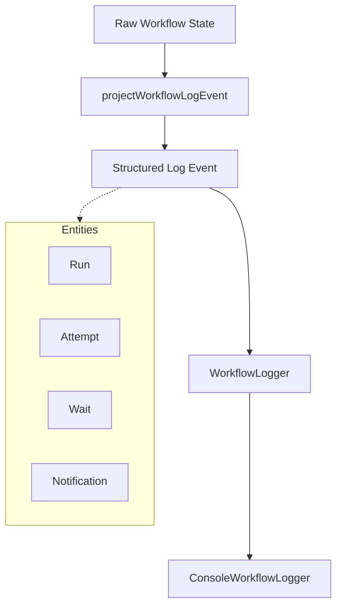
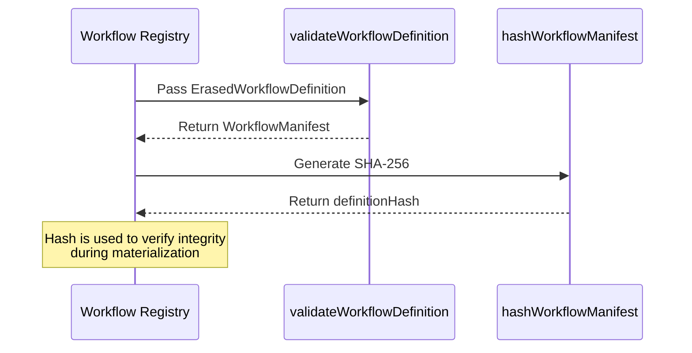

Relevant source files

The following files were used as context for generating this wiki page:

- [apps/backend/src/workflows/workflowObservability.ts](apps/backend/src/workflows/workflowObservability.ts)
- [apps/backend/src/workflows/workflowErrorDiagnostics.ts](apps/backend/src/workflows/workflowErrorDiagnostics.ts)
- [apps/backend/src/workflows/validation.ts](apps/backend/src/workflows/validation.ts)
- [scripts/run-real-workflow-provider-tests.ts](scripts/run-real-workflow-provider-tests.ts)
- [apps/backend/tests/workflows/workflowObservability.test.ts](apps/backend/tests/workflows/workflowObservability.test.ts)

# Workflow Observability & AI Metering

Workflow Observability and AI Metering form a critical subsystem within the project designed to track, log, and analyze the execution of complex asynchronous workflows and their associated AI provider consumption. This system ensures that every state transition, external effect, and AI token usage is captured with high fidelity while remaining isolated from the authoritative workflow state to prevent observability failures from impacting runtime stability.

The system is divided into two primary concerns: **Observability**, which handles structured logging and transient event publication for real-time monitoring, and **Metering/Diagnostics**, which focuses on capturing granular AI usage metrics (tokens, models, providers) and detailed error contexts for failure analysis.
Sources: [apps/backend/src/workflows/workflowObservability.ts](apps/backend/src/workflows/workflowObservability.ts), [scripts/run-real-workflow-provider-tests.ts](scripts/run-real-workflow-provider-tests.ts)

## Observability Architecture

The observability layer employs a "best-effort" philosophy. It projects internal runtime outcomes into content-free structured events, ensuring that sensitive user data (like prompts or secrets) is never leaked into logs.

### Event Projection and Logging
The `projectWorkflowLogEvent` function acts as a gateway that transforms raw workflow state into safe, log-ready objects. It categorizes events into several distinct entities: `run`, `attempt`, `definition`, `wait`, `notification`, and `runtime`.

The system utilizes a `WorkflowLogger` interface, primarily implemented by `ConsoleWorkflowLogger`, which outputs JSON-serialized events at various levels (`info`, `warn`, `error`).
Sources: [apps/backend/src/workflows/workflowObservability.ts:413-440](apps/backend/src/workflows/workflowObservability.ts#L413-L440), [apps/backend/src/workflows/workflowObservability.ts:457-463](apps/backend/src/workflows/workflowObservability.ts#L457-L463)

### Transient Event System
Transient events are process-local, lossy notifications delivered after authoritative transactions commit. They allow real-time observers to track progress without being able to modify the durable workflow state.

| Feature | Description |
| :--- | :--- |
| **Synchronous Delivery** | Events are delivered to all subscribers in the current process loop. |
| **Isolation** |Paylod nesting is frozen/cloned to prevent observers from mutating data seen by others. |
| **Process-Local** | Unlike durable events, these do not survive process restarts. |

Sources: [apps/backend/src/workflows/workflowObservability.ts:32-72](apps/backend/src/workflows/workflowObservability.ts#L32-L72), [apps/backend/tests/workflows/workflowObservability.test.ts:70-96](apps/backend/tests/workflows/workflowObservability.test.ts#L70-L96)

## AI Metering and Usage Tracking

AI Metering tracks the consumption of tokens across different providers (e.g., Codex) and models. This data is persisted in the `public.workflow_ai_usage` table for auditing and cost management.

### Metering Data Model
The system tracks several token-level metrics for every workflow run:

| Field | Description |
| :--- | :--- |
| `input_tokens` | Total tokens sent in the prompt. |
| `output_tokens` | Total tokens generated by the model. |
| `reasoning_tokens` | Tokens used for internal model "thought" processes (if supported). |
| `cache_read_tokens` | Tokens retrieved from provider-side caches. |
| `cache_write_tokens` | Tokens written to provider-side caches. |
| `model` | The specific model string (e.g., `gpt-5.6-luna`). |
| `provider` | The AI service provider name (e.g., `codex`). |

Sources: [scripts/run-real-workflow-provider-tests.ts:46-56](scripts/run-real-workflow-provider-tests.ts#L46-L56), [scripts/run-real-workflow-provider-tests.ts:285-320](scripts/run-real-workflow-provider-tests.ts#L285-L320)

### Diagnostic Context
When a workflow step involving an AI model fails, the system captures a `WorkflowModelDiagnostic`. This includes the `slot` (e.g., `course`, `lesson`), the `provider`, and the `serviceTier` (e.g., `fast`), providing immediate context for debugging provider-specific issues.
Sources: [apps/backend/src/workflows/workflowObservability.ts:365-385](apps/backend/src/workflows/workflowObservability.ts#L365-L385), [apps/backend/src/workflows/workflowErrorDiagnostics.ts](apps/backend/src/workflows/workflowErrorDiagnostics.ts)

## Workflow Integrity and Validation

To ensure observability remains consistent across software updates, the system utilizes manifest hashing and validation.

The `validateWorkflowDefinition` function ensures that every node, schema, and event within a workflow follows a strictly defined structure before it can be registered or materialized.
Sources: [apps/backend/src/workflows/validation.ts:251-285](apps/backend/src/workflows/validation.ts#L251-L285), [apps/backend/src/workflows/validation.ts:287-288](apps/backend/src/workflows/validation.ts#L287-L288)

## Diagnostic Tooling: `doctor`

The `doctor` script provides a local diagnostic suite for developers to verify the health of the observability and metering infrastructure, including Supabase migration parity and local Sonar service status.

| Profile | Checks Performed |
| :--- | :--- |
| `checks` | Quality, Semgrep, Fallow regression, and Test suite. |
| `gate` | Probes local SonarQube service and token validity. |
| `local` | Verifies Supabase Auth, Data API, Storage, and Migration drift. |
| `all` | Runs all available diagnostic profiles. |

Sources: [scripts/doctor.ts:60-70](scripts/doctor.ts#L60-L70), [scripts/doctor.ts:108-130](scripts/doctor.ts#L108-L130)

## Conclusion
The Workflow Observability & AI Metering system provides a robust framework for monitoring the project's distributed logic. By strictly separating authoritative execution from best-effort logging, and by capturing granular AI usage data, it allows the platform to scale while maintaining high visibility into both operational performance and provider costs.
Sources: [apps/backend/src/workflows/workflowObservability.ts](apps/backend/src/workflows/workflowObservability.ts), [scripts/run-real-workflow-provider-tests.ts](scripts/run-real-workflow-provider-tests.ts)
