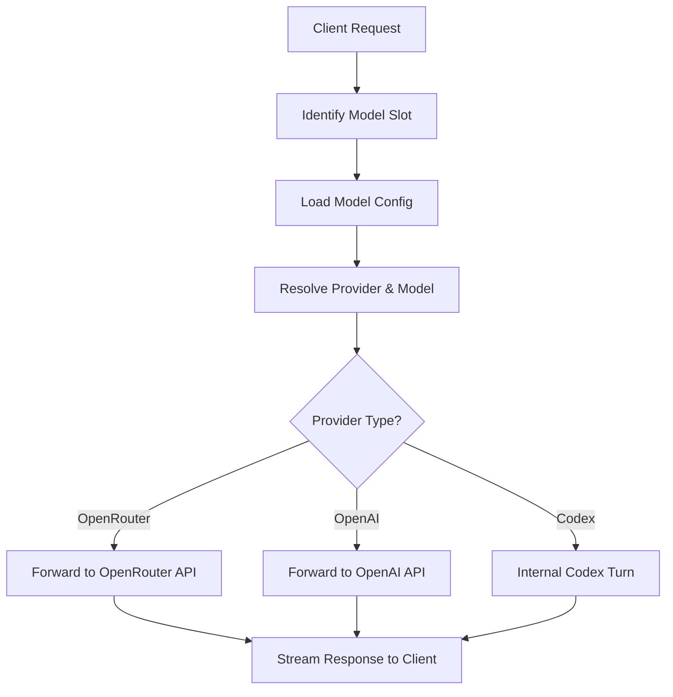
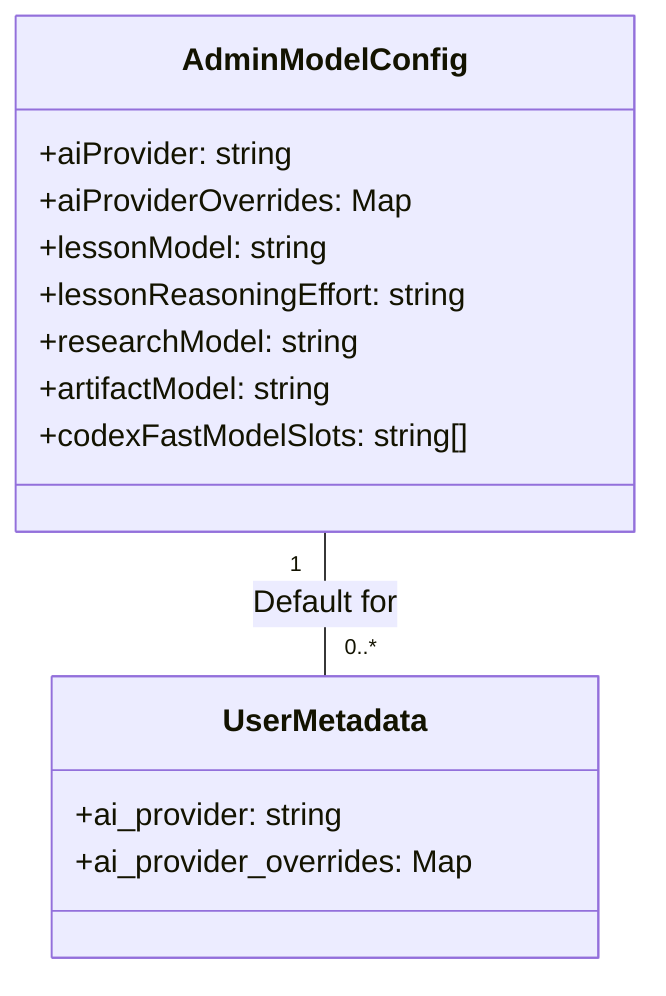

Relevant source files

The following files were used as context for generating this wiki page:

- [apps/backend/src/routes/openRouterProxy.ts](apps/backend/src/routes/openRouterProxy.ts)
- [apps/backend/tests/routes/chat.test.ts](apps/backend/tests/routes/chat.test.ts)
- [apps/backend/tests/config/modelConfig.test.ts](apps/backend/tests/config/modelConfig.test.ts)
- [apps/web/tests/components/admin/AdminPanel.test.tsx](apps/web/tests/components/admin/AdminPanel.test.tsx)
- [apps/backend/src/services/lessonGenerationModel.ts](apps/backend/src/services/lessonGenerationModel.ts)
- [apps/backend/src/index.ts](apps/backend/src/index.ts)
- [README.md](README.md)

# AI Provider Setup & Configuration

AI Provider Setup & Configuration in Nous is a multi-layered system designed to manage interactions with various Large Language Model (LLM) providers, primarily **OpenRouter**, **OpenAI**, and the internal **Codex app-server**. The system allows for granular control over which provider and specific model is used for different functional "slots" such as lesson generation, research, artifacts, and assessment.

This configuration is handled through environment variables for global defaults, an administrative panel for system-wide overrides, and user-level metadata for personalized provider selection. The backend employs a proxy mechanism to normalize requests across these providers, ensuring a consistent interface for the frontend and internal workflows.
Sources: [README.md:15-22](README.md#L15-L22), [apps/backend/src/routes/openRouterProxy.ts:46-59](apps/backend/src/routes/openRouterProxy.ts#L46-L59), [apps/web/tests/components/admin/AdminPanel.test.tsx:44-78](apps/web/tests/components/admin/AdminPanel.test.tsx#L44-L78)

## Supported Providers

Nous supports three main avenues for AI service integration:

| Provider | Description | Authentication |
| :--- | :--- | :--- |
| **OpenRouter** | Aggregator providing access to various models (DeepSeek, Google, etc.). | `OPENROUTER_API_KEY` |
| **OpenAI API** | Direct connection to OpenAI's GPT models. | `OPENAI_API_KEY` |
| **Codex** | Internal `app-server` that can wrap a shared account for authenticated users. | `CODEX_APP_SERVER_ENABLED=true` |

Sources: [README.md:16-22](README.md#L16-L22), [apps/backend/src/routes/openRouterProxy.ts:25-30](apps/backend/src/routes/openRouterProxy.ts#L25-L30)

## Architecture & Data Flow

The system uses a proxy architecture where all AI requests are routed through a central backend endpoint (`/api/openrouter/chat/completions`). This endpoint resolves the appropriate model and provider based on the requested "slot" and user preferences.

### Request Proxy Flow

The following diagram illustrates how a request for AI generation is processed and routed to the correct upstream provider.

The proxy identifies the `X-Nous-Model-Slot` header to determine the functional requirement (e.g., `lesson`) and matches it against the configured model for the active provider.
Sources: [apps/backend/src/routes/openRouterProxy.ts:61-125](apps/backend/src/routes/openRouterProxy.ts#L61-L125), [apps/backend/src/routes/openRouterProxy.ts:457-480](apps/backend/src/routes/openRouterProxy.ts#L457-L480)

### Model Slots
Functions are categorized into specific slots to allow optimized model selection:
- `artifact` / `artifactInteractive`: For generating visual and interactive lesson components.
- `lesson`: For main course content writing.
- `research`: For web-based factual gathering.
- `assessment`: For student evaluation and feedback.
- `context`: For localized chat and provinence analysis.
- `progress`: For tracking student learning state.

Sources: [apps/backend/src/routes/openRouterProxy.ts:61-70](apps/backend/src/routes/openRouterProxy.ts#L61-L70), [apps/backend/tests/config/modelConfig.test.ts:20-55](apps/backend/tests/config/modelConfig.test.ts#L20-L55)

## Configuration Management

### Administrative Configuration
Admins can set default models and reasoning efforts for the entire system via the Admin Panel. This includes mapping specific model strings (e.g., `openai/gpt-4o`) to functional slots for each provider.

Sources: [apps/web/tests/components/admin/AdminPanel.test.tsx:44-78](apps/web/tests/components/admin/AdminPanel.test.tsx#L44-L78), [apps/backend/tests/config/modelConfig.test.ts:114-131](apps/backend/tests/config/modelConfig.test.ts#L114-L131)

### Reasoning Effort
For models supporting specialized reasoning (like OpenAI's o1 or OpenRouter reasoning models), the system configures an `effort` level:
- `none` / `minimal`
- `low`
- `medium`
- `high`

Sources: [apps/backend/src/routes/openRouterProxy.ts:221-230](apps/backend/src/routes/openRouterProxy.ts#L221-L230), [apps/web/tests/components/admin/AdminPanel.test.tsx:128-150](apps/web/tests/components/admin/AdminPanel.test.tsx#L128-L150)

## Service Specific Implementations

### Codex App-Server
When `CODEX_APP_SERVER_ENABLED` is true, the backend can use an internal `runCodexAppServerTurn`. This mode is unique as it does not require individual user API keys but relies on the server's authenticated context. It supports "Fast Model Slots" where specific tasks are routed to higher-performance service tiers.
Sources: [README.md:20-22](README.md#L20-L22), [apps/backend/src/routes/openRouterProxy.ts:258-300](apps/backend/src/routes/openRouterProxy.ts#L258-L300), [apps/backend/tests/config/modelConfig.test.ts:106-112](apps/backend/tests/config/modelConfig.test.ts#L106-L112)

### OpenRouter & Web Search
Web search is treated as a specialized tool (`openrouter:web_search`). The proxy ensures that if a search is requested, the model is switched to the designated `research` slot model if the primary model does not support it.
Sources: [apps/backend/src/routes/openRouterProxy.ts:182-205](apps/backend/src/routes/openRouterProxy.ts#L182-L205), [apps/backend/tests/routes/chat.test.ts:250-275](apps/backend/tests/routes/chat.test.ts#L250-L275)

## Environment Setup Summary

| Variable | Description |
| :--- | :--- |
| `OPENROUTER_API_KEY` | Required for OpenRouter access. |
| `OPENAI_API_KEY` | Optional for direct OpenAI access. |
| `CODEX_APP_SERVER_ENABLED` | Enables shared Codex account mode. |
| `CORS_ALLOWED_ORIGINS` | Limits browser origins for AI proxy security. |

Sources: [README.md:16-30](README.md#L16-L30), [apps/backend/src/index.ts:121-135](apps/backend/src/index.ts#L121-L135)

The AI Provider Setup & Configuration ensures that Nous Reader remains flexible across different LLM ecosystems while providing administrators and users with the tools to balance cost, performance, and reasoning capabilities for pedagogical tasks.
