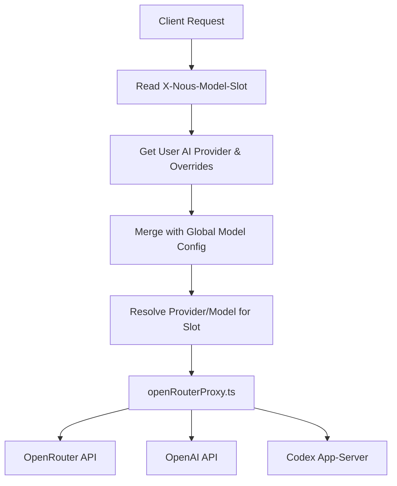
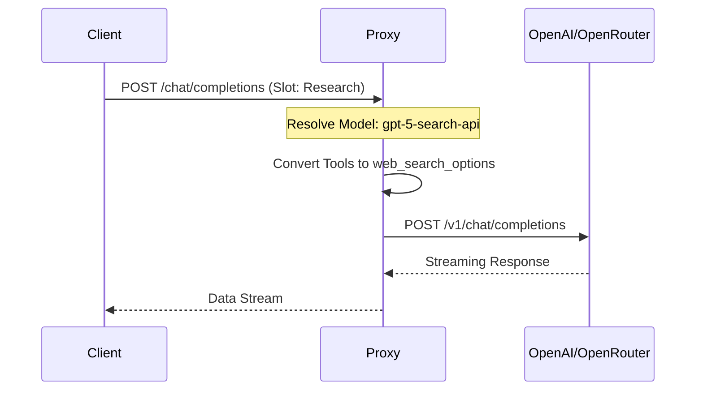

<details>
<summary>Relevant source files</summary>

The following files were used as context for generating this wiki page:

- [apps/backend/src/routes/openRouterProxy.ts](apps/backend/src/routes/openRouterProxy.ts)
- [apps/backend/src/config/modelConfig.ts](apps/backend/src/config/modelConfig.ts)
- [apps/backend/tests/config/modelConfig.test.ts](apps/backend/tests/config/modelConfig.test.ts)
- [apps/backend/src/services/lessonGenerationModel.ts](apps/backend/src/services/lessonGenerationModel.ts)
- [apps/web/tests/components/admin/AdminPanel.test.tsx](apps/web/tests/components/admin/AdminPanel.test.tsx)
- [apps/backend/src/services/courseCoverRegeneration.ts](apps/backend/src/services/courseCoverRegeneration.ts)
</details>

# AI Provider Setup & Configuration

AI Provider Setup & Configuration in Nous is a multi-layered system designed to manage interactions with various Large Language Model (LLM) providers, including OpenRouter, OpenAI, and a private "Codex" app-server. The system centralizes model selection, reasoning effort levels, and credential management to ensure consistent AI behavior across different functional "slots" such as lesson generation, course planning, and research.

The architecture relies on a global configuration that can be overridden at the user level, allowing for flexible deployments ranging from shared hosted instances to private, self-hosted environments using the Codex app-server. This configuration determines not only which model is used for a specific task but also how parameters like reasoning effort and service tiers are applied during the API proxying phase.

## Architecture & Data Flow

The system uses a proxy-based approach to route requests to AI providers. The `openRouterProxy` acts as a central gateway for all AI interactions, resolving the appropriate model and provider based on the requested "Model Slot."

### Model Slot Resolution
Every AI request must specify a `X-Nous-Model-Slot`. This slot maps the high-level intent (e.g., generating a lesson) to a specific model and provider configuration defined in the backend.



*The diagram above shows the flow from an initial client request through the resolution of model configurations to the final provider routing.*
Sources: [apps/backend/src/routes/openRouterProxy.ts:98-111](apps/backend/src/routes/openRouterProxy.ts#L98-L111), [apps/backend/src/config/modelConfig.ts](apps/backend/src/config/modelConfig.ts)

### Provider Implementation Details
The project distinguishes between three primary provider types:
1.  **OpenRouter**: Used as the default aggregator. Supports specialized headers like `X-Title` and reasoning effort configurations.
2.  **OpenAI**: Standard API integration, specifically used for research and search models (e.g., `gpt-5-search-api`).
3.  **Codex**: A specialized internal provider that runs via `runCodexAppServerTurn`. It is used for secure, server-side processing without exposing raw provider tokens to the client.

Sources: [apps/backend/src/routes/openRouterProxy.ts:50-65](apps/backend/src/routes/openRouterProxy.ts#L50-L65), [apps/backend/src/routes/openRouterProxy.ts:133-172](apps/backend/src/routes/openRouterProxy.ts#L133-L172)

## Configuration Components

### Global Model Configuration
The `GlobalModelConfig` structure defines the default models and reasoning levels for the entire application. It includes mappings for specific slots like `artifact`, `assessment`, `course`, and `lesson`.

| Parameter | Description | Supported Values |
| :--- | :--- | :--- |
| `aiProvider` | The default AI provider for the system. | `openrouter`, `openai`, `codex` |
| `reasoningEffort` | The level of computation/reasoning the model should apply. | `none`, `minimal`, `low`, `medium`, `high` |
| `serviceTier` | The priority level for API requests (specific to Codex/OpenRouter). | `fast`, `flex` |
| `aiProviderOverrides` | Map of specific slots to alternative providers. | Key-Value pairs (e.g., `lesson: codex`) |

Sources: [apps/backend/src/config/modelConfig.ts](apps/backend/src/config/modelConfig.ts), [apps/backend/tests/config/modelConfig.test.ts:13-52](apps/backend/tests/config/modelConfig.test.ts#L13-L52)

### Model Slots
The system categorizes AI tasks into distinct slots, allowing granular control over which model handles which type of work:
*  **Artifact**: Used for generating visual or interactive elements.
*  **Assessment**: Used for student evaluation and chat-based interviews.
*  **Course**: Handles high-level course planning and structuring.
*  **Lesson**: Manages the detailed generation of lesson content.
*  **Research**: Utilizes models with web-search capabilities for factual gathering.

Sources: [apps/backend/src/routes/openRouterProxy.ts:80-92](apps/backend/src/routes/openRouterProxy.ts#L80-L92)

## Proxy Logic & Request Transformation

The `openRouterProxy.ts` handles the transformation of generic chat requests into provider-specific payloads.

### Handling Specialized Tools
When `webSearch` is requested via the `openrouter:web_search` tool, the proxy must ensure the resolved model supports it. For OpenAI, this requires routing to specific research models like `gpt-5-search-api` and translating the tool into `web_search_options`.



*Sequence of a research request involving web search tool transformation.*
Sources: [apps/backend/src/routes/openRouterProxy.ts:118-132](apps/backend/src/routes/openRouterProxy.ts#L118-L132), [apps/backend/src/routes/openRouterProxy.ts:133-155](apps/backend/src/routes/openRouterProxy.ts#L133-L155)

### Image Input Filtering
The proxy implements safety checks for multimodal inputs. If a model is identified as not supporting images (via `openRouterModelSupportsImages`), the proxy strips `image_url` content from the messages before forwarding the request to prevent API errors.
Sources: [apps/backend/src/routes/openRouterProxy.ts:175-197](apps/backend/src/routes/openRouterProxy.ts#L175-L197)

## Administrative Configuration

Admin users can modify the AI provider setup through the `AdminPanel`. This interface allows for:
*  **Global Provider Swapping**: Changing the primary `aiProvider`.
*  **Slot Overrides**: Setting a user-specific provider for a single function (e.g., forcing a specific user to use `openai` for `lessons` while the rest of the system uses `openrouter`).
*  **Reasoning Adjustment**: Fine-tuning the `reasoningEffort` for different task types.

Sources: [apps/web/tests/components/admin/AdminPanel.test.tsx:143-162](apps/web/tests/components/admin/AdminPanel.test.tsx#L143-L162), [apps/web/tests/components/admin/AdminPanel.test.tsx:238-259](apps/web/tests/components/admin/AdminPanel.test.tsx#L238-L259)

## Service Tiers & Reasoning

Reasoning levels are mapped per provider to their native API equivalents. For example, OpenRouter uses a `reasoning` object with `effort` and `enabled` fields, while OpenAI uses the `reasoning_effort` property directly.

```typescript
// Example of reasoning mapping in openRouterProxy.ts
const reasoning = isRecord(openRouterRequestBody.reasoning)
  ? openRouterRequestBody.reasoning
  : {};
return {
  provider,
  body: {
    ...openRouterRequestBody,
    model,
    reasoning: {
      ...reasoning,
      enabled: true,
      effort: reasoningEffort,
    },
  },
};
```

Sources: [apps/backend/src/routes/openRouterProxy.ts:208-223](apps/backend/src/routes/openRouterProxy.ts#L208-L223), [apps/backend/tests/config/modelConfig.test.ts:98-102](apps/backend/tests/config/modelConfig.test.ts#L98-L102)

## Conclusion

The AI Provider Setup & Configuration system provides a robust abstraction layer that separates the functional requirements of the application from the specifics of LLM APIs. By utilizing Model Slots and a centralized Proxy, Nous maintains high flexibility in model selection while enforcing consistent reasoning policies and secure credential management across all AI-driven features.
