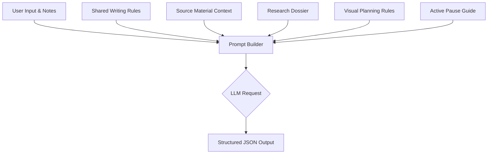
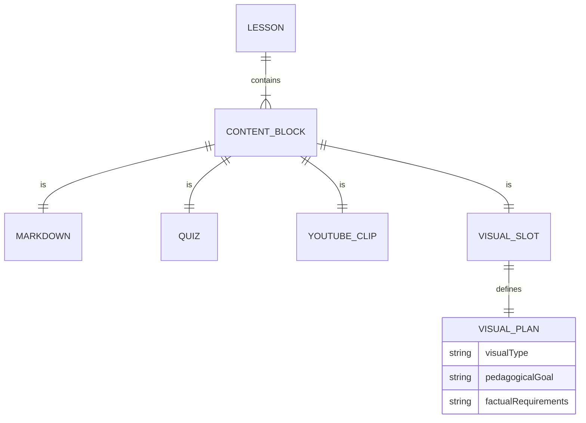

Relevant source files

The following files were used as context for generating this wiki page:

- [packages/shared-types/lessonWritingContract.ts](../../../packages/shared-types/lessonWritingContract.ts)
- [apps/backend/src/services/lessonGenerationPrompt.ts](../../../apps/backend/src/services/lessonGenerationPrompt.ts)
- [apps/web/services/openrouter/prompts.ts](../../../apps/web/services/openrouter/prompts.ts)
- [packages/shared-types/lessonVisualContracts.ts](../../../packages/shared-types/lessonVisualContracts.ts)
- [apps/backend/src/services/lessonGenerationModel.ts](../../../apps/backend/src/services/lessonGenerationModel.ts)
- [AGENTS.md](../../../AGENTS.md)

# Prompt Engineering & Shared Contracts

The Prompt Engineering and Shared Contracts system in Nous establishes a rigorous, centralized framework for orchestrating Large Language Model (LLM) behaviors across the platform. By utilizing shared TypeScript constants and strictly defined JSON schemas, the project ensures that pedagogical tone, structural integrity, and technical constraints remain consistent between the backend generation services and frontend display components.

This architecture prioritizes a "Source of Truth" philosophy, where AI prompt fragments, pedagogical rules, and output contracts are co-located with the features they govern. This prevents context drift and ensures that the "Professor Nous" persona maintains a high-quality, ADHD-friendly learning environment regardless of the underlying model provider.
Sources: [AGENTS.md:89-94](../../../AGENTS.md#L89-L94), [packages/shared-types/lessonWritingContract.ts:60-90](../../../packages/shared-types/lessonWritingContract.ts#L60-L90)

## Core Instructional Framework

The system utilizes a multi-layered prompt construction strategy. At the base is the `SYSTEM_INSTRUCTION_TEACHER`, which defines the fundamental identity and pedagogical principles of the AI.

### Pedagogical Principles
The "Professor Nous" persona is governed by four primary pillars:
1.  **Discursive Style:** Prefers paragraphs over bullet points for the main body to maintain a narrative flow.
2.  **Self-Sufficiency:** The lesson must work without the student having the original source open.
3.  **Interactivity:** Strategic placement of "Active Pauses" (inline quizzes) and interactive visuals.
4.  **Propedeutic Order:** Concepts are introduced in a strictly logical sequence where each step only requires previously explained information.
Sources: [packages/shared-types/lessonWritingContract.ts:60-90](../../../packages/shared-types/lessonWritingContract.ts#L60-L90), [apps/backend/src/services/lessonGenerationPrompt.ts:63-70](../../../apps/backend/src/services/lessonGenerationPrompt.ts#L63-L70)

### Prompt Composition Flow
The final prompt sent to the model is dynamically assembled from several modules:

The prompt builder integrates user-specific customization notes, which are given high priority unless they conflict with structural safety or JSON schema requirements.
Sources: [apps/backend/src/services/lessonGenerationPrompt.ts:32-60](../../../apps/backend/src/services/lessonGenerationPrompt.ts#L32-L60), [packages/shared-types/lessonWritingContract.ts:81-96](../../../packages/shared-types/lessonWritingContract.ts#L81-L96)

## Shared Writing Contracts

Shared contracts ensure that the AI adheres to specific formatting and linguistic constraints. These are exported as constants to be used by both the backend generator and the web-based research services.

### Key Writing Rules
| Rule Constant | Description |
| :--- | :--- |
| `LESSON_SHARED_WRITING_RULES` | Defines 18+ rules regarding lexicon, acronyms, analogies, and Markdown usage. |
| `LESSON_LOCAL_PROPEDEUTIC_RULES` | Enforces logical flow; prevents referencing concepts before they are defined. |
| `FORMULA_RELEVANCE_RULE` | Restricts LaTeX formulas to instances where they add precision, avoiding decorative math. |
| `YOUTUBE_CLIP_PEDAGOGY_RULES` | Dictates when to use video clips versus static images (e.g., for spatial movement). |
Sources: [packages/shared-types/lessonWritingContract.ts:1-55](../../../packages/shared-types/lessonWritingContract.ts#L1-L55), [apps/web/services/openrouter/prompts.ts:14-25](../../../apps/web/services/openrouter/prompts.ts#L14-L25)

## Structured Output Schemas

To ensure deterministic behavior, the system enforces strict JSON schemas for different AI tasks. This prevents the LLM from returning conversational filler or malformed Markdown image syntax.

### Lesson Content Schema
The `LESSON_JOB_RESPONSE_SCHEMA` defines the structure of a generated lesson, which must include:
*  **contentBlocks:** An array containing `markdown`, `inline-quiz`, `youtube-clips`, or `generated-visual` blocks.
*  **generatedVisuals:** Metadata for pedagogical diagrams (slotId, visualType, factualRequirements).
*  **imageRefs:** References to original document assets (assetId, alt, anchorHeading).
Sources: [apps/backend/src/services/lessonGenerationModel.ts:43-146](../../../apps/backend/src/services/lessonGenerationModel.ts#L43-L146)

### Research Dossier Schema
Before generation, a research phase builds a `LessonResearchSummary`.
Sources: [apps/backend/src/services/lessonGenerationModel.ts:148-185](../../../apps/backend/src/services/lessonGenerationModel.ts#L148-L185)

Sources: [apps/backend/src/services/lessonGenerationModel.ts:70-120](../../../apps/backend/src/services/lessonGenerationModel.ts#L70-L120)

## Visual & Interactive Contracts

The system defines specific rules for how different visual formats should be used and rendered. This is handled via the `LESSON_VISUAL_PLANNING_RULES` and specific render instructions for SVG, HTML, and Mermaid.

### Visual Type Selection
| Type | Use Case |
| :--- | :--- |
| `illustrative_image` | Raster images for physical reality, perspective, or complex textures. |
| `flowchart_svg` | Process pipelines or decision trees. |
| `interactive_html` | HTML/JS labs where student interaction is necessary to explore a concept. |
| `mermaid_erd` | Entity-Relationship diagrams for database schemas. |
Sources: [packages/shared-types/lessonVisualContracts.ts:121-137](../../../packages/shared-types/lessonVisualContracts.ts#L121-L137)

### Image Security and Integrity
The lesson-generation prompt forbids Markdown image syntax (``) and `` tags in Markdown blocks. Original images are represented through `imageRefs`, using only the supplied asset IDs.
Sources: [apps/backend/src/services/lessonGenerationPrompt.ts:21-31](../../../apps/backend/src/services/lessonGenerationPrompt.ts#L21-L31), [apps/backend/src/services/lessonGenerationPrompt.ts:72-80](../../../apps/backend/src/services/lessonGenerationPrompt.ts#L72-L80)

## Validation & Verification

Generation is followed by a verification layer that ensures the draft meets technical "contracts" before being served to the user.

1.  **Strict JSON Parsing:** The `ai` SDK's `Output.object` ensures the response matches the schema.
2.  **Quiz Placement Validation:** Checks that `inline-quiz` blocks are preceded by `markdown` blocks containing the necessary information.
3.  **LaTeX Balancing:** The `assertBalancedLatexEnvironments` function scans Markdown blocks to ensure all `\begin{...}` tags have corresponding `\end{...}` tags.
4.  **Asset Verification:** Ensures `slotId` values in the content blocks match the definitions in the visual plan.
Sources: [apps/backend/src/services/lessonGenerationModel.ts:285-375](../../../apps/backend/src/services/lessonGenerationModel.ts#L285-L375)

Prompt Engineering & Shared Contracts serve as the foundational governance layer of Nous, ensuring that complex pedagogical requirements are translated into reliable, structured data. By centralizing these instructions, the project maintains high standards for accessibility and technical precision across diverse AI models.
