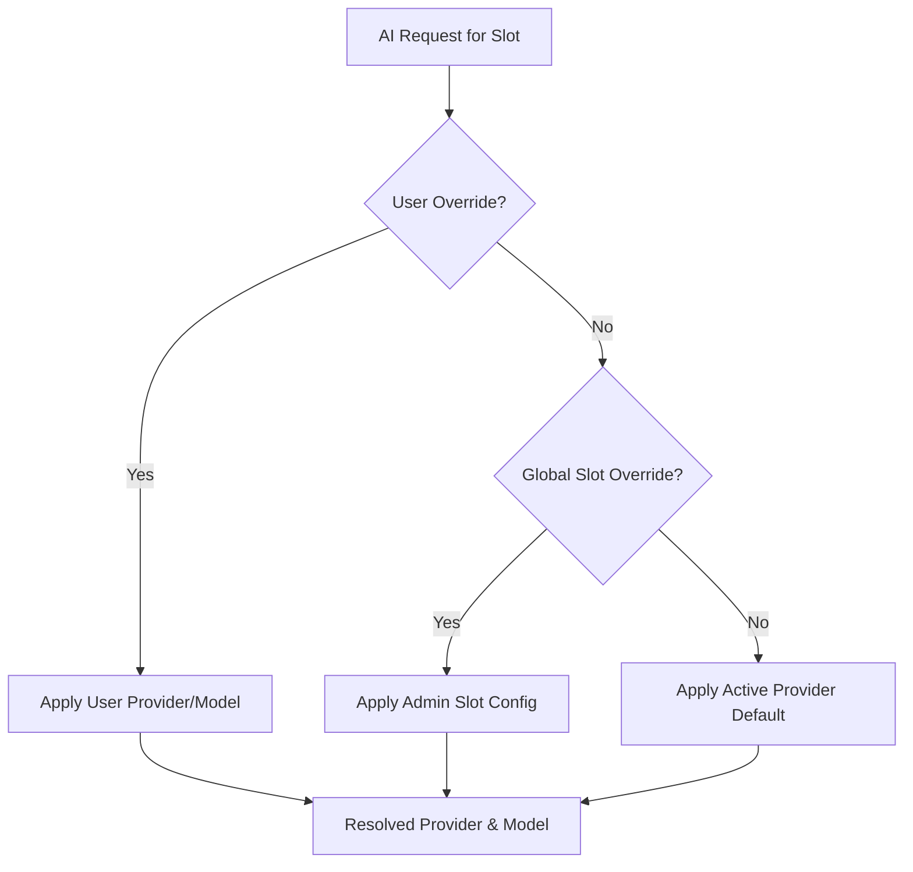
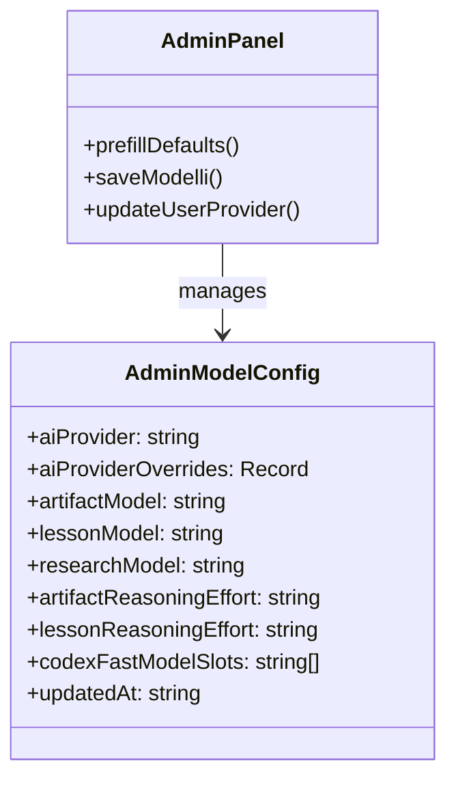

Relevant source files

The following files were used as context for generating this wiki page:

- [apps/backend/src/routes/openRouterProxy.ts](../../../apps/backend/src/routes/openRouterProxy.ts)
- [apps/backend/tests/config/modelConfig.test.ts](../../../apps/backend/tests/config/modelConfig.test.ts)
- [apps/web/tests/components/admin/AdminPanel.test.tsx](../../../apps/web/tests/components/admin/AdminPanel.test.tsx)
- [apps/backend/src/services/lessonGenerationModel.ts](../../../apps/backend/src/services/lessonGenerationModel.ts)
- [apps/backend/tests/workflows/workflowErrorDiagnostics.test.ts](../../../apps/backend/tests/workflows/workflowErrorDiagnostics.test.ts)
- [README.md](../../../README.md)

# AI Provider Setup & Configuration

## Introduction

The AI Provider Setup and Configuration system in Lumina-Reader manages the orchestration, routing, and environment settings for multiple Large Language Model (LLM) providers. The project primarily supports **OpenRouter**, **OpenAI API**, and a self-hosted **Codex app-server**. This system ensures that specific pedagogical tasks—such as lesson generation, research, and interactive artifact creation—are routed to the most appropriate model based on global settings, user-specific overrides, or functional requirements.

The configuration layer allows administrators to fine-tune "reasoning effort" levels and model selection per "slot" (e.g., `lesson`, `artifact`, `assessment`). It also handles proxying requests to external APIs, providing a unified interface for the frontend while managing sensitive credentials and service tiers on the backend.

Sources: [apps/backend/src/routes/openRouterProxy.ts:20-30](../../../apps/backend/src/routes/openRouterProxy.ts#L20-L30), [apps/web/tests/components/admin/AdminPanel.test.tsx:50-90](../../../apps/web/tests/components/admin/AdminPanel.test.tsx#L50-L90), [README.md:15-25](../../../README.md#L15-L25)

## Supported AI Providers

Lumina-Reader supports three primary backends for AI operations. Each provider can be globally active or assigned to specific functional slots.

| Provider | Description | Key Configuration Keys |
| :--- | :--- | :--- |
| **OpenRouter** | Aggregator service providing access to models like DeepSeek, Gemini, and Claude. | `OPENROUTER_API_KEY` |
| **OpenAI API** | Direct integration with OpenAI models (GPT-4o, o1, etc.). | `OPENAI_API_KEY` |
| **Codex** | A self-hosted bridge for using ChatGPT/Codex accounts without per-token costs. | `CODEX_APP_SERVER_ENABLED` |

Sources: [README.md:15-22](../../../README.md#L15-L22), [apps/backend/src/routes/openRouterProxy.ts:23-28](../../../apps/backend/src/routes/openRouterProxy.ts#L23-L28), [apps/web/tests/components/admin/AdminPanel.test.tsx:50-75](../../../apps/web/tests/components/admin/AdminPanel.test.tsx#L50-L75)

## Model Slot Architecture

The system uses "slots" to categorize AI tasks. This allows the application to use a highly capable model for complex lesson writing while using faster, cheaper models for progress tracking or simple summaries.

### Functional Slots
- **Lesson**: Main pedagogical content generation.
- **Research**: Web-searching and factual dossier building.
- **Artifact / ArtifactInteractive**: Generation of SVG diagrams or HTML/JS labs.
- **Assessment**: Generation of quizzes and reflection prompts.
- **Context / Progress**: Metadata extraction and student advancement analysis.

Sources: [apps/backend/src/routes/openRouterProxy.ts:58-70](../../../apps/backend/src/routes/openRouterProxy.ts#L58-L70), [apps/backend/tests/config/modelConfig.test.ts:20-60](../../../apps/backend/tests/config/modelConfig.test.ts#L20-L60)

### Routing Logic
The backend resolves the model and provider by checking three layers of precedence:
1. **User Overrides**: User-specific settings stored in metadata.
2. **Global Overrides**: Admin-defined overrides for specific slots (e.g., "always use Codex for lessons").
3. **Active Provider Default**: The fallback model for the currently active global provider.

Sources: [apps/backend/tests/config/modelConfig.test.ts:100-118](../../../apps/backend/tests/config/modelConfig.test.ts#L100-L118), [apps/backend/src/routes/openRouterProxy.ts:114-125](../../../apps/backend/src/routes/openRouterProxy.ts#L114-L125)

## Proxy and Transformation Logic

The `openRouterProxy` acts as a gateway, transforming generic internal requests into provider-specific formats. It handles model-specific requirements such as "reasoning effort" and "service tiers."

### Request Processing Flow
When a request hits `/api/chat/completions`, the proxy performs the following:
1. **Header Identification**: Reads the `X-Nous-Model-Slot` to determine the task.
2. **Body Sanitization**: Removes OpenRouter-specific tools (like `web_search`) if the resolved provider is OpenAI or Codex, or transforms them into the correct format.
3. **Reasoning Injection**: For OpenRouter, it wraps reasoning settings into the `reasoning: { enabled: true, effort: ... }` object. For OpenAI, it uses `reasoning_effort`.
4. **Image Fallback**: If a model does not support images, the proxy can strip `image_url` content if `x-nous-allow-text-only-image-fallback` is enabled.

Sources: [apps/backend/src/routes/openRouterProxy.ts:130-180](../../../apps/backend/src/routes/openRouterProxy.ts#L130-L180), [apps/backend/src/routes/openRouterProxy.ts:200-220](../../../apps/backend/src/routes/openRouterProxy.ts#L200-L220)

### Reasoning Effort Levels
Reasoning models (like OpenAI o1 or DeepSeek V3/R1) support specific effort levels:
- `none`
- `minimal`
- `low`
- `medium`
- `high`

Sources: [apps/web/tests/components/admin/AdminPanel.test.tsx:110-130](../../../apps/web/tests/components/admin/AdminPanel.test.tsx#L110-L130), [apps/backend/src/routes/openRouterProxy.ts:320-330](../../../apps/backend/src/routes/openRouterProxy.ts#L320-L330)

## Admin Configuration Interface

The Admin Panel provides a centralized UI to manage these settings without modifying environment variables.

Sources: [apps/web/tests/components/admin/AdminPanel.test.tsx:50-95](../../../apps/web/tests/components/admin/AdminPanel.test.tsx#L50-L95), [apps/backend/tests/config/modelConfig.test.ts:85-95](../../../apps/backend/tests/config/modelConfig.test.ts#L85-L95)

### Key Configuration Options
| Setting | Description |
| :--- | :--- |
| **Active AI Provider** | Sets the default provider (OpenRouter, OpenAI, Codex). |
| **Provider Overrides** | Assigns a specific provider to a specific slot (e.g., OpenAI for Research). |
| **Codex Fast Slots** | Determines which slots use the "fast" service tier when routed through Codex. |
| **Visual Review** | Enables `artifactVisualReviewEnabled` and sets `artifactVisualReviewMaxRounds`. |

Sources: [apps/web/tests/components/admin/AdminPanel.test.tsx:55-90](../../../apps/web/tests/components/admin/AdminPanel.test.tsx#L55-L90), [apps/backend/tests/config/modelConfig.test.ts:90-105](../../../apps/backend/tests/config/modelConfig.test.ts#L90-L105)

## Error Diagnostics & Redaction

The system includes a diagnostic layer that tracks AI failures while ensuring sensitive information (prompts, API keys, provider secrets) is not leaked into logs or the database.

- **Redaction**: The `toWorkflowErrorDiagnostic` function strips `requestBodyValues`, `responseBody`, and specific substrings like `api_key` or `token`.
- **Classification**: Errors are categorized as `ProviderTransientError` or `AI_APICallError`.
- **Model Tracking**: Logs include the effective `model`, `provider`, `serviceTier`, and `slot` used during the failure.

Sources: [apps/backend/tests/workflows/workflowErrorDiagnostics.test.ts:10-50](../../../apps/backend/tests/workflows/workflowErrorDiagnostics.test.ts#L10-L50), [apps/backend/tests/workflows/workflowErrorDiagnostics.test.ts:100-115](../../../apps/backend/tests/workflows/workflowErrorDiagnostics.test.ts#L100-L115)

## Summary

AI Provider Configuration in Lumina-Reader is a multi-layered system designed for flexibility and pedagogical precision. By decoupling functional "slots" from specific LLM backends, the system allows for granular control over cost, speed, and reasoning depth. The backend proxy ensures a consistent interface for the frontend, while the administrative controls provide real-time updates to routing and model behaviors.
