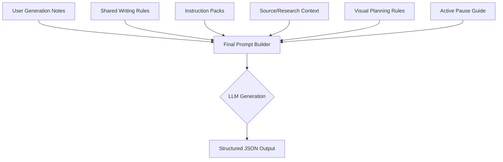
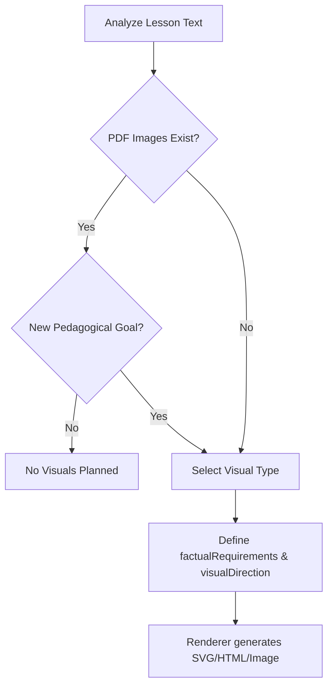

Relevant source files

The following files were used as context for generating this wiki page:

- [apps/backend/src/services/lessonGenerationPrompt.ts](apps/backend/src/services/lessonGenerationPrompt.ts)
- [packages/shared-types/lessonWritingContract.ts](packages/shared-types/lessonWritingContract.ts)
- [packages/shared-types/lessonVisualContracts.ts](packages/shared-types/lessonVisualContracts.ts)
- [apps/web/services/openrouter/research.ts](apps/web/services/openrouter/research.ts)
- [apps/backend/src/services/lessonGenerationModel.ts](apps/backend/src/services/lessonGenerationModel.ts)
- [apps/backend/src/services/lessonGenerationAids.ts](apps/backend/src/services/lessonGenerationAids.ts)
- [AGENTS.md](AGENTS.md)

# Prompt Engineering & Shared Directives

Prompt Engineering in the Lumina-Reader project is a centralized architecture designed to govern AI behavior across different learning phases, including research, planning, and content generation. It utilizes a "Professor Nous" persona to maintain a consistent pedagogical tone while strictly adhering to structured writing contracts and visual planning rules.

The system relies on shared directives to ensure continuity between lessons, manage cognitive load through "active pauses," and integrate multi-modal content like YouTube clips and generated visuals. This approach prevents "context drift" and ensures that the AI functions as a rigorous, accessible educator rather than a generic content generator.

Sources: [apps/backend/src/services/lessonGenerationPrompt.ts:60](apps/backend/src/services/lessonGenerationPrompt.ts#L60), [packages/shared-types/lessonWritingContract.ts:47](packages/shared-types/lessonWritingContract.ts#L47), [AGENTS.md:5](AGENTS.md#L5)

## Architecture of Shared Directives

The prompt engineering framework is built on modular "contracts" that are injected into the LLM context based on the current task (e.g., writing a lesson, planning visuals, or conducting research).

### Core Directive Modules

| Module | Description | Key Source Files |
| :--- | :--- | :--- |
| **Writing Contract** | Defines pedagogical tone, vocabulary constraints, and structural Markdown rules. | `lessonWritingContract.ts` |
| **Visual Planning** | Rules for selecting between raster images, SVGs, or interactive HTML artifacts. | `lessonVisualContracts.ts` |
| **Research Context** | Directives for web-crawled dossier structuring and YouTube transcript evaluation. | `research.ts` |
| **Learning Aids** | Logic for extracting definitions, formulas, and analogies to reduce cognitive load. | `lessonGenerationAids.ts` |

Sources: [packages/shared-types/lessonWritingContract.ts:47](packages/shared-types/lessonWritingContract.ts#L47), [packages/shared-types/lessonVisualContracts.ts:133](packages/shared-types/lessonVisualContracts.ts#L133), [apps/backend/src/services/lessonGenerationAids.ts:25](apps/backend/src/services/lessonGenerationAids.ts#L25)

### Prompt Construction Flow

The generation of a full lesson involves aggregating multiple instruction blocks into a final system or user prompt.

The final prompt builder combines high-priority user notes with fixed pedagogical principles to ensure the output adheres to the required JSON schema while reflecting user preferences.
Sources: [apps/backend/src/services/lessonGenerationPrompt.ts:40-100](apps/backend/src/services/lessonGenerationPrompt.ts#L40-L100), [packages/shared-types/lessonWritingContract.ts:108-124](packages/shared-types/lessonWritingContract.ts#L108-L124)

## Pedagogical Tone and Writing Rules

The project enforces a specific persona, "Professor Nous," characterized by a "rigorous but accessible" style. Directives explicitly forbid ASCII art, generic meta-discourse, and repetitive paraphrasing.

### Key Writing Directives
*  **Autonomy:** Lessons must be self-sufficient; readers should not need the original document open to understand the content.
*  **Propedeutic Order:** Concepts must be introduced before they are used; definitions must be positive and autonomous before using contrasts.
*  **Formula Relevance:** Formulas are only permitted if they add real precision; they must use KaTeX syntax ($...$ or $$...$$).
*  **Continuity:** Lessons must reference completed lesson titles without hallucinating future content or using retroactive phrases like "as we will see."

Sources: [packages/shared-types/lessonWritingContract.ts:7-45](packages/shared-types/lessonWritingContract.ts#L7-L45), [apps/backend/src/services/lessonGenerationPrompt.ts:18](apps/backend/src/services/lessonGenerationPrompt.ts#L18), [apps/backend/src/services/lessonGenerationPrompt.ts:46-52](apps/backend/src/services/lessonGenerationPrompt.ts#L46-L52)

## Visual Content Strategy

Directives for visual content are split between original source images and AI-generated pedagogical artifacts.

### Generated Visual Selection
The `LESSON_VISUAL_PLANNING_RULES` restrict the AI to a maximum of 3 generated visuals per lesson, favoring the minimum necessary to improve comprehension.

| Visual Type | Usage Rule |
| :--- | :--- |
| `illustrative_image` | Used for physical objects, textures, scenes, or complex spatial relations. |
| `flowchart_svg` | Reserved for abstract process relationships (pipelines, decision trees). |
| `interactive_html` | Used when real-time interaction is indispensable for exploring a concept. |
| `mermaid_erd/class` | Used strictly for Entity-Relationship or Object-Oriented Class diagrams. |

Sources: [packages/shared-types/lessonVisualContracts.ts:133-149](packages/shared-types/lessonVisualContracts.ts#L133-L149), [apps/backend/src/services/lessonGenerationModel.ts:98-124](apps/backend/src/services/lessonGenerationModel.ts#L98-L124)

### Visual Flow Diagram

Sources: [packages/shared-types/lessonVisualContracts.ts:151-167](packages/shared-types/lessonVisualContracts.ts#L151-L167)

## Research and Dossier Structuring

The `research.ts` service manages how external data is transformed into a "dossier" for the lesson writer. It evaluates YouTube candidates and structures web search results into factual summaries.

*  **YouTube Evaluation:** The model must decide if a video is a `selected-source` or `rejected` based on transcript relevance rather than social metrics (views/likes).
*  **Dossier Integrity:** The structurer is forbidden from inventing sources or facts not present in the research brief.
*  **Recent Developments:** Actively searches for news from the last 12-24 months to overcome LLM training cutoffs.

Sources: [apps/web/services/openrouter/research.ts:316-347](apps/web/services/openrouter/research.ts#L316-L347), [apps/backend/src/services/lessonGenerationModel.ts:145-177](apps/backend/src/services/lessonGenerationModel.ts#L145-L177)

## Cognitive Load Management (Active Pauses)

The system manages student engagement through "Active Pauses"—inline quizzes that require inference, diagnosis, or sequencing rather than simple paraphrasing.

*  **Placement:** Quizzes must follow explanatory Markdown blocks; they cannot be grouped at the end of a lesson.
*  **Distractors:** Every pause requires four textually distinct options with plausible distractors.
*  **Types:** Guided by `ACTIVE_PAUSE_EXERCISE_PROMPT_GUIDE`, focusing on application and synthesis.

Sources: [apps/backend/src/services/lessonGenerationPrompt.ts:94-102](apps/backend/src/services/lessonGenerationPrompt.ts#L94-L102), [apps/backend/src/services/lessonGenerationModel.ts:25-33](apps/backend/src/services/lessonGenerationModel.ts#L25-L33)

## Summary of Prompt Engineering Principles

Prompt engineering in Lumina-Reader is not merely about instructions but about enforcing a strict operational contract. By centralizing directives in shared packages, the system ensures that changes to the pedagogical tone or visual styles propagate consistently across the research, planning, and writing modules. This structure prioritizes pedagogical accuracy, stability of output, and the reduction of cognitive load for the end learner.

Sources: [AGENTS.md:5-20](AGENTS.md#L5-L20), [packages/shared-types/lessonWritingContract.ts:47-80](packages/shared-types/lessonWritingContract.ts#L47-L80)
