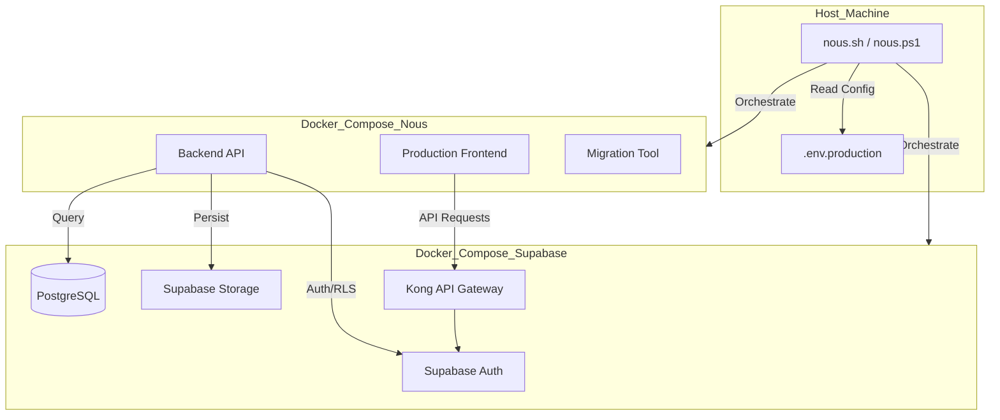
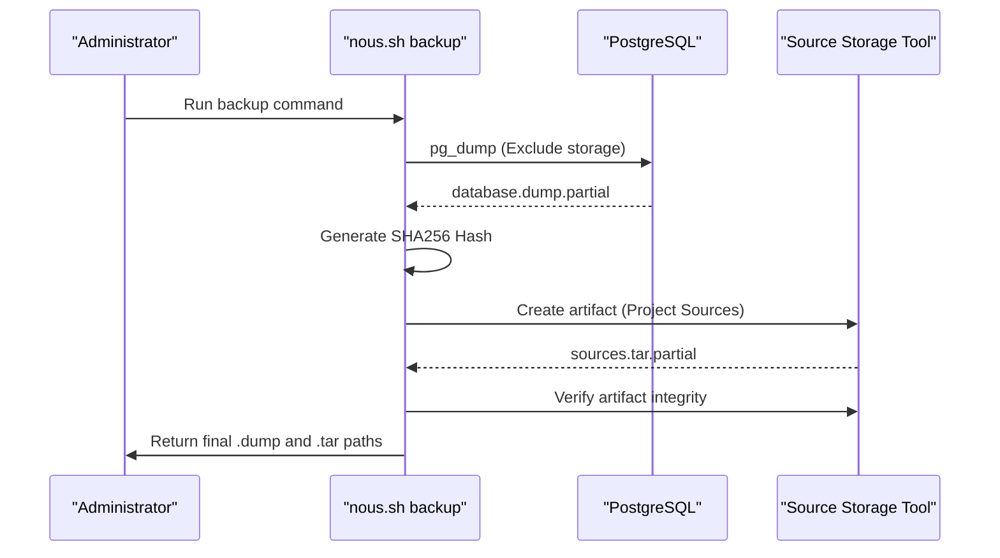

Relevant source files

The following files were used as context for generating this wiki page:

- [deploy/nous.sh](deploy/nous.sh)
- [deploy/nous.ps1](deploy/nous.ps1)
- [apps/web/tests/scripts/productionDeployment.test.ts](apps/web/tests/scripts/productionDeployment.test.ts)
- [README.md](README.md)
- [scripts/serve-production-frontend.ts](scripts/serve-production-frontend.ts)
- [apps/backend/tests/integration/supabaseLocal.integration.test.ts](apps/backend/tests/integration/supabaseLocal.integration.test.ts)

# Self-Hosted Deployment

Self-hosted deployment allows Nous Reader to be operated on private infrastructure using a containerized architecture. The system supports two primary profiles: `managed` (relying on external Supabase services) and `self-hosted` (deploying a full Supabase stack locally). This approach ensures that project storage, authentication, and AI-backed course generation are maintained within a controlled environment.

The deployment orchestration is managed via specialized shell scripts (`nous.sh` for Linux/macOS and `nous.ps1` for Windows) that interface with Docker Compose to manage service lifecycles, configuration validation, and health monitoring.

Sources: [README.md:59-60](README.md#L59-L60), [deploy/nous.sh:7-10](deploy/nous.sh#L7-L10)

## Architecture and Infrastructure

The self-hosted architecture relies on Docker and Docker Compose (v2.24+ required) to manage a multi-container environment. In the `self-hosted` profile, the deployment includes both the Nous application services and a localized Supabase infrastructure.

### Component Stack

| Category | Components | Responsibility |
| :--- | :--- | :--- |
| **Nous App** | Frontend, Backend | Web interface and API logic for course generation. |
| **Auth** | Supabase Auth (GoTrue) | User authentication and session management. |
| **Database** | PostgreSQL | Storage for project snapshots, metadata, and feedback. |
| **Storage** | Supabase Storage | Authenticated storage for project source files (PDFs, ZIPs). |
| **Gateway** | Kong | API Gateway for routing requests to Supabase services. |
| **AI Integration** | Codex (Optional) | Local ChatGPT/Codex app-server for administrative AI access. |

Sources: [README.md:23-28](README.md#L23-L28), [deploy/nous.sh:22-44](deploy/nous.sh#L22-L44), [apps/web/tests/scripts/productionDeployment.test.ts:74-88](apps/web/tests/scripts/productionDeployment.test.ts#L74-L88)

### Infrastructure Flow Diagram

The following diagram illustrates the relationship between the deployment scripts, the environment configuration, and the containerized services.

Sources: [deploy/nous.sh:76-88](deploy/nous.sh#L76-L88), [deploy/nous.ps1:126-140](deploy/nous.ps1#L126-L140), [apps/backend/tests/integration/supabaseLocal.integration.test.ts:168-190](apps/backend/tests/integration/supabaseLocal.integration.test.ts#L168-L190)

## Deployment Lifecycle

The deployment process follows a strict sequence of preflight checks, environment setup, and service orchestration.

### 1. Preflight and Validation
The scripts verify the host architecture (Linux/Darwin x86_64/aarch64 or Windows 64-bit) and Docker daemon availability. A critical requirement is Docker Compose version 2.24.0 or higher to support safe port overrides.

Sources: [deploy/nous.sh:11-38](deploy/nous.sh#L11-L38), [deploy/nous.ps1:17-43](deploy/nous.ps1#L17-L43)

### 2. Environment Configuration
Configuration is driven by a `.env.production` file. The deployment scripts include a `config` command to validate the integrity of this file, checking for required public URLs, API keys, and JWT secrets.

Sources: [deploy/nous.sh:40-52](deploy/nous.sh#L40-L52), [apps/web/tests/scripts/productionDeployment.test.ts:25-58](apps/web/tests/scripts/productionDeployment.test.ts#L25-L58)

### 3. Supabase Bundle Initialization
For `self-hosted` deployments, the system downloads a pinned official Supabase bundle specified in `deploy/SUPABASE_VERSION`. It generates necessary cryptographic keys (JWT secrets, API keys) automatically if they are missing.

Sources: [deploy/nous.sh:91-125](deploy/nous.sh#L91-L125), [deploy/nous.ps1:97-124](deploy/nous.ps1#L97-L124)

## Security and Authentication

Nous uses authenticated server storage as the standard product path. Security is enforced via Supabase Auth and Row Level Security (RLS) within the PostgreSQL database.

### Auth Configurations
- **JWT Issuer:** Must be an absolute URL, typically the internal Supabase Auth URL.
- **Service Role Key:** Used by the backend for administrative bypass of RLS where necessary.
- **Local Bypass:** Development can use `AUTH_MODE=local-bypass`, but this is restricted to testing or specific local development profiles to prevent exposing unsecured backends to a LAN.

Sources: [README.md:33-47](README.md#L33-L47), [apps/web/tests/scripts/productionDeployment.test.ts:60-72](apps/web/tests/scripts/productionDeployment.test.ts#L60-L72)

### Email Templates
Branded Auth email templates (confirmation, invite, magic-link, recovery) are served via a dedicated internal volume mapping.
- **Template Source:** `supabase/templates/`
- **Branding:** Templates are structurally branded with Nous logos and specific subjects like "Il tuo invito a Nous".

Sources: [apps/web/tests/scripts/productionDeployment.test.ts:90-107](apps/web/tests/scripts/productionDeployment.test.ts#L90-L107), [apps/backend/tests/scripts/supabaseAuthTemplates.test.ts:27-46](apps/backend/tests/scripts/supabaseAuthTemplates.test.ts#L27-L46)

## Operations and Maintenance

### Health Monitoring (Smoke Tests)
The deployment includes a smoke test suite to verify the operational status of the stack. It checks:
- **Frontend:** Reachability of the web interface.
- **Backend:** API health endpoint.
- **Supabase:** Auth service health using the anon key for authentication.
- **Database:** `pg_isready` check and a basic query test.

Sources: [deploy/nous.sh:127-132](deploy/nous.sh#L127-L132), [apps/web/tests/scripts/productionDeployment.test.ts:121-163](apps/web/tests/scripts/productionDeployment.test.ts#L121-L163)

### Backup and Restore
The system provides commands for complete data portability:
1. **Database Dump:** Uses `pg_dump` to create a custom-format dump, excluding the `storage` schema.
2. **Project Sources:** Archives project source files from the storage layer.
3. **Verification:** Calculates SHA256 hashes of the database dump to ensure artifact integrity during restore.

Sources: [deploy/nous.sh:185-225](deploy/nous.sh#L185-L225), [deploy/nous.ps1:221-260](deploy/nous.ps1#L221-L260)

### Backup Workflow Sequence

Sources: [deploy/nous.sh:197-217](deploy/nous.sh#L197-L217), [deploy/nous.ps1:241-255](deploy/nous.ps1#L241-L255)

## Conclusion

The self-hosted deployment of Nous Reader provides a robust, containerized environment that prioritizes data sovereignty and infrastructure control. By leveraging Docker Compose and a pinned Supabase stack, the system ensures consistent behavior across different host environments while maintaining strict security through RLS and authenticated storage. The included orchestration scripts simplify complex tasks such as secret generation, health monitoring, and disaster recovery.

Sources: [README.md:59-65](README.md#L59-L65), [deploy/nous.sh:142-159](deploy/nous.sh#L142-L159)
