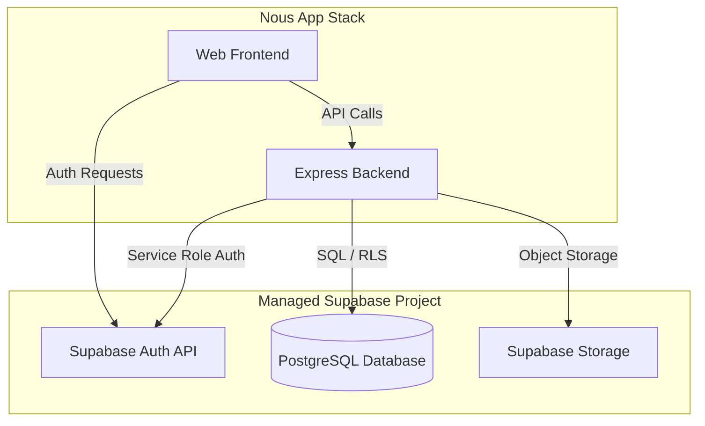
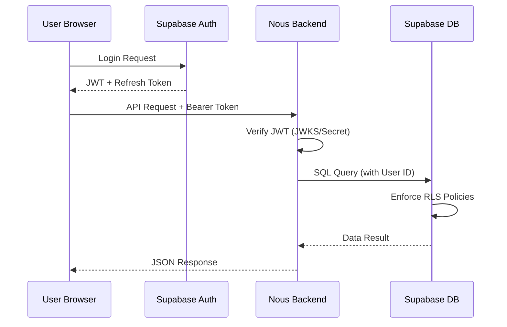

<details>
<summary>Relevant source files</summary>

The following files were used as context for generating this wiki page:

- [deploy/compose.yml](deploy/compose.yml)
- [deploy/supabase.override.yml](deploy/supabase.override.yml)
- [deploy/nous.sh](deploy/nous.sh)
- [apps/web/tests/scripts/productionDeployment.test.ts](apps/web/tests/scripts/productionDeployment.test.ts)
- [README.md](README.md)
- [scripts/sync-supabase-auth-emails.ts](scripts/sync-supabase-auth-emails.ts)
- [apps/backend/tests/integration/supabaseLocal.integration.test.ts](apps/backend/tests/integration/supabaseLocal.integration.test.ts)
</details>

# Managed Supabase Deployment

Managed Supabase Deployment refers to the configuration and integration of the Nous Reader application with a hosted Supabase project. In this mode, the application utilizes Supabase's cloud infrastructure for Authentication, PostgreSQL database, and Storage services rather than running a local or self-hosted containerized Supabase stack.

This deployment strategy is defined by setting the `SUPABASE_DEPLOYMENT` environment variable to `managed`. It requires strict alignment between the application's environment variables and the Supabase project's API origins and security keys. Key operations include syncing branded email templates to the hosted project and ensuring that the backend and frontend correctly route requests to the Supabase project origin.

Sources: [README.md:52-58](README.md#L52-L58), [deploy/nous.sh:78-82](deploy/nous.sh#L78-L82), [apps/web/tests/scripts/productionDeployment.test.ts:38-40](apps/web/tests/scripts/productionDeployment.test.ts#L38-L40)

## Architecture and Integration

The architecture for a managed deployment separates the Nous application containers (Frontend and Backend) from the data and identity layer provided by the Supabase Cloud. The Nous backend interacts with Supabase via a direct PostgreSQL connection for data and the Supabase Auth API for identity verification.

### System Flow
The following diagram illustrates the flow between the Nous deployment and the Managed Supabase services.



Sources: [compose.yml:25-30](compose.yml#L25-L30), [README.md:52-60](README.md#L52-L60), [apps/backend/tests/integration/supabaseLocal.integration.test.ts:135-155](apps/backend/tests/integration/supabaseLocal.integration.test.ts#L135-L155)

## Deployment Configuration

A managed deployment requires a specific set of environment variables to be defined in `.env.production`. The deployment scripts validate these variables to ensure that `SUPABASE_URL` and `NOUS_SUPABASE_PUBLIC_URL` point to the same project origin.

### Required Environment Variables
| Variable | Description | Requirement |
| :--- | :--- | :--- |
| `SUPABASE_DEPLOYMENT` | Must be set to `managed`. | Mandatory |
| `SUPABASE_URL` | The internal API URL of the Supabase project. | Mandatory |
| `NOUS_SUPABASE_PUBLIC_URL` | The public-facing URL for the Supabase Auth service. | Mandatory |
| `DATABASE_URL` | Connection string for the Supabase PostgreSQL instance (e.g., using Transaction Pooler). | Mandatory |
| `SUPABASE_SERVICE_ROLE_KEY` | Secret key for backend administrative access. | Mandatory |
| `NOUS_SUPABASE_ANON_KEY` | Public key for frontend authentication requests. | Mandatory |
| `SUPABASE_JWT_ISSUER` | Set if the token issuer differs from the internal URL. | Optional |

Sources: [apps/web/tests/scripts/productionDeployment.test.ts:32-60](apps/web/tests/scripts/productionDeployment.test.ts#L32-L60), [compose.yml:76-80](compose.yml#L76-L80), [README.md:52-60](README.md#L52-L60)

## Authentication and Security

In a managed deployment, security is enforced through a combination of JWT verification and Row Level Security (RLS) on the Supabase PostgreSQL database. The Nous backend uses the `SUPABASE_SERVICE_ROLE_KEY` to perform administrative tasks, such as bootstrapping the admin user or managing project source files.

### Identity Flow
The application uses Supabase Auth to manage user sessions. The backend verifies incoming JWTs against the Supabase project's JWKS or shared secret.



Sources: [apps/backend/tests/integration/supabaseLocal.integration.test.ts:250-280](apps/backend/tests/integration/supabaseLocal.integration.test.ts#L250-L280), [apps/web/tests/scripts/productionDeployment.test.ts:187-210](apps/web/tests/scripts/productionDeployment.test.ts#L187-L210), [README.md:55-60](README.md#L55-L60)

## Storage and Asset Management

Nous uses Supabase Storage for project artifacts. In a managed environment, the backend handles the persistence of project source bytes into a private `project-sources` bucket. Snapshots stored in the primary database do not contain the raw data bytes; instead, they refer to the storage path.

### Project Source Persistence Logic
1. **Upload:** Backend receives files and uploads them to Supabase Storage using the Service Role Key.
2. **Indexing:** Metadata (byte size, hash, object path) is stored in the `public.project_sources` table.
3. **Retrieval:** The frontend requests sources via the Nous Backend API, which fetches the data from Supabase Storage and streams it back.

Sources: [apps/backend/tests/integration/supabaseLocal.integration.test.ts:300-350](apps/backend/tests/integration/supabaseLocal.integration.test.ts#L300-L350), [scripts/project-source-storage-artifact.ts:16-30](scripts/project-source-storage-artifact.ts#L16-L30)

## Management API Integrations

Managed deployments support synchronization of branded assets to the Supabase cloud via the Supabase Management API. This is particularly relevant for Auth Email templates.

### Email Template Syncing
Branded HTML templates located in `supabase/templates/` can be synced to the hosted project. The `sync-supabase-auth-emails.ts` script uses a `SUPABASE_ACCESS_TOKEN` and `SUPABASE_PROJECT_REF` to patch the hosted configuration.

```typescript
const patchHostedAuthConfig = async ({
  accessToken,
  patch,
  projectRef,
}: {
  accessToken: string;
  patch: Record<string, string>;
  projectRef: string;
}): Promise<void> => {
  const response = await fetch(`${MANAGEMENT_API_BASE_URL}/projects/${projectRef}/config/auth`, {
    method: 'PATCH',
    headers: {
      Authorization: `Bearer ${accessToken}`,
      'Content-Type': 'application/json',
    },
    body: JSON.stringify(patch),
  });
};
```

Sources: [scripts/sync-supabase-auth-emails.ts:43-61](scripts/sync-supabase-auth-emails.ts#L43-L61), [apps/backend/tests/scripts/supabaseAuthTemplates.test.ts:10-25](apps/backend/tests/scripts/supabaseAuthTemplates.test.ts#L10-L25)

## Operational Procedures

Managed deployments are managed through the `deploy/nous.sh` script (or `nous.ps1` for Windows). The primary command for initialization is `setup`.

*  **Setup:** Validates the configuration and starts the application stack using `compose.yml`. Unlike self-hosted mode, it skips the local Supabase container startup.
*  **Smoke Test:** Executes a health check against the hosted Supabase Auth endpoint (`/auth/v1/health`) using the `NOUS_SUPABASE_ANON_KEY` for authentication.
*  **Admin Bootstrap:** A dedicated tool runs to promote the initial user account to the `admin` role by updating `app_metadata` in Supabase Auth.

Sources: [deploy/nous.sh:160-174](deploy/nous.sh#L160-L174), [apps/web/tests/scripts/productionDeployment.test.ts:145-165](apps/web/tests/scripts/productionDeployment.test.ts#L145-L165), [compose.yml:148-160](compose.yml#L148-L160)

## Summary
Managed Supabase Deployment allows Nous Reader to scale by offloading core infrastructure to Supabase Cloud. It requires precise synchronization of authentication keys and origins between the Nous environment and the Supabase Management API. Security is maintained through strict RLS enforcement and private storage buckets managed by the Nous backend.
