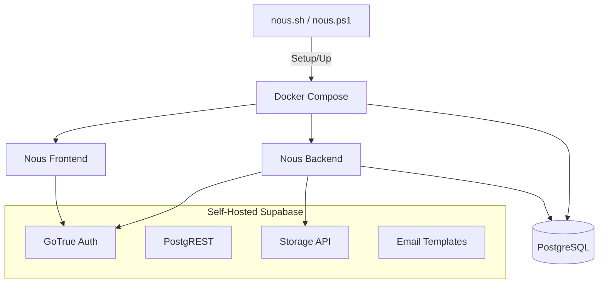
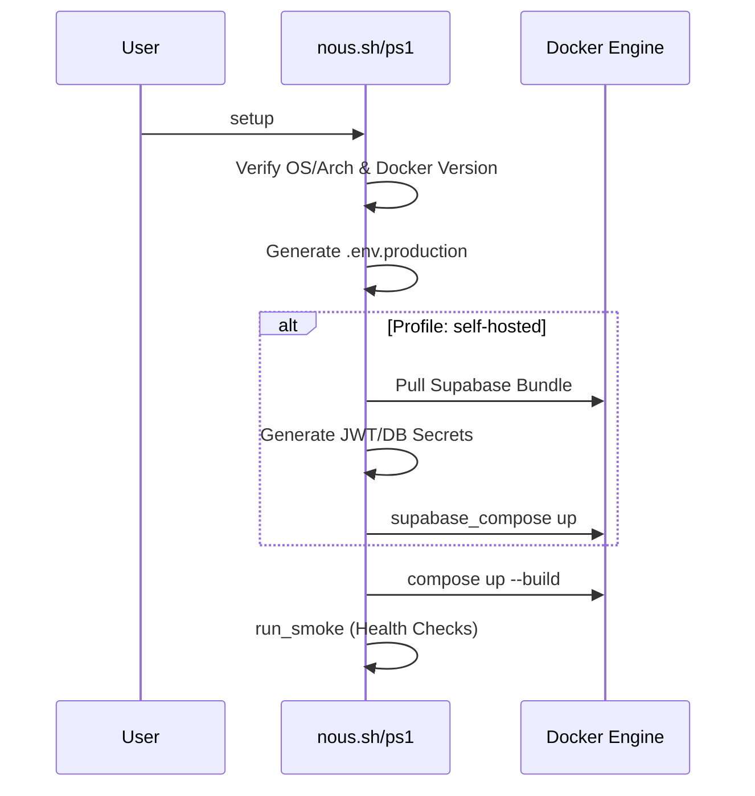
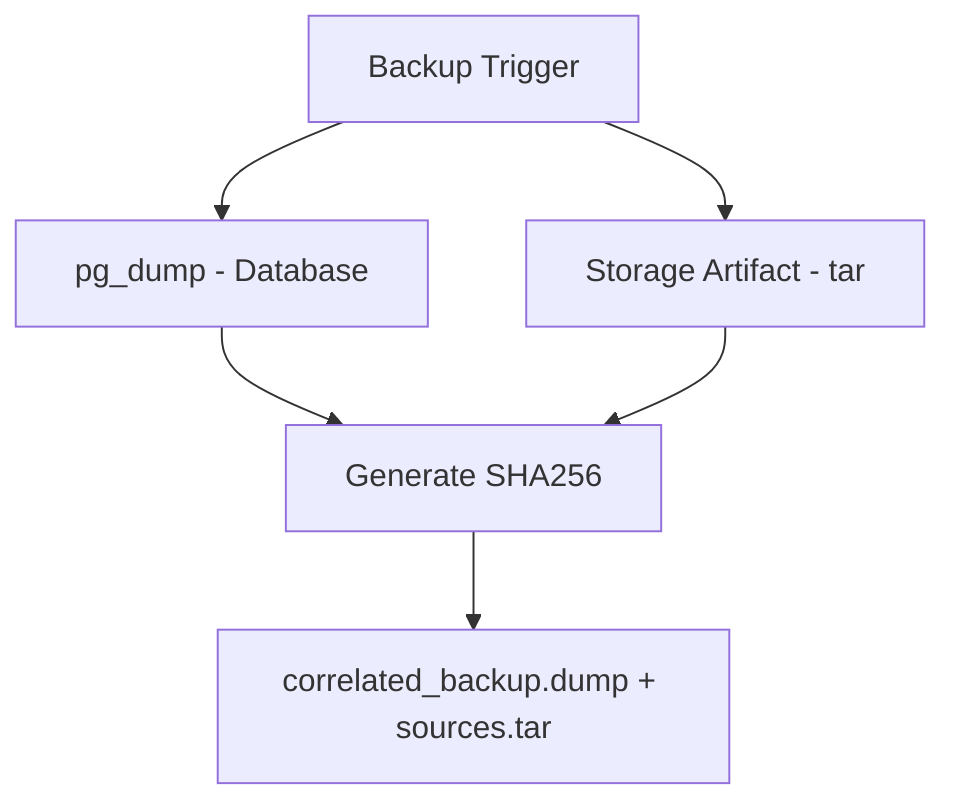

Relevant source files

The following files were used as context for generating this wiki page:

- [deploy/compose.self-hosted.yml](deploy/compose.self-hosted.yml)
- [deploy/nous.sh](deploy/nous.sh)
- [deploy/nous.ps1](deploy/nous.ps1)
- [README.md](README.md)
- [apps/web/tests/scripts/productionDeployment.test.ts](apps/web/tests/scripts/productionDeployment.test.ts)
- [apps/backend/tests/integration/supabaseLocal.integration.test.ts](apps/backend/tests/integration/supabaseLocal.integration.test.ts)
- [scripts/doctor.ts](scripts/doctor.ts)

# Self-Hosted Deployment

Self-hosted deployment allows users to run the Nous Reader platform on their own infrastructure using Docker and Docker Compose. This deployment model supports two primary configurations: "managed," where external services like Supabase are used, and "self-hosted," which includes a local Supabase stack for authentication, database, and storage.

The deployment process is managed via orchestration scripts (`nous.sh` for Unix-like systems and `nous.ps1` for Windows) that handle environment validation, service provisioning, and lifecycle management. The architecture ensures that private integration credentials remain isolated within the backend service, while the frontend is served as a static single-page application (SPA).

Sources: [README.md:1-12](README.md#L1-L12), [deploy/nous.sh:1-10](deploy/nous.sh#L1-L10), [apps/web/tests/scripts/productionDeployment.test.ts:119-124](apps/web/tests/scripts/productionDeployment.test.ts#L119-L124)

## Architecture and Components

The self-hosted architecture is built on Docker Compose, orchestrating multiple services including the Vite frontend, Express backend, and the optional local Supabase stack.

### System Overview
The following diagram illustrates the relationship between the deployment orchestration scripts and the containerized services.

The deployment separates the core application from the infrastructure management, allowing for smoke tests and health checks across frontend, backend, and auth endpoints.

Sources: [deploy/nous.sh:76-90](deploy/nous.sh#L76-L90), [deploy/compose.self-hosted.yml](deploy/compose.self-hosted.yml), [apps/web/tests/scripts/productionDeployment.test.ts:130-150](apps/web/tests/scripts/productionDeployment.test.ts#L130-L150)

### Core Service Definitions

| Service | Responsibility | Configuration |
| :--- | :--- | :--- |
| **Frontend** | Vite-based SPA | Configured via `VITE_AUTH_MODE` and `NOUS_PUBLIC_URL`. |
| **Backend** | Express API Server | Handles AI orchestration and sensitive integration keys. |
| **Auth (GoTrue)** | User Authentication | Supports Magic Link, Invitations, and Password Recovery. |
| **Email Templates** | Nginx-served templates | Serves branded HTML emails for the auth flow. |
| **Storage** | Object Storage | Persists project sources (PDFs, ZIPs) separately from DB. |

Sources: [README.md:38-55](README.md#L38-L55), [deploy/compose.self-hosted.yml](deploy/compose.self-hosted.yml), [apps/web/tests/scripts/productionDeployment.test.ts:74-85](apps/web/tests/scripts/productionDeployment.test.ts#L74-L85)

## Deployment Lifecycle

### 1. Preflight and Setup
The orchestration scripts perform preflight checks to ensure Docker Engine and Docker Compose (v2.24+) are available. The `setup` command initializes the `.env.production` file and, for self-hosted profiles, downloads the pinned Supabase bundle.

Sources: [deploy/nous.sh:13-58](deploy/nous.sh#L13-L58), [deploy/nous.sh:99-116](deploy/nous.sh#L99-L116), [deploy/nous.ps1:19-45](deploy/nous.ps1#L19-L45)

### 2. Environment Configuration
The system uses a strict validation logic for deployment configurations. Key parameters include:
*  `SUPABASE_DEPLOYMENT`: Must be `managed` or `self-hosted`.
*  `NOUS_BACKEND_PUBLIC_URL`: Public endpoint for the API.
*  `CORS_ALLOWED_ORIGINS`: Explicit list of trusted origins.

Private credentials like `GITHUB_FEEDBACK_TOKEN` or `DECODO_SCRAPING_API_KEY` are passed exclusively to the backend service.

Sources: [apps/web/tests/scripts/productionDeployment.test.ts:32-60](apps/web/tests/scripts/productionDeployment.test.ts#L32-L60), [README.md:57-65](README.md#L57-L65)

## Authentication and Security

### Self-Hosted Supabase Integration
In self-hosted mode, the backend derives internal URLs (e.g., `http://kong:8000`) for service-to-service communication while the browser uses the public `NOUS_SUPABASE_PUBLIC_URL`. Branded email templates are served internally via a dedicated Nginx container to ensure the auth flow remains consistent with the Nous Reader branding.

Sources: [apps/web/tests/scripts/productionDeployment.test.ts:74-85](apps/web/tests/scripts/productionDeployment.test.ts#L74-L85), [deploy/compose.self-hosted.yml](deploy/compose.self-hosted.yml)

### Security Constraints
*  **Signups**: In production, `DISABLE_SIGNUP` is typically set to `true` to restrict access.
*  **CORS**: Browser origins are restricted, though the backend permits RFC1918 (private) origins for Vite development convenience.
*  **Isolation**: User data is isolated at the database level via Row Level Security (RLS) in PostgreSQL.

Sources: [README.md:60-65](README.md#L60-L65), [apps/backend/tests/integration/supabaseLocal.integration.test.ts:167-175](apps/backend/tests/integration/supabaseLocal.integration.test.ts#L167-L175)

## Backup and Recovery

The deployment toolset includes integrated backup and restore commands.

*  **Backup**: Performs a `pg_dump` of the database (excluding the `storage` schema) and creates a tarball of the project source storage. A SHA256 hash is used to correlate the database state with the storage artifact.
*  **Restore**: Requires setting `CONFIRM_RESTORE=nous-reader`. It verifies the SHA256 match before applying the database dump and storage files.

Sources: [deploy/nous.sh:176-215](deploy/nous.sh#L176-L215), [deploy/nous.ps1:221-255](deploy/nous.ps1#L221-L255)

## Health Monitoring

The `smoke` command executes a suite of health checks to ensure the stack is operational. It validates:
1.  **Frontend**: Reaches the `/health` endpoint.
2.  **Backend**: Reaches the `/health` endpoint.
3.  **Auth**: Reaches `/auth/v1/health` using the anon key.
4.  **Database**: Verifies connectivity via `pg_isready` and a simple query test.

Sources: [deploy/nous.sh:130-134](deploy/nous.sh#L130-L134), [apps/web/tests/scripts/productionDeployment.test.ts:130-150](apps/web/tests/scripts/productionDeployment.test.ts#L130-L150), [scripts/doctor.ts:208-230](scripts/doctor.ts#L208-L230)

## Conclusion
The Self-Hosted Deployment system provides a robust, containerized environment that mirrors the project's development standards. By utilizing the `nous` orchestration scripts, administrators can manage complex infrastructure requirements—such as local Supabase stacks and correlated backups—with minimal manual intervention, ensuring a secure and pedagogically consistent environment for Nous Reader users.

Sources: [README.md:73-77](README.md#L73-L77), [deploy/nous.sh:266-269](deploy/nous.sh#L266-L269)
