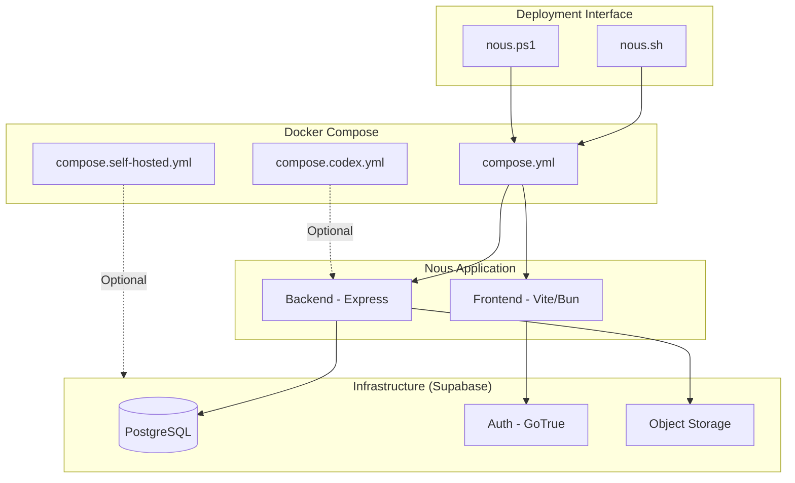
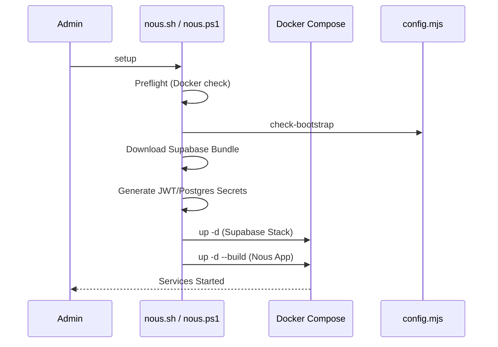

<details>
<summary>Relevant source files</summary>

The following files were used as context for generating this wiki page:

- [deploy/nous.sh](deploy/nous.sh)
- [deploy/nous.ps1](deploy/nous.ps1)
- [README.md](README.md)
- [apps/web/tests/scripts/productionDeployment.test.ts](apps/web/tests/scripts/productionDeployment.test.ts)
- [scripts/serve-production-frontend.ts](scripts/serve-production-frontend.ts)
- [apps/backend/tests/integration/supabaseLocal.integration.test.ts](apps/backend/tests/integration/supabaseLocal.integration.test.ts)
</details>

# Self-Hosted Deployment

Self-hosted deployment of Nous Reader allows developers and organizations to run the entire learning environment infrastructure on their own hardware or private cloud. This deployment model supports two primary profiles: `managed` (using external services like Supabase Cloud) and `self-hosted` (deploying a local Supabase stack alongside the Nous application). The system leverages Docker Compose to orchestrate the frontend, backend, and auxiliary services, ensuring a consistent environment across different host systems.

The deployment process is managed through platform-specific scripts (`nous.sh` for Unix-like systems and `nous.ps1` for Windows), which handle preflight checks, environment configuration, service orchestration, and lifecycle operations such as backups and restores. A critical component of the self-hosted setup is the integration with a local Supabase stack, which provides authentication, PostgreSQL storage, and object storage for project artifacts.

Sources: [README.md:1-24](README.md#L1-L24), [deploy/nous.sh:1-20](deploy/nous.sh#L1-L20), [deploy/nous.ps1:1-25](deploy/nous.ps1#L1-L25)

## Infrastructure and Components

The Nous Reader self-hosted architecture consists of several interconnected Docker containers. In a `self-hosted` profile, the application deploys both the Nous-specific services and a full Supabase infrastructure.

### Component Overview

| Component | Description |
| :--- | :--- |
| **Frontend** | A Vite-based React application served via a production-optimized server (Bun). |
| **Backend** | An Express-based API server handling business logic, AI orchestration, and database interactions. |
| **Supabase Stack** | Includes Auth (GoTrue), PostgreSQL (Database), PostgREST (API), and Storage. |
| **Codex App Server** | Optional service for bridging local ChatGPT/Codex accounts to the instance. |
| **Tools Container** | Ephemeral containers used for migrations, smoke tests, and administrative tasks. |

Sources: [README.md:26-55](README.md#L26-L55), [apps/web/tests/scripts/productionDeployment.test.ts:117-141](apps/web/tests/scripts/productionDeployment.test.ts#L117-L141), [deploy/nous.sh:76-105](deploy/nous.sh#L76-L105)

### Architecture Diagram

The following diagram illustrates the relationship between the deployment scripts, the Docker Compose orchestrator, and the resulting service stack.



Sources: [deploy/nous.sh:76-92](deploy/nous.sh#L76-L92), [deploy/nous.ps1:130-142](deploy/nous.ps1#L130-L142)

## Deployment Lifecycle

The deployment is managed through a set of commands that transition the system from initial setup to production maintenance.

### 1. Preflight and Setup
The scripts perform architecture validation (supporting Linux/x86_64, aarch64, and Darwin) and ensure Docker Compose (v2.24+) is available. During the `setup` phase, the system generates required secrets using OpenSSL and downloads a pinned version of the Supabase Docker bundle.

Sources: [deploy/nous.sh:11-53](deploy/nous.sh#L11-L53), [deploy/nous.ps1:27-56](deploy/nous.ps1#L27-L56)

### 2. Service Orchestration
The deployment status is controlled via standard lifecycle commands:
*  `setup`: Performs initial configuration, generates keys, and starts all services.
*  `up`: Starts existing containers without rebuilding.
*  `down`: Stops and removes all containers.
*  `redeploy`: Rebuilds images and applies database migrations.



Sources: [deploy/nous.sh:163-195](deploy/nous.sh#L163-L195), [deploy/nous.ps1:144-180](deploy/nous.ps1#L144-L180)

### 3. Verification and Health Checks
After services start, a "smoke test" is executed to verify endpoint availability. This involves checking:
*  **Frontend Health**: Reached via `/health`.
*  **Backend Health**: Verifies connectivity to the project store.
*  **Supabase Auth**: Tested using the `anon` key.

Sources: [apps/web/tests/scripts/productionDeployment.test.ts:153-190](apps/web/tests/scripts/productionDeployment.test.ts#L153-L190), [deploy/nous.sh:142-147](deploy/nous.sh#L142-L147)

## Environment Configuration

Configuration is driven by a `.env.production` file. Key variables define the interaction between frontend, backend, and the identity provider.

### Core Variables

| Variable | Usage |
| :--- | :--- |
| `SUPABASE_DEPLOYMENT` | Must be `managed` or `self-hosted`. |
| `NOUS_PUBLIC_URL` | The external origin for the frontend application. |
| `DATABASE_URL` | Connection string for the PostgreSQL project store. |
| `SUPABASE_JWT_SECRET` | Secret used for HS256 JWT validation. |
| `VITE_AUTH_MODE` | Set to `supabase` for production environments. |
| `CODEX_APP_SERVER_ENABLED` | Enables bridging to a local Codex/ChatGPT account. |

Sources: [README.md:38-55](README.md#L38-L55), [apps/web/tests/scripts/productionDeployment.test.ts:25-58](apps/web/tests/scripts/productionDeployment.test.ts#L25-L58), [scripts/serve-production-frontend.ts:28-44](scripts/serve-production-frontend.ts#L28-L44)

### Runtime Configuration Injection
The frontend receives its environment configuration through a dynamically generated `/config.js` script served by the Bun production server. This prevents the need to rebuild the frontend for different URLs.

```typescript
// scripts/serve-production-frontend.ts:33-44
export const buildRuntimeConfigScript = (environment: Environment): string => {
  const backendUrl = normalizeHttpUrl(
    requireEnvironmentValue(environment, 'NOUS_BACKEND_PUBLIC_URL'),
    'NOUS_BACKEND_PUBLIC_URL'
  );
  const runtimeConfig = {
    authMode: 'supabase',
    backendUrl,
    supabaseAnonKey: requireEnvironmentValue(environment, 'NOUS_SUPABASE_ANON_KEY'),
    supabaseUrl: normalizeHttpUrl(
      requireEnvironmentValue(environment, 'NOUS_SUPABASE_PUBLIC_URL'),
      'NOUS_SUPABASE_PUBLIC_URL'
    ),
  };

  return `globalThis.__NOUS_RUNTIME_CONFIG__ = Object.freeze(${JSON.stringify(runtimeConfig)});\nglobalThis.__NOUS_SERVER_CONFIG__ = Object.freeze({backendUrl: ${JSON.stringify(backendUrl)}});\n`;
};
```

## Data Management

### Persistent Storage
Self-hosted deployments utilize PostgreSQL for project metadata and Supabase Storage for large binary assets (PDFs, archives). The `PostgresProjectStore` manages the mapping between these two layers.

Sources: [apps/backend/tests/integration/supabaseLocal.integration.test.ts:279-335](apps/backend/tests/integration/supabaseLocal.integration.test.ts#L279-L335), [README.md:38-42](README.md#L38-L42)

### Backup and Restore
The deployment scripts include comprehensive backup and restore logic that ensures data consistency between the database and object storage.
*  **Backup**: Generates a custom-format PostgreSQL dump (excluding the storage schema) and creates a tarball of the project source files from the storage bucket.
*  **Validation**: Both parts are verified using SHA256 hashes before completion.
*  **Restore**: Requires `CONFIRM_RESTORE=nous-reader` and applies the database dump within a single transaction before restoring storage artifacts.

Sources: [deploy/nous.sh:227-300](deploy/nous.sh#L227-L300), [deploy/nous.ps1:214-307](deploy/nous.ps1#L214-L307)

## Security and Authentication

### Authorization Flow
Authentication is strictly enforced at the API layer. The backend validates JWTs issued by the Supabase stack using either `SUPABASE_JWT_SECRET` (HS256) or `SUPABASE_JWKS_URL` (RS256).

Sources: [README.md:43-51](README.md#L43-L51), [apps/backend/tests/integration/supabaseLocal.integration.test.ts:168-208](apps/backend/tests/integration/supabaseLocal.integration.test.ts#L168-L208)

### Administrative Access
Initial administrative access is established via the `admin` command, which runs `scripts/bootstrap-admin.ts`. This promotes a specific email address to the `admin` role within Supabase `app_metadata`, allowing access to the administrative dashboard and model configurations.

Sources: [apps/web/tests/scripts/productionDeployment.test.ts:221-248](apps/web/tests/scripts/productionDeployment.test.ts#L221-L248), [deploy/nous.sh:224-226](deploy/nous.sh#L224-L226)

The self-hosted deployment architecture ensures that Nous Reader remains a private, controllable environment while providing the scalability of a containerized microservices stack. By centralizing deployment logic in `nous.sh` and `nous.ps1`, the project maintains high technical parity between different hosting environments.
