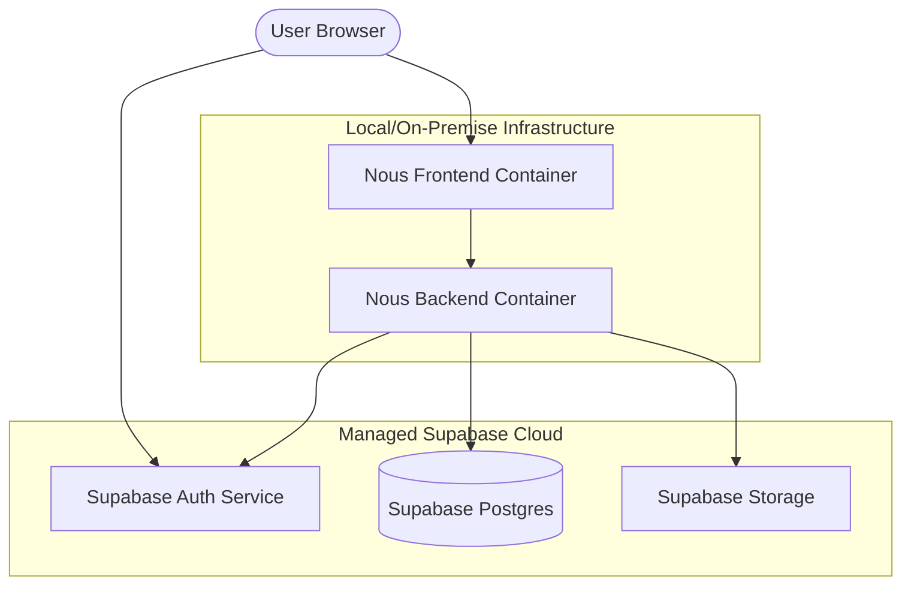
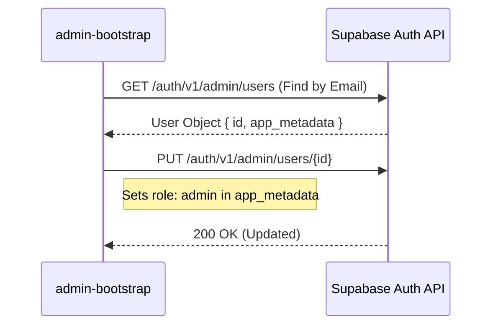
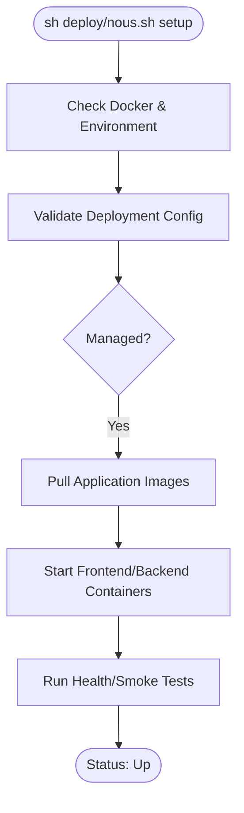

Relevant source files

The following files were used as context for generating this wiki page:

- [deploy/nous.sh](deploy/nous.sh)
- [deploy/compose.yml](compose.yml)
- [apps/web/tests/scripts/productionDeployment.test.ts](apps/web/tests/scripts/productionDeployment.test.ts)
- [README.md](README.md)
- [scripts/sync-supabase-auth-emails.ts](scripts/sync-supabase-auth-emails.ts)
- [apps/backend/tests/integration/supabaseLocal.integration.test.ts](apps/backend/tests/integration/supabaseLocal.integration.test.ts)
- [scripts/project-source-storage-artifact.ts](scripts/project-source-storage-artifact.ts)

# Managed Supabase Deployment

Managed Supabase Deployment refers to the configuration and orchestration of the Nous Reader platform using an externally managed Supabase project rather than a self-hosted Docker-based stack. In this mode, the application utilizes the official Supabase cloud infrastructure for Authentication, PostgreSQL database, and Storage services.

This deployment strategy is governed by the `SUPABASE_DEPLOYMENT` environment variable set to `managed`. It requires precise alignment between the application's public URLs and the Supabase project origin to ensure security, particularly regarding Cross-Origin Resource Sharing (CORS) and JSON Web Token (JWT) validation.

Sources: [README.md](README.md), [deploy/nous.sh:78-83](deploy/nous.sh#L78-L83), [apps/web/tests/scripts/productionDeployment.test.ts:35-42](apps/web/tests/scripts/productionDeployment.test.ts#L35-L42)

## Architecture and Components

In a managed deployment, the Nous backend and frontend run in a containerized environment (typically via Docker Compose) while delegating stateful services to the Supabase Cloud.

### Component Interaction Flow

The following diagram illustrates how the Nous components interact with the managed Supabase services.

*Note: The frontend serves the SPA, while authentication tokens are issued directly by Supabase Auth and verified by the Nous Backend.*
Sources: [compose.yml](compose.yml), [README.md](README.md)

## Configuration Requirements

Managed deployments rely on a set of environment variables that define the connection strings and security keys for the Supabase project.

### Core Environment Variables

| Variable | Description | Requirement |
| :--- | :--- | :--- |
| `SUPABASE_DEPLOYMENT` | Set to `managed` for cloud-hosted Supabase. | Mandatory |
| `NOUS_SUPABASE_PUBLIC_URL` | The public URL of the Supabase project (e.g., `https://xyz.supabase.co`). | Mandatory |
| `NOUS_SUPABASE_ANON_KEY` | The client-side "anon" key for the project. | Mandatory |
| `SUPABASE_URL` | Internal backend URL for Supabase API access. | Must match project origin |
| `DATABASE_URL` | Direct connection string to Supabase Postgres (typically via transaction pooler). | Mandatory |
| `SUPABASE_SERVICE_ROLE_KEY` | The secret service-role key for administrative tasks. | Backend Only |
| `SUPABASE_JWT_ISSUER` | The expected `iss` claim in JWTs; must be an absolute URL. | Optional |

Sources: [apps/web/tests/scripts/productionDeployment.test.ts:35-65](apps/web/tests/scripts/productionDeployment.test.ts#L35-L65), [compose.yml:25-30](compose.yml#L25-L30)

### Security Constraints
The deployment configuration enforces strict validation:
1.  **Project Origin Match:** The `SUPABASE_URL` and `NOUS_SUPABASE_PUBLIC_URL` must use the same project origin to prevent misrouted authentication requests.
2.  **JWT Issuer:** If `SUPABASE_JWT_ISSUER` is set, it must be an absolute URL.
3.  **CORS:** The `CORS_ALLOWED_ORIGINS` must explicitly list the production origin of the frontend to allow browser-based API calls.

Sources: [apps/web/tests/scripts/productionDeployment.test.ts:50-58](apps/web/tests/scripts/productionDeployment.test.ts#L50-L58), [README.md](README.md)

## Authentication Integration

Nous uses Supabase Auth for identity management. The backend validates incoming requests by checking the Bearer token against the Supabase JWT secret or JWKS endpoint.

### Admin Bootstrapping
For managed deployments, admin accounts are promoted via the `admin-bootstrap` tool. This script updates a user's `app_metadata` to include the `admin` role without discarding existing provider metadata.

Sources: [apps/web/tests/scripts/productionDeployment.test.ts:219-242](apps/web/tests/scripts/productionDeployment.test.ts#L219-L242), [compose.yml:153-162](compose.yml#L153-L162)

### Template Synchronization
Branded email templates (Invite, Magic Link, Recovery) are managed via the Supabase Management API. The `sync-supabase-auth-emails.ts` script fetches the current hosted configuration and applies patches derived from local HTML templates in `supabase/templates/`.

Sources: [scripts/sync-supabase-auth-emails.ts:40-75](scripts/sync-supabase-auth-emails.ts#L40-L75), [apps/backend/tests/scripts/supabaseAuthTemplates.test.ts:10-25](apps/backend/tests/scripts/supabaseAuthTemplates.test.ts#L10-L25)

## Storage and Artifacts

Nous utilizes authenticated server storage for project materials. Managed Supabase Storage buckets are used to store binary artifacts like PDFs and ZIP archives.

### Storage Manifest and Integrity
Project source objects are stored using content-addressing (SHA-256 hashes). A manifest-based system ensures integrity during backup and restore operations.

| Field | Description |
| :--- | :--- |
| `bucket` | Fixed to `project-sources`. |
| `databaseDumpSha256` | SHA-256 of the corresponding database dump for consistency. |
| `objectPath` | Path format: `users/{userId}/projects/{projectId}/{sourceId}/{hash}/original`. |

Sources: [scripts/project-source-storage-artifact.ts:23-40](scripts/project-source-storage-artifact.ts#L23-L40), [apps/backend/tests/integration/supabaseLocal.integration.test.ts:303-310](apps/backend/tests/integration/supabaseLocal.integration.test.ts#L303-L310)

### Deployment Lifecycle Flow
The `deploy/nous.sh` script handles the setup and maintenance of the application stack.

Sources: [deploy/nous.sh:150-178](deploy/nous.sh#L150-L178), [apps/web/tests/scripts/productionDeployment.test.ts:162-180](apps/web/tests/scripts/productionDeployment.test.ts#L162-L180)

## Health Monitoring
Health checks for managed deployments involve verifying connectivity to the external Supabase services. The smoke test checks:
1.  **Frontend Health:** Static file serving and SPA entry point.
2.  **Backend Health:** Database connectivity and API readiness.
3.  **Auth Health:** `auth/v1/health` endpoint on the Supabase public URL, requiring the `apikey` and `Authorization` headers (Anon Key).

Sources: [apps/web/tests/scripts/productionDeployment.test.ts:162-205](apps/web/tests/scripts/productionDeployment.test.ts#L162-L205), [compose.yml:185-197](compose.yml#L185-L197)

## Summary
The Managed Supabase Deployment allows Nous Reader to leverage scalable cloud infrastructure while maintaining a lightweight containerized application layer. It emphasizes strict URL validation and role-based access control (RLS) within Supabase to ensure tenant isolation and secure management of document artifacts.

Sources: [README.md](README.md), [apps/backend/tests/integration/supabaseLocal.integration.test.ts:167-200](apps/backend/tests/integration/supabaseLocal.integration.test.ts#L167-L200)
