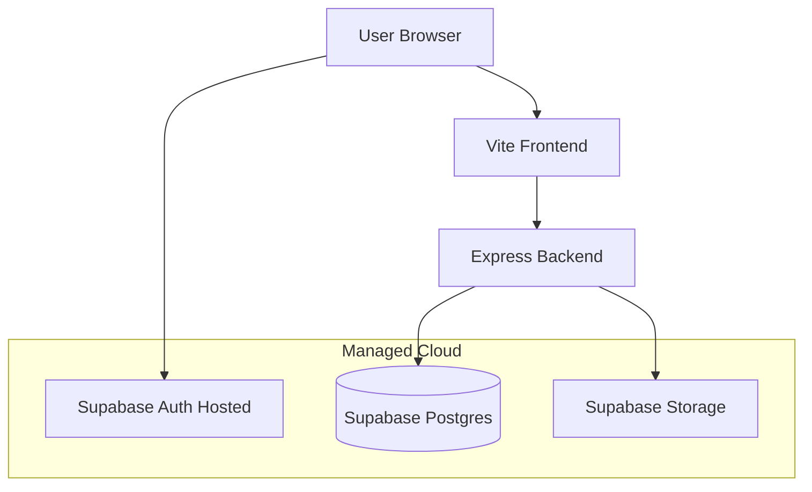
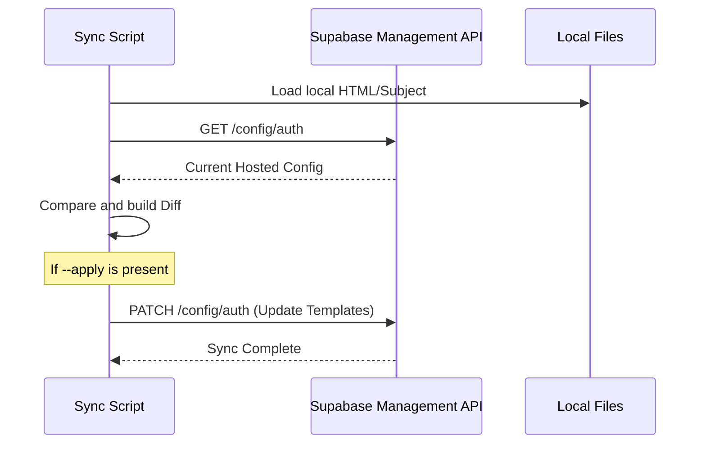
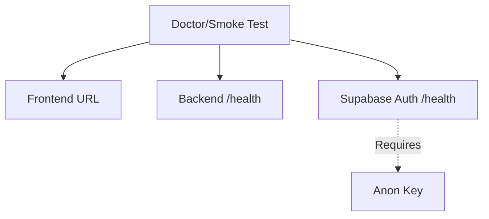

Relevant source files

The following files were used as context for generating this wiki page:

- [deploy/supabase.override.yml](deploy/supabase.override.yml)
- [scripts/serve-production-frontend.ts](scripts/serve-production-frontend.ts)
- [apps/web/tests/scripts/productionDeployment.test.ts](apps/web/tests/scripts/productionDeployment.test.ts)
- [scripts/sync-supabase-auth-emails.ts](scripts/sync-supabase-auth-emails.ts)
- [deploy/nous.sh](deploy/nous.sh)
- [README.md](README.md)
- [apps/backend/src/projects/projectSourceStorage.ts](apps/backend/src/projects/projectSourceStorage.ts)

# Managed Supabase Deployment

Managed Supabase Deployment refers to the configuration and operation of the Nous Reader platform using the official Supabase hosted infrastructure. In this mode, the project leverages external Supabase services for Authentication, PostgreSQL database storage, and Storage buckets rather than hosting a local Docker-based Supabase stack.

The deployment relies on specific environment variables to bridge the Nous Reader backend and frontend with the Supabase project. Key requirements include consistent project origins for API and Auth URLs, and the synchronization of branded email templates via the Supabase Management API.

## Architecture and Data Flow

In a managed deployment, the Nous Reader components (Frontend and Backend) communicate directly with the Supabase cloud endpoints. The backend acts as a proxy for sensitive operations, such as serving project source bytes from private storage buckets, while the frontend handles user sessions via Supabase Auth.

*The diagram shows the interaction between the application components and the managed Supabase cloud services.*
Sources: [README.md:38-46](README.md#L38-L46), [deploy/nous.sh:58-65](deploy/nous.sh#L58-L65)

## Deployment Configuration

Managed deployment is activated by setting the `SUPABASE_DEPLOYMENT` environment variable to `managed`. The system performs strict validation to ensure that the internal `SUPABASE_URL` and the public `NOUS_SUPABASE_PUBLIC_URL` share the same project origin (e.g., both referencing `*.supabase.co`).

### Required Environment Variables

| Variable | Description | Requirement |
| :--- | :--- | :--- |
| `SUPABASE_DEPLOYMENT` | Set to `managed` for cloud hosting. | Must be `managed` |
| `NOUS_SUPABASE_PUBLIC_URL` | The public URL of the Supabase project. | Absolute URL |
| `SUPABASE_URL` | The internal API URL for the Supabase project. | Matches public origin |
| `NOUS_SUPABASE_ANON_KEY` | The anonymous/publishable key for client-side auth. | Non-empty string |
| `SUPABASE_SERVICE_ROLE_KEY` | High-privilege key for backend administrative tasks. | Keep private |
| `SUPABASE_JWT_ISSUER` | The expected issuer in the JWT. | Absolute URL |

Sources: [apps/web/tests/scripts/productionDeployment.test.ts:33-54](apps/web/tests/scripts/productionDeployment.test.ts#L33-L54), [README.md:41-45](README.md#L41-L45)

## Authentication and Email Synchronization

Managed deployments utilize Supabase Auth for session management. Unlike self-hosted setups that use local volumes for templates, managed deployments must sync branded email templates (for invites, magic links, and password recovery) using the Supabase Management API.

### Template Synchronization Logic
The project provides scripts to detect drift between local template files in `supabase/templates/` and the remote configuration. The synchronization uses the `SUPABASE_ACCESS_TOKEN` and `SUPABASE_PROJECT_REF` to patch the hosted configuration.

*Sequence of events for synchronizing Auth email templates with the managed Supabase environment.*
Sources: [scripts/sync-supabase-auth-emails.ts:18-68](scripts/sync-supabase-auth-emails.ts#L18-L68), [README.md:65-69](README.md#L65-L69)

## Project Source Storage

In the managed configuration, the backend uses the `SupabaseProjectSourceStorage` class to interact with a private bucket named `project-sources`. This service handles the uploading, downloading, and integrity verification of document bytes.

Key aspects of managed storage:
*  **Private Buckets:** The `project-sources` bucket must be private. The deployment scripts verify this by checking the `public: false` attribute via the Storage API.
*  **Integrity Verification:** The system enforces SHA-256 hash checks and byte-size validation for all objects downloaded from the managed bucket to prevent corruption.
*  **Authenticated Access:** All storage requests are signed using the `SUPABASE_SERVICE_ROLE_KEY`.

Sources: [apps/backend/src/projects/projectSourceStorage.ts:25-33, 91-118](apps/backend/src/projects/projectSourceStorage.ts#L25-L33), [scripts/migrate-project-sources-to-storage.ts:474-500](scripts/migrate-project-sources-to-storage.ts#L474-L500)

## Health and Connectivity

Managed deployments are validated through "smoke tests" that verify the availability of the three primary cloud endpoints.

*Connectivity verification flow for managed cloud endpoints.*

The Supabase Auth health check specifically requires passing the `apikey` and `Authorization` headers containing the `NOUS_SUPABASE_ANON_KEY`.
Sources: [apps/web/tests/scripts/productionDeployment.test.ts:133-149](apps/web/tests/scripts/productionDeployment.test.ts#L133-L149), [deploy/nous.sh:135-139](deploy/nous.sh#L135-L139)

## Conclusion

Managed Supabase Deployment simplifies infrastructure overhead by offloading database and auth management to Supabase Cloud. It requires precise synchronization of JWT issuers and project origins, and relies on the `project-source-storage-artifact` utilities to manage data portability between the local environment and the managed cloud storage.
