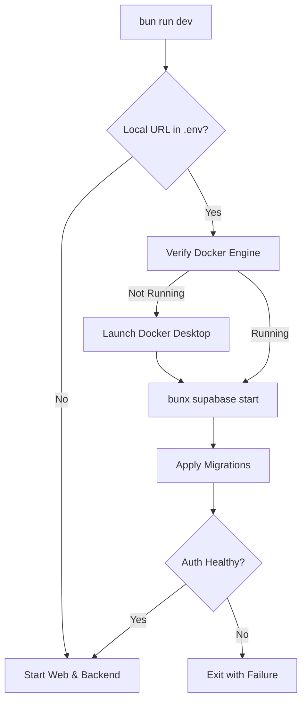
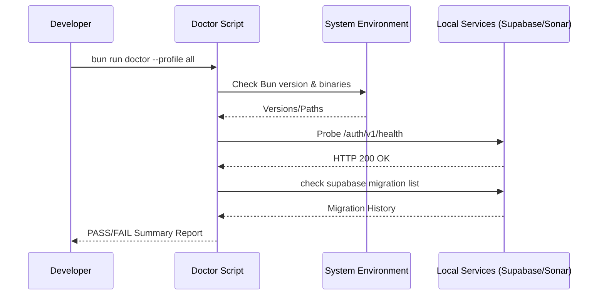

Relevant source files

The following files were used as context for generating this wiki page:

- [README.md](README.md)
- [scripts/ensure-local-dev-services.ts](scripts/ensure-local-dev-services.ts)
- [scripts/doctor.ts](scripts/doctor.ts)
- [AGENTS.md](AGENTS.md)
- [apps/backend/tests/integration/supabaseLocal.integration.test.ts](apps/backend/tests/integration/supabaseLocal.integration.test.ts)
- [biome.json](biome.json)

# Local Environment Setup

The local environment setup for Nous Reader provides developers with a containerized infrastructure to support full-stack development. It primarily relies on the Bun runtime for package management and script execution, and utilizes Docker to host a local Supabase stack (including PostgreSQL and Auth services). This setup ensures that features such as personalized course generation, AI feedback, and server-side project storage function correctly in a development context.

The environment is designed to be self-checking, using automated scripts to verify Docker status, apply migrations, and probe service health before the application launches. Developers can validate their setup using the `doctor` utility, which provides a comprehensive health report across various diagnostic profiles.

Sources: [README.md:1-20](README.md#L1-L20), [AGENTS.md:100-115](AGENTS.md#L100-L115)

## Core Infrastructure

The project utilizes a split architecture consisting of a Vite frontend and an Express backend. For local development, these services are coordinated through Bun.

### Service Orchestration
Local infrastructure is triggered automatically by the `bun run dev` command when the environment is configured to point to local hostnames (e.g., `localhost` or `127.0.0.1`). The system performs a sequence of checks to ensure the Docker engine is running and the Supabase stack is initialized.

The diagram shows the automated initialization sequence triggered during local development startup.
Sources: [scripts/ensure-local-dev-services.ts:101-145](scripts/ensure-local-dev-services.ts#L101-L145), [README.md:17-25](README.md#L17-L25)

### Prerequisite Components
| Component | Purpose | Requirement |
| :--- | :--- | :--- |
| Bun | Primary runtime and package manager | Pinned version in `package.json` |
| Docker | Hosts local Supabase services | Running engine (Desktop for Win/macOS) |
| Supabase CLI | Manages local DB and Auth stack | Installed via `bunx` |
| uv/uvx | Required for Semgrep quality gates | System installation |

Sources: [scripts/doctor.ts:250-280](scripts/doctor.ts#L250-L280), [README.md:10-15](README.md#L10-L15)

## Configuration and Environment Variables

Configuration is handled via a `.env.local` file. The backend and frontend utilize specific keys to determine if the local infrastructure should be managed or bypassed.

### Required Environment Keys
*  `DATABASE_URL`: Pointer to the PostgreSQL instance (local or remote).
*  `SUPABASE_URL` / `VITE_SUPABASE_URL`: API gateway for Supabase services.
*  `VITE_SUPABASE_ANON_KEY`: Publishable key for frontend authentication.
*  `OPENROUTER_API_KEY`: Required for AI-backed lesson generation.
*  `AUTH_MODE`: Set to `supabase` for standard flow or `local-bypass` for specific test scenarios.

Sources: [README.md:10-15, 34-45](README.md#L10-L15), [scripts/ensure-local-dev-services.ts:7-10](scripts/ensure-local-dev-services.ts#L7-L10)

### Local Auth Bypass
In specific development profiles (`LOCAL_DEV_PROFILE=true` and `LOCAL_AUTH_BYPASS=true`), the system allows bypassing standard authentication. However, the backend remains restricted to loopback origins (port 5173) to prevent unauthorized access in shared network environments.

Sources: [README.md:36-55](README.md#L36-L55)

## Diagnostic Tools and Validation

The environment includes a diagnostic script, `scripts/doctor.ts`, which performs non-destructive health probes.

### Doctor Profiles
Developers use `bun run doctor -- --profile <name>` to execute specific check suites:
*  **checks**: (Default) Validates Bun runtime versions, workspace binaries (Biome, Vitest, Semgrep), and Fallow baselines.
*  **gate**: Probes the local SonarQube service and token validity.
*  **local**: Probes local Supabase Auth, REST, and Storage health, and checks for migration drift.
*  **all**: Executes all of the above.

Sources: [scripts/doctor.ts:68-90, 310-340](scripts/doctor.ts#L68-L90)

The sequence diagram illustrates the diagnostic flow when a developer runs a full system check.
Sources: [scripts/doctor.ts:380-450](scripts/doctor.ts#L380-L450)

## Development Workflow Commands

Commonly used commands for maintaining the local environment:

| Command | Description |
| :--- | :--- |
| `bun run deps:install` | Installs all workspace dependencies. |
| `bun run dev` | Starts frontend (5173), backend (3301), and local infrastructure. |
| `bun run doctor` | Runs local health diagnostics. |
| `bun run fix` | Auto-fixes Biome linting, formatting, and import ordering. |
| `bun run supabase:templates:sync` | Syncs local Supabase email templates. |
| `bun run test:supabase-local` | Runs integration tests against the local Supabase stack. |

Sources: [AGENTS.md:100-115](AGENTS.md#L100-L115), [README.md:10-25, 60-65](README.md#L10-L25)

## Code Quality and Style
The environment enforces strict code quality via **Biome**. Configuration resides in `biome.json`, which defines rules for formatting (2-space indentation, single quotes) and linting (warning on unused imports, enforcing `useConst`).

Sources: [biome.json:20-70](biome.json#L20-L70)

The local setup is critical for ensuring that the ADHD-friendly learning environment's pedagogical rules and AI prompt constructions are tested in a controlled, server-backed context before deployment.

Sources: [AGENTS.md:50-70](AGENTS.md#L50-L70)
