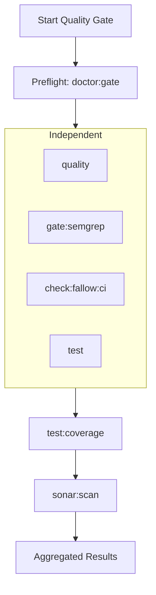

Relevant source files

The following files were used as context for generating this wiki page:

- [scripts/run-full-quality-gate.ts](scripts/run-full-quality-gate.ts)
- [scripts/run-full-quality-gate.test.ts](scripts/run-full-quality-gate.test.ts)
- [scripts/doctor.test.ts](scripts/doctor.test.ts)
- [AGENTS.md](AGENTS.md)
- [apps/web/tests/scripts/workflowPostgresCi.test.ts](apps/web/tests/scripts/workflowPostgresCi.test.ts)
- [scripts/select-workflow-postgres-contract.test.ts](scripts/select-workflow-postgres-contract.test.ts)
- [README.md](README.md)

# Testing & Quality Gates

Testing and Quality Gates in the Nous project comprise a multi-layered validation framework designed to ensure code reliability, security, and architectural integrity. This system spans from local diagnostic checks using the `doctor` utility to comprehensive Continuous Integration (CI) pipelines that enforce strict quality standards before code can be merged.

The project follows a "Context Before Code" philosophy, emphasizing that validation should not just check if code works, but if it adheres to the established architecture, naming conventions, and domain assumptions. Automated gates are used to triage bugs, vulnerabilities, and security hotspots while reducing technical debt through static analysis and regression checks.
Sources: [AGENTS.md:124-128](AGENTS.md#L124-L128), [AGENTS.md:195-200](AGENTS.md#L195-L200), [README.md:99-102](README.md#L99-L102)

## Quality Gate Architecture

The project employs a structured hierarchy of validation commands, allowing developers to run the narrowest meaningful validation first before proceeding to full gates.

### Validation Command Hierarchy

| Command | Description | Profile/Notes |
| :--- | :--- | :--- |
| `bun run doctor` | Read-only diagnostics | Defaults to `checks` profile |
| `bun run quality` | TypeScript type checks + Biome lint | Fast feedback loop |
| `bun run gate` | quality + fallow + tests | Standard local gate |
| `bun run gate:full` | Full local gate | Includes Semgrep, Fallow, and Sonar |
| `bun run gate:ci` | CI-specific gate | Quality + Fallow regression + tests |
| `bun run test` | Vitest test suite | Runs under Bun runtime |

Sources: [AGENTS.md:154-169](AGENTS.md#L154-L169), [README.md:99-102](README.md#L99-L102)

### Full Quality Gate Execution Flow

The `executeFullQualityGate` function coordinates the execution of various stages, ensuring that independent checks run in parallel while critical sequential stages (like Sonar analysis) wait for prerequisite data like test coverage.

The Full Quality Gate starts with a preflight check to ensure the local environment is ready, followed by a parallel burst of linting, security scanning, and testing. It concludes with coverage reporting and a final Sonar scan.
Sources: [scripts/run-full-quality-gate.ts:58-65](scripts/run-full-quality-gate.ts#L58-L65), [scripts/run-full-quality-gate.test.ts:25-50](scripts/run-full-quality-gate.test.ts#L25-L50)

## Diagnostic Tooling: Doctor

The `doctor` utility is a read-only diagnostic tool that reports results without mutating the environment. It supports multiple profiles to target specific subsystems.

*  **Profiles**: 
  *  `checks`: Default service-free diagnostics.
  *  `gate`: Probes the local Sonar service.
  *  `local`: Probes local Supabase services and migration parity.
  *  `all`: Combines all available probes.
*  **Key Validations**:
  *  Bun runtime version pinned in `package.json`.
  *  Workspace dependency integrity.
  *  Supabase configuration safety (e.g., preventing unsafe loopback incoherent configurations).
  *  Migration drift between local and remote databases.
  *  Fallow baseline regression (checking for unused files, dependencies, and exports).

Sources: [AGENTS.md:171-177](AGENTS.md#L171-L177), [scripts/doctor.test.ts:13-25](scripts/doctor.test.ts#L13-L25), [scripts/doctor.test.ts:70-80](scripts/doctor.test.ts#L70-L80), [scripts/doctor.test.ts:109-120](scripts/doctor.test.ts#L109-L120)

## CI Workflow & Database Contracts

The CI pipeline uses specialized scripts to determine the blast radius of changes and run appropriate database contract tests.

### PostgreSQL CI Selection logic
The script `select-workflow-postgres-contract.ts` analyzes changed files to decide if the PostgreSQL contract tests need to run. It triggers for changes in:
*  Supabase migrations (`supabase/migrations/`).
*  Database-related backend code (`apps/backend/src/projects/postgresProjectStore.ts`).
*  Workflow stores (`apps/backend/src/workflows/postgresWorkflowStore.ts`).
*  Shared types and project contracts.
*  CI configuration files.

Sources: [apps/web/tests/scripts/workflowPostgresCi.test.ts:40-60](apps/web/tests/scripts/workflowPostgresCi.test.ts#L40-L60), [scripts/select-workflow-postgres-contract.test.ts:10-30](scripts/select-workflow-postgres-contract.test.ts#L10-L30)

### Database Test Modes
CI runs two distinct versions of the database contract:
1.  **Critical Contract**: Run on Pull Requests if relevant changes are detected. It uses `bun run test:workflow-postgres:critical`.
2.  **Full Contract**: Run only on `push` events to the `main` branch. It executes the complete deterministic suite via `bun run test:workflow-postgres`.

Sources: [apps/web/tests/scripts/workflowPostgresCi.test.ts:63-87](apps/web/tests/scripts/workflowPostgresCi.test.ts#L63-L87)

## Quality Standards and Guidelines

The project maintains strict coding and testing standards summarized in the `AGENTS.md` instructions:

### Testing Principles
*  **Regression Focus**: Automated tests must catch meaningful regressions in behavior, contracts, or persistence.
*  **Anti-Patterns**: Avoid "tautological" string-inclusion tests for AI prompts that merely freeze copy without proving correctness.
*  **Stability**: Never rely on undefined iteration order in tests; stable output reduces flakiness.
*  **Isolation**: Mocks and test state must be cleaned up after each execution.

Sources: [AGENTS.md:374-394](AGENTS.md#L374-L394), [AGENTS.md:364-370](AGENTS.md#L364-L370)

### Cognitive Complexity
Functions are expected to maintain low cognitive complexity (target below 15). This is achieved through:
*  Guard clauses instead of nested conditionals.
*  Extracting responsibilities into helpers.
*  Separating validation, transformation, and side effects.

Sources: [AGENTS.md:213-222](AGENTS.md#L213-L222)

## Summary

The Testing and Quality Gates in Nous establish a high bar for code acceptance. By integrating diagnostic checks (`doctor`), static analysis (`quality`, `semgrep`, `fallow`), and multi-tier database contracts, the system ensures that changes are technically sound and architecturally consistent. The parallel execution of independent gate stages optimizes developer feedback while the mandatory sequential Sonar scanning provides final oversight on technical debt and security.
Sources: [scripts/run-full-quality-gate.ts:58-65](scripts/run-full-quality-gate.ts#L58-L65), [AGENTS.md:180-186](AGENTS.md#L180-L186)
