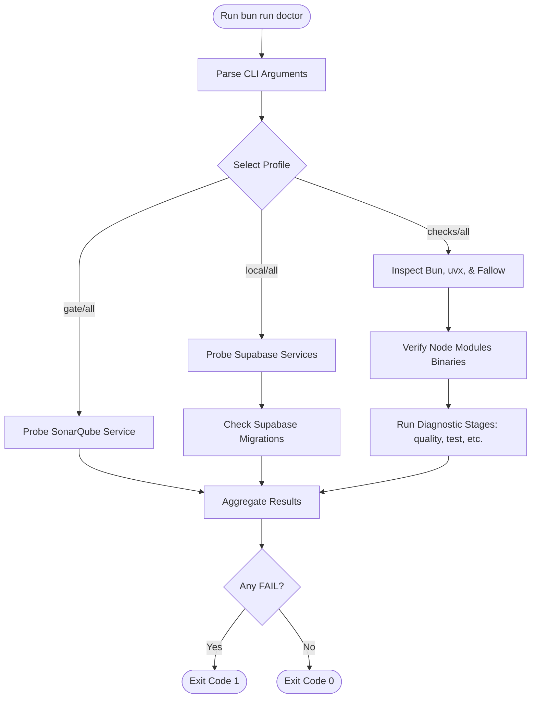
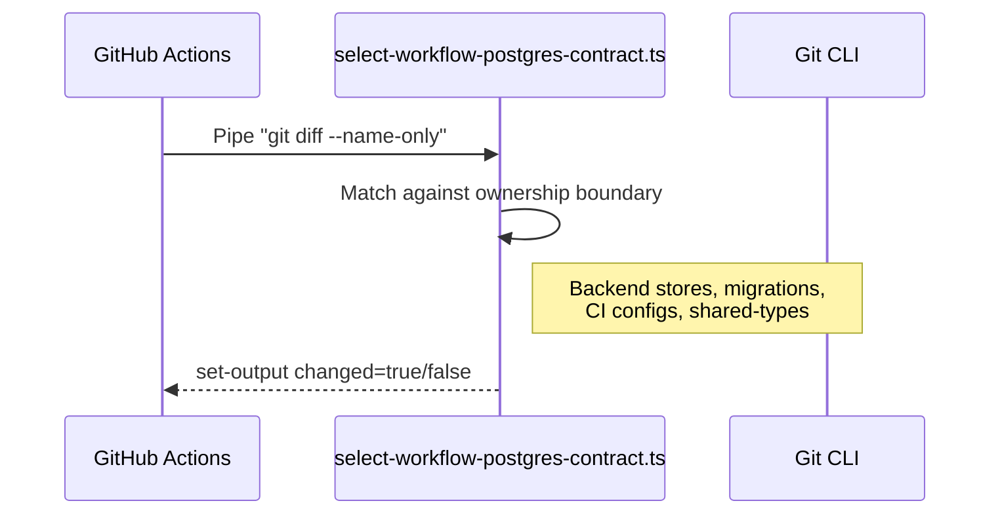

Relevant source files

The following files were used as context for generating this wiki page:

- [scripts/doctor.ts](scripts/doctor.ts)
- [AGENTS.md](AGENTS.md)
- [scripts/doctor.test.ts](scripts/doctor.test.ts)
- [apps/web/tests/scripts/workflowPostgresCi.test.ts](apps/web/tests/scripts/workflowPostgresCi.test.ts)
- [scripts/select-workflow-postgres-contract.test.ts](scripts/select-workflow-postgres-contract.test.ts)
- [README.md](README.md)

# CLI Tools & Diagnostics

Nous Reader employs a comprehensive suite of CLI tools and diagnostic scripts to ensure environment health, code quality, and service stability. These tools act as the primary interface for developers to validate local configurations, check for regressions, and manage synchronization between the application and its infrastructure components like Supabase and SonarQube.

The core of this system is the `doctor` utility, which provides observational health reports across different profiles, ranging from simple environment checks to full service probes. These diagnostics are integrated into the project's [Testing and Quality Gates](#validation-commands) to maintain a robust CI/CD pipeline.

Sources: [scripts/doctor.ts:413-435](scripts/doctor.ts#L413-L435), [README.md:95-97](README.md#L95-L97)

## The Doctor Utility

The `doctor.ts` script is a central diagnostic tool that performs read-only observations of the environment and services. It reports results using four statuses: `PASS`, `FAIL`, `WARN`, and `SKIP`. It is designed to be observational, meaning it does not modify configurations or restart services.

Sources: [scripts/doctor.ts:50-58](scripts/doctor.ts#L50-L58), [AGENTS.md:128-132](AGENTS.md#L128-L132)

### Diagnostic Profiles

The tool supports four execution profiles to target specific areas of the system:

| Profile | Scope | Description |
| :--- | :--- | :--- |
| `checks` | Environment & Static Analysis | Validates Bun runtime, workspace binaries, Fallow baselines, and uvx availability. |
| `gate` | SonarQube | Probes the local SonarQube service status and token validity. |
| `local` | Supabase | Probes local Supabase Auth, Data API, Storage, Realtime, and migration parity. |
| `all` | Full Suite | Executes all checks from the `checks`, `gate`, and `local` profiles. |

Sources: [scripts/doctor.ts:46-48](scripts/doctor.ts#L46-L48), [scripts/doctor.ts:162-177](scripts/doctor.ts#L162-L177), [AGENTS.md:128-132](AGENTS.md#L128-L132)

### Execution Logic Flow

The following diagram illustrates how the `doctor` script processes arguments and executes diagnostic stages based on the selected profile.

The script uses `Bun.spawn` to trigger sub-processes for diagnostic stages like quality checks and test suites.
Sources: [scripts/doctor.ts:380-435](scripts/doctor.ts#L380-L435), [scripts/doctor.ts:347-362](scripts/doctor.ts#L347-L362)

## Environment Verification

Environment verification focuses on runtime consistency and the presence of required project dependencies.

### Bun Runtime Consistency
The system enforces a strict Bun version contract. The `inspectBunRuntime` function compares the current `process.versions.bun` against the version pinned in `package.json` (`packageManager` field) and the CI workflow file (`.github/workflows/ci.yml`). If these versions do not align, the diagnostic fails.
Sources: [scripts/doctor.ts:182-211](scripts/doctor.ts#L182-L211)

### Workspace Binary Validation
The script ensures that essential binaries are present in `node_modules/.bin`. The required binaries vary by profile:
*  **Common/Checks**: `biome`, `dependency-cruiser`, `eslint`, `tsgo`, `vitest`.
*  **Gate**: `sonar-scanner`.
*  **Local**: `supabase`.

Sources: [scripts/doctor.ts:13-25](scripts/doctor.ts#L13-L25), [scripts/doctor.ts:213-228](scripts/doctor.ts#L213-L228)

## Service & Migration Diagnostics

For local development and integration testing, the system validates the state of external services.

### Supabase Health Checks
The `local` profile probes Supabase endpoints to ensure the stack is responsive. It specifically checks:
*  **Auth**: `/auth/v1/health`
*  **Data API**: `/rest/v1/`
*  **Storage**: `/storage/v1/status`
*  **Realtime**: Health endpoint for the `realtime-dev` tenant.

Sources: [scripts/doctor.ts:27-36](scripts/doctor.ts#L27-L36), [scripts/doctor.ts:303-333](scripts/doctor.ts#L303-L333)

### Database Migration Drift
The tool detects "migration drift" by comparing local migration files against the history recorded in the database. It executes the `supabase migration list` command and parses the JSON output to identify discrepancies between `local` and `remote` versions.
Sources: [scripts/doctor.ts:108-125](scripts/doctor.ts#L108-L125), [scripts/doctor.ts:347-380](scripts/doctor.ts#L347-L380)

### SonarQube Integration
The `gate` profile reads settings from `sonar.local.properties`. It verifies:
1.  Service reachability via `/api/system/status`.
2.  Token validity via `/api/authentication/validate`.

Sources: [scripts/doctor.ts:273-301](scripts/doctor.ts#L273-L301)

## Automated Quality Gates

Beyond observational diagnostics, the project defines several high-level validation commands that combine diagnostics with active checks.

| Command | Action |
| :--- | :--- |
| `bun run quality` | Runs TypeScript type checks and Biome linting. |
| `bun run gate` | Full local gate: quality + fallow analysis + tests. |
| `bun run gate:ci` | CI-specific gate: quality + fallow regression + tests. |
| `bun run check:fallow:ci` | Static dead-code and duplication analysis against a baseline. |

Sources: AGENTS.md:133-143](), [scripts/doctor.ts:40-46](scripts/doctor.ts#L40-L46)

### Fallow Regression Analysis
The Fallow check uses a baseline file located at `.fallow-baselines/regression.json`. The `doctor` script parses this file to report "accepted issues" across categories like `unused files`, `unused dependencies`, and `unused exports`. A `WARN` status is issued if there is existing debt, while a `FAIL` occurs if the baseline file is unreadable.
Sources: [scripts/doctor.ts:86-106](scripts/doctor.ts#L86-L106), [scripts/doctor.ts:230-249](scripts/doctor.ts#L230-L249)

## CI Workflow Selection

To optimize CI runs, the project includes scripts to determine if a change necessitates running heavy PostgreSQL contract tests. The `select-workflow-postgres-contract.ts` script analyzes the Git diff between `BASE_SHA` and `HEAD_SHA`.

The selection logic monitors files such as `apps/backend/src/projects/postgresProjectStore.ts`, `supabase/migrations/`, and `packages/shared-types/projectContract.ts`.
Sources: [apps/web/tests/scripts/workflowPostgresCi.test.ts:37-54](apps/web/tests/scripts/workflowPostgresCi.test.ts#L37-L54), [scripts/select-workflow-postgres-contract.test.ts:10-30](scripts/select-workflow-postgres-contract.test.ts#L10-L30)
