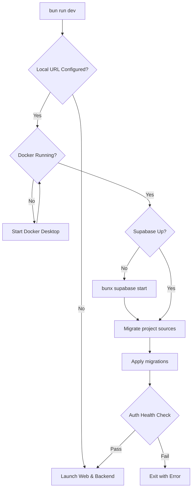
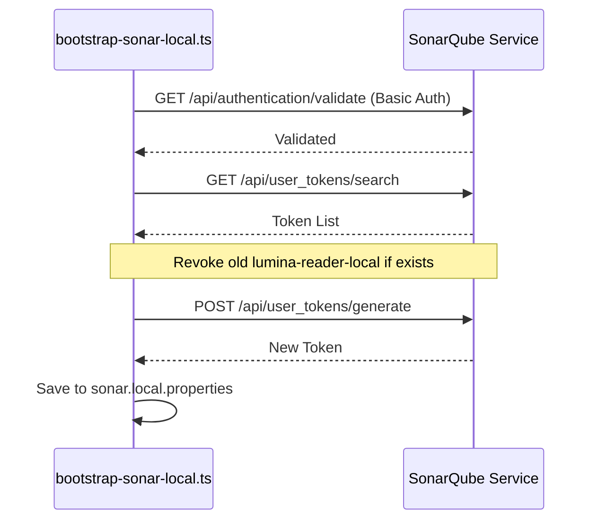

Relevant source files

The following files were used as context for generating this wiki page:

- [README.md](../../../README.md)
- [package.json](../../../package.json)
- [scripts/ensure-local-dev-services.ts](../../../scripts/ensure-local-dev-services.ts)
- [scripts/doctor.ts](../../../scripts/doctor.ts)
- [scripts/bootstrap-sonar-local.ts](../../../scripts/bootstrap-sonar-local.ts)
- [AGENTS.md](../../../AGENTS.md)
- [biome.json](../../../biome.json)

# Local Environment Setup

The local environment for Nous Reader is a containerized infrastructure designed to support development, testing, and quality assurance. It relies on the Bun runtime for dependency management and script execution, utilizing Docker to host local Supabase and SonarQube services. The environment is managed through a suite of automated scripts that ensure service health, apply migrations, and enforce quality gates.

The setup process involves installing workspace dependencies, configuring environment variables for local authentication and external AI providers (such as OpenRouter), and initializing the local service stack. A dedicated "Doctor" utility provides diagnostics to verify that the local environment meets the project's pinned runtime requirements and service availability standards.

## Core Prerequisites and Installation

The project uses a unified workspace managed by Bun. All commands should be executed within the root directory to ensure proper binary resolution.

### Basic Setup Steps
1.  **Install Dependencies:** Run `bun run deps:install` to install project executables including Biome, Vitest, and Supabase CLI.
2.  **Environment Configuration:** Copy `.env.example` to `.env.local`. 
3.  **API Keys:** Set required keys such as `OPENROUTER_API_KEY` and local Supabase keys.
4.  **Start Services:** Execute `bun run dev` to launch the Vite frontend (`:5173`) and Express backend (`:3301`).

Sources: [README.md:14-25](../../../README.md#L14-L25), [scripts/doctor.ts:12-25](../../../scripts/doctor.ts#L12-L25)

### Runtime Validation
The project strictly pins its runtime version. The `doctor` script verifies that the local Bun version matches the one defined in `package.json` and the CI workflow (`.github/workflows/ci.yml`).

Sources: [scripts/doctor.ts:252-276](../../../scripts/doctor.ts#L252-L276), [package.json:208](../../../package.json#L208)

## Service Infrastructure Management

The project automates the lifecycle of Docker-based services. The initialization flow checks for loopback URLs in environment variables (e.g., `SUPABASE_URL`) to determine if local infrastructure is required.

### Local Service Orchestration
The initialization logic performs the following sequence:
- **Docker Info:** Verifies the Docker engine is running; on Windows/macOS, it attempts to start Docker Desktop with a 120-second timeout.
- **Supabase Stack:** Starts the Supabase local stack if it is not already reachable. If the stack is incomplete, it attempts a recovery (stop and restart).
- **Project Sources:** Runs `scripts/migrate-project-sources-to-storage.ts` to stage local project data.
- **Database Migrations:** Applies local migrations via `supabase migration up --local` after source staging.

Sources: [scripts/ensure-local-dev-services.ts:74-135](../../../scripts/ensure-local-dev-services.ts#L74-L135), [README.md:27-31](../../../README.md#L27-L31)

### Infrastructure Initialization Flow
The following diagram illustrates the automated startup sequence when running `bun run dev`.

A visual representation of the pre-flight checks performed to ensure a functional local backend.
Sources: [scripts/ensure-local-dev-services.ts:137-160](../../../scripts/ensure-local-dev-services.ts#L137-L160)

## Health Diagnostics and Quality Gates

The `doctor` utility is the primary tool for environment verification. It supports multiple profiles to probe different subsystems without mutating their state.

### Doctor Profiles
| Profile | Description |
| :--- | :--- |
| `checks` | Default. Runs read-only diagnostics on Bun runtime, workspace binaries, and lint/test stages. |
| `gate` | Probes the local SonarQube service for connectivity and token validity. |
| `local` | Probes local Supabase services (Auth, Data API, Storage, Realtime) and checks for migration drift. |
| `all` | Combines all the above checks and service probes. |

Sources: [scripts/doctor.ts:47-52](../../../scripts/doctor.ts#L47-L52), [AGENTS.md:121-131](../../../AGENTS.md#L121-L131)

### Quality Control Commands
| Command | Purpose |
| :--- | :--- |
| `bun run quality` | Runs TypeScript type checks and Biome linting. |
| `bun run doctor` | Generates an actionable local health report. |
| `bun run gate` | Executes the full local quality gate (quality + tests). |
| `bun run fix` | Auto-fixes Biome lint, formatting, and import ordering issues. |

Sources: [AGENTS.md:132-145](../../../AGENTS.md#L132-L145), [biome.json:34-73](../../../biome.json#L34-L73)

## Local SonarQube Integration

For local static analysis, the environment includes a bootstrap script for SonarQube.

### Sonar Setup Process
1.  **Service Start:** Start the Sonar service via Docker (referenced as `bun run sonar:up`).
2.  **Bootstrapping:** Run `bun run sonar:bootstrap`. This script:
  - Authenticates using default admin credentials (`admin`/`admin`).
  - Generates a local user token named `lumina-reader-local`.
  - Persists configurations to `sonar.local.properties`.
3.  **Validation:** The `doctor --profile gate` command verifies that the service is `UP` and the token is valid.

Sources: [scripts/bootstrap-sonar-local.ts:121-168](../../../scripts/bootstrap-sonar-local.ts#L121-L168), [scripts/doctor.ts:289-325](../../../scripts/doctor.ts#L289-L325)

Sequence of token generation and authentication required for local SonarQube analysis.
Sources: [scripts/bootstrap-sonar-local.ts:170-198](../../../scripts/bootstrap-sonar-local.ts#L170-L198)

## Conclusion
The local environment setup for Lumina-Reader is designed for reliability and consistency. By utilizing Bun and Docker, it provides a predictable sandbox where developers can verify authentication flows, database migrations, and AI-driven lesson generation. The inclusion of the `doctor` utility ensures that environmental discrepancies are identified early, maintaining the project's high standards for code quality and service stability.
