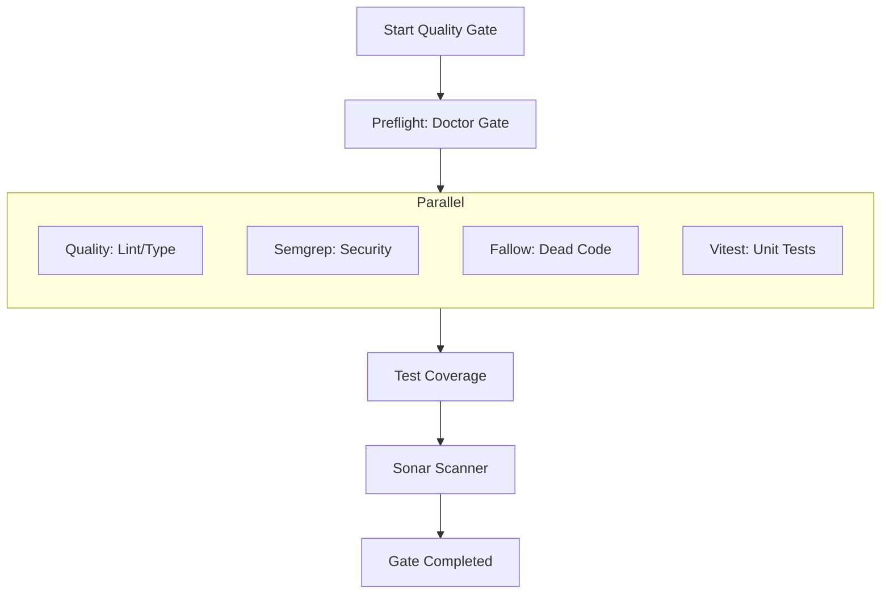
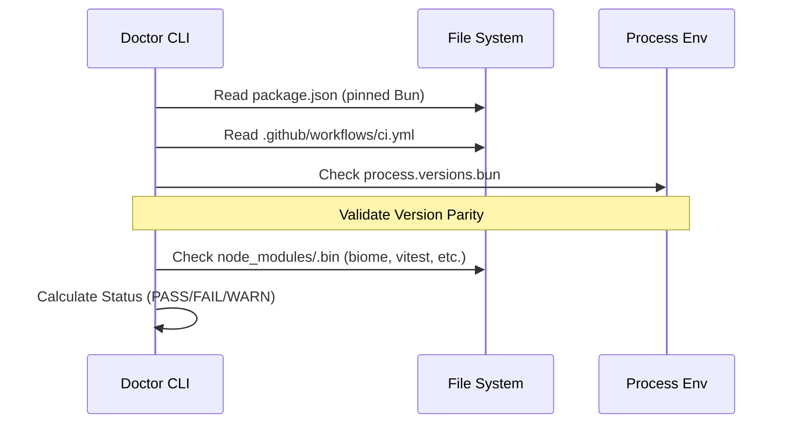

Relevant source files

The following files were used as context for generating this wiki page:

- [scripts/run-full-quality-gate.ts](../../../scripts/run-full-quality-gate.ts)
- [scripts/run-full-quality-gate.test.ts](../../../scripts/run-full-quality-gate.test.ts)
- [scripts/doctor.ts](../../../scripts/doctor.ts)
- [scripts/doctor.test.ts](../../../scripts/doctor.test.ts)
- [apps/web/tests/scripts/workflowPostgresCi.test.ts](../../../apps/web/tests/scripts/workflowPostgresCi.test.ts)
- [scripts/select-workflow-postgres-contract.ts](../../../scripts/select-workflow-postgres-contract.ts)
- [AGENTS.md](../../../AGENTS.md)

# Testing & Quality Gates

Testing and Quality Gates in Lumina-Reader comprise a multi-layered validation system designed to ensure code reliability, security, and architectural integrity. The system ranges from local diagnostic tools to complex CI/CD workflows that enforce "contracts" on database migrations and external integrations. The primary goal is to maintain high standards of code quality through automated linting, type checking, static analysis (Semgrep), and comprehensive test suites running under the Bun runtime.

Sources: [AGENTS.md:92-108](../../../AGENTS.md#L92-L108), [scripts/run-full-quality-gate.ts:16-37](../../../scripts/run-full-quality-gate.ts#L16-L37)

## Quality Gate Architecture

The quality gate is structured as a sequence of execution stages, moving from local readiness checks to full static and dynamic analysis. It utilizes a "fail-fast" yet comprehensive approach where independent checks run in parallel, followed by sequential coverage analysis and Sonar scanning.

### Execution Flow

The full quality gate follows a strict order of operations to ensure that basic health is verified before resource-intensive scans are performed.

The orchestration logic ensures that even if one independent stage fails, the runner exposes every failed stage rather than exiting immediately after the first error.

Sources: [scripts/run-full-quality-gate.ts:66-73](../../../scripts/run-full-quality-gate.ts#L66-L73), [scripts/run-full-quality-gate.test.ts:18-42](../../../scripts/run-full-quality-gate.test.ts#L18-L42)

## Diagnostic Tools: Nous Reader Doctor

The `doctor.ts` script acts as a read-only diagnostic utility that probes the health of the local development environment and external services. It supports multiple profiles to target specific subsystems.

| Profile | Scope |
| :--- | :--- |
| `checks` | Default. Runs quality checks, Semgrep, Fallow regression, and test suites. |
| `gate` | Probes local SonarQube service availability and token validity. |
| `local` | Probes local Supabase services (Auth, Data, Storage, Realtime) and migration parity. |
| `all` | Combines environment inspection, service probes, and diagnostic stages. |

Sources: [scripts/doctor.ts:74-95](../../../scripts/doctor.ts#L74-L95), [scripts/doctor.ts:400-415](../../../scripts/doctor.ts#L400-L415)

### Environment Inspection Logic
The Doctor tool verifies the runtime environment by checking pinned versions of the Bun runtime and the existence of required binaries in the workspace.

Sources: [scripts/doctor.ts:252-290](../../../scripts/doctor.ts#L252-L290), [scripts/doctor.ts:303-316](../../../scripts/doctor.ts#L303-L316)

## Database & Integration Contracts

Lumina-Reader utilizes "PostgreSQL Contracts" to validate that changes to the database schema or workflow logic do not introduce regressions. These are specifically triggered in CI for pull requests that affect the persistence layer.

### Workflow Selection Logic
A dedicated script, `select-workflow-postgres-contract.ts`, determines whether a pull request needs the critical workflow PostgreSQL contract by checking file paths against ownership boundaries. The full workflow contract runs separately after pushes to `main`.

| Category | Relevant Files / Paths |
| :--- | :--- |
| **Migrations** | `supabase/migrations/*.sql`, `supabase/config.toml` |
| **Persistence** | `apps/backend/src/projects/postgresProjectStore.ts`, `apps/backend/src/workflows/postgresWorkflowStore.ts` |
| **Configuration** | `apps/backend/package.json`, `apps/backend/src/config/modelConfig.ts` |
| **Tests** | `apps/backend/tests/workflows/*.integration.test.ts` |

Sources: [apps/web/tests/scripts/workflowPostgresCi.test.ts:32-52](../../../apps/web/tests/scripts/workflowPostgresCi.test.ts#L32-L52), [scripts/select-workflow-postgres-contract.test.ts:13-30](../../../scripts/select-workflow-postgres-contract.test.ts#L13-L30)

## Validation Commands Summary

The project provides a set of Bun-based commands for different stages of the quality pipeline:

| Command | Description |
| :--- | :--- |
| `bun run doctor` | Diagnostic report; defaults to `checks` profile. |
| `bun run quality` | Executes TypeScript type checks and Biome linting. |
| `bun run gate` | Full local gate: runs quality, fallow, and unit tests. |
| `bun run gate:full` | Extended gate including coverage and Sonar analysis. |
| `bun run test` | Executes the Vitest suite under the Bun runtime. |
| `bun run check:fallow` | Performs static dead-code and duplication analysis. |

Sources: [AGENTS.md:92-108](../../../AGENTS.md#L92-L108), [scripts/run-full-quality-gate.ts:16-37](../../../scripts/run-full-quality-gate.ts#L16-L37)

## Conclusion
Testing and Quality Gates in Lumina-Reader serve as the "strategic north star" for technical health. By integrating environmental diagnostics (`doctor`), static code analysis (`biome`, `semgrep`, `fallow`), and dynamic integration contracts, the project ensures that its ADHD-friendly learning environment remains stable and secure through every iteration.

Sources: [AGENTS.md:83-88](../../../AGENTS.md#L83-L88), [scripts/run-full-quality-gate.ts:98-112](../../../scripts/run-full-quality-gate.ts#L98-L112)
