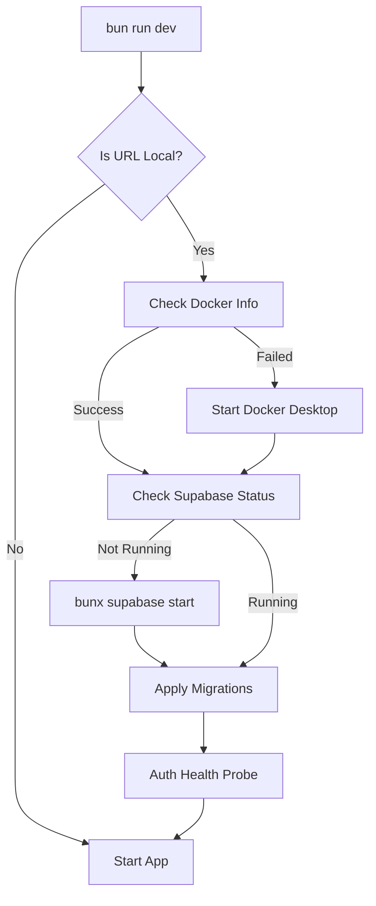
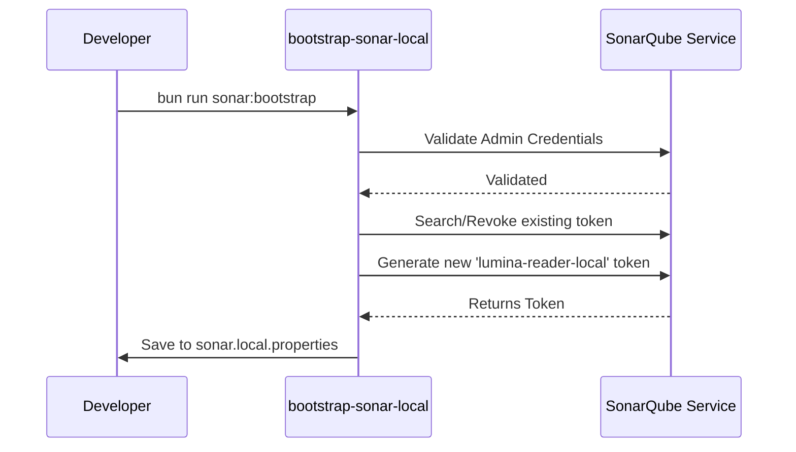

Relevant source files

The following files were used as context for generating this wiki page:

- [scripts/ensure-local-dev-services.ts](../../../scripts/ensure-local-dev-services.ts)
- [scripts/doctor.ts](../../../scripts/doctor.ts)
- [scripts/bootstrap-sonar-local.ts](../../../scripts/bootstrap-sonar-local.ts)
- [README.md](../../../README.md)
- [AGENTS.md](../../../AGENTS.md)
- [biome.json](../../../biome.json)

# Local Environment Setup

The local environment setup for Nous Reader is designed to provide a consistent development experience by automating the verification and orchestration of necessary infrastructure. The system ensures that all dependencies, including Docker, local Supabase instances, and quality gate tools like SonarQube, are correctly configured and reachable before the application starts.

This setup is primarily managed through Bun scripts and specialized diagnostic tools that check for runtime compatibility (e.g., Bun versions), service health, and database migration parity. By centralizing these checks, the project prevents common issues where a frontend starts without its required backend services or when developers use mismatched runtime versions.

## Initialization and Dependencies

The project utilizes [Bun](https://bun.sh/) as its primary runtime and package manager. Initializing the environment requires installing workspace dependencies and configuring environment variables to point toward local service instances.

### Core Commands
| Command | Description |
| :--- | :--- |
| `bun run deps:install` | Installs all Bun workspace dependencies. |
| `bun run dev` | Starts the Vite frontend and Express backend, orchestrating local services if configured. |
| `bun run doctor` | Runs an actionable health report on the local environment. |
| `bun run quality` | Executes TypeScript type checks and Biome linting. |

Sources: [README.md:15-22](../../../README.md#L15-L22), [AGENTS.md:144-155](../../../AGENTS.md#L144-L155)

### Runtime Verification
The environment health is validated by comparing the current environment against pinned versions defined in `package.json` and CI workflows.
*  **Bun Version:** The system expects a specific version of Bun (e.g., `1.3.14`). Mismatches trigger a `FAIL` status in the diagnostic tools.
*  **Workspace Binaries:** Essential tools like `biome`, `eslint`, `vitest`, and `supabase` must be present in `node_modules/.bin`.

Sources: [scripts/doctor.ts:167-195](../../../scripts/doctor.ts#L167-L195), [scripts/doctor.ts:19-27](../../../scripts/doctor.ts#L19-L27)

## Service Orchestration

When the `DATABASE_URL` or `SUPABASE_URL` points to a loopback address (e.g., `localhost` or `127.0.0.1`), the development startup sequence automatically ensures the underlying infrastructure is running.

### Docker and Supabase Flow
The `ensureLocalDevServices` function manages the lifecycle of local containers. On Windows and macOS, it can automatically attempt to start Docker Desktop if the engine is not reachable.

*Flow of the local service orchestration logic.*
Sources: [scripts/ensure-local-dev-services.ts:75-126](../../../scripts/ensure-local-dev-services.ts#L75-L126), [README.md:27-32](../../../README.md#L27-L32)

### Database Migrations
The setup ensures the local database is in sync with the project source code.
1.  **Supabase Migrations:** Executes `supabase migration up --local` to apply pending schema changes, including the project-source Storage schema and private bucket. Local startup does not run a separate project-source staging script.
2.  **Migration Drift:** The `doctor` script checks for drift by comparing local migration files against the migration history recorded in the database.

Sources: [scripts/ensure-local-dev-services.ts:125-135](../../../scripts/ensure-local-dev-services.ts#L125-L135), [scripts/doctor.ts:501-541](../../../scripts/doctor.ts#L501-L541), [supabase/migrations/202607190002_project_sources_storage.sql](../../../supabase/migrations/202607190002_project_sources_storage.sql), [supabase/migrations/20260816152200_provision_private_project_source_bucket.sql](../../../supabase/migrations/20260816152200_provision_private_project_source_bucket.sql)

## Quality and Diagnostics

Nous Reader employs a multi-layered diagnostic system to ensure code quality and service availability before merging or deploying changes.

### The "Doctor" Utility
The `doctor` script supports multiple profiles to probe different aspects of the environment:
*  **`checks`:** Validates runtime versions, workspace binaries, and static debt (Fallow baseline).
*  **`gate`:** Probes the local SonarQube service.
*  **`local`:** Probes Supabase health (Auth, REST, Storage, Realtime) and migration parity.
*  **`all`:** Combines all of the above.

Sources: [scripts/doctor.ts:152-165](../../../scripts/doctor.ts#L152-L165), [scripts/doctor.ts:245-276](../../../scripts/doctor.ts#L245-L276)

### Local SonarQube Setup
For deep code analysis, a local SonarQube instance is used as a merge gate. The `bootstrap-sonar-local.ts` script automates token generation and configuration storage in `sonar.local.properties`.

*Sequence for bootstrapping local SonarQube analysis.*
Sources: [scripts/bootstrap-sonar-local.ts:119-150](../../../scripts/bootstrap-sonar-local.ts#L119-L150), [AGENTS.md:157-163](../../../AGENTS.md#L157-L163)

## Configuration Management

Environment variables are managed via `.env.local`. Key configurations include:

| Variable | Description | Default/Example |
| :--- | :--- | :--- |
| `SUPABASE_URL` | The local API endpoint for Supabase. | `http://127.0.0.1:54321` |
| `VITE_AUTH_MODE` | Determines frontend auth strategy. | `supabase` |
| `LOCAL_AUTH_BYPASS` | Bypasses auth for testing (requires `LOCAL_DEV_PROFILE=true`). | `false` |
| `OPENROUTER_API_KEY` | Required for AI lesson generation. | `(User-defined)` |

Sources: [README.md:21-23](../../../README.md#L21-L23), [README.md:40-45](../../../README.md#L40-L45), [scripts/ensure-local-dev-services.ts:8](../../../scripts/ensure-local-dev-services.ts#L8)

### Code Style Enforcement
The project uses **Biome** for linting and formatting, replacing traditional ESLint/Prettier setups for speed. The configuration is defined in `biome.json`, enforcing single quotes and a line width of 100.
Sources: [biome.json:20-40](../../../biome.json#L20-L40)

## Conclusion
The local environment setup in Nous Reader emphasizes automation and preventative diagnostics. By using the `ensureLocalDevServices` and `doctor` utilities, developers can maintain a high-quality development cycle where infrastructure issues are caught and often resolved automatically before the application code even executes.

Sources: [scripts/ensure-local-dev-services.ts:133-145](../../../scripts/ensure-local-dev-services.ts#L133-L145), [AGENTS.md:154-156](../../../AGENTS.md#L154-L156)
