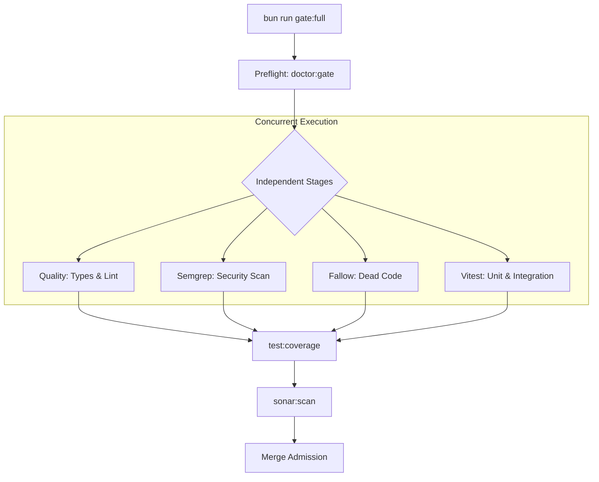
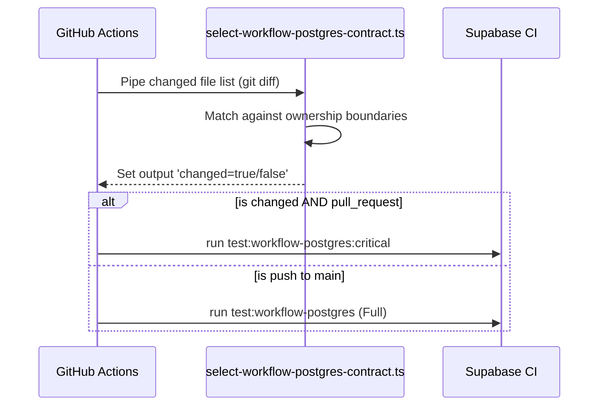

<details>
<summary>Relevant source files</summary>

The following files were used as context for generating this wiki page:

- [scripts/run-full-quality-gate.ts](../../../scripts/run-full-quality-gate.ts)
- [scripts/run-full-quality-gate.test.ts](../../../scripts/run-full-quality-gate.test.ts)
- [scripts/doctor.ts](../../../scripts/doctor.ts)
- [scripts/doctor.test.ts](../../../scripts/doctor.test.ts)
- [scripts/select-workflow-postgres-contract.ts](../../../scripts/select-workflow-postgres-contract.ts)
- [apps/web/tests/scripts/workflowPostgresCi.test.ts](../../../apps/web/tests/scripts/workflowPostgresCi.test.ts)
- [AGENTS.md](../../../AGENTS.md)
</details>

# Testing & Quality Gates

The Nous project employs a multi-tiered validation strategy to ensure code reliability, architectural consistency, and deployment readiness. This system includes local health checks, static analysis for dead code and security vulnerabilities, comprehensive test suites using Vitest, and a mandatory local SonarQube quality gate that acts as the final authority before merging.

Sources: [AGENTS.md:143-162](../../../AGENTS.md#L143-L162), [scripts/run-full-quality-gate.ts:1-20](../../../scripts/run-full-quality-gate.ts#L1-L20)

## Validation Hierarchy

The quality process is organized into discrete profiles and stages, allowing developers to run the narrowest meaningful validation first before proceeding to the full merge gate.

### Local Health Diagnostics (Doctor)
The `doctor` utility is a read-only diagnostic tool that reports on environment health without modifying state. It supports four distinct profiles to probe different layers of the application.

| Profile | Description |
| :--- | :--- |
| `checks` | Default profile. Runs service-free environment checks (Bun, dependencies) and static analysis. |
| `gate` | Probes the loopback-only local SonarQube service. |
| `local` | Probes local Supabase services and checks for migration parity/drift. |
| `all` | Combines environment checks with both Sonar and Supabase service probes. |

Sources: [scripts/doctor.ts:98-124](../../../scripts/doctor.ts#L98-L124), [AGENTS.md:144-150](../../../AGENTS.md#L144-L150)

### The Full Quality Gate
The `gate:full` command executes a sequence of independent and dependent stages. Independent stages (Quality, Semgrep, Fallow, Test) are run concurrently to minimize duration, while Coverage and Sonar analysis are run sequentially to ensure accurate reporting.



The workflow ensures that even if an earlier stage fails, the process continues through to Sonar analysis to provide a complete diagnostic report.
Sources: [scripts/run-full-quality-gate.ts:22-60](../../../scripts/run-full-quality-gate.ts#L22-L60), [scripts/run-full-quality-gate.test.ts:39-57](../../../scripts/run-full-quality-gate.test.ts#L39-L57)

## Static Analysis & Regressions

### Fallow: Dead Code Detection
The project uses "Fallow" to detect unused files, exports, and dependencies. It maintains a baseline to prevent regressions in debt.
- **Baseline Path:** `.fallow-baselines/regression.json`
- **Metric Categories:** Unused files, unused dependencies, and unused exports.
- **Enforcement:** The doctor tool warns if the total issues in the baseline are greater than zero.

Sources: [scripts/doctor.ts:6-7](../../../scripts/doctor.ts#L6-L7), [scripts/doctor.ts:162-184](../../../scripts/doctor.ts#L162-L184)

### Semgrep & Quality
Security and architectural constraints are enforced via Semgrep rules. General code quality (TypeScript checks and Biome linting) is grouped under the `quality` script.
Sources: [scripts/run-full-quality-gate.ts:25-26](../../../scripts/run-full-quality-gate.ts#L25-L26), [AGENTS.md:151](../../../AGENTS.md#L151)

## Continuous Integration (CI) Contracts

The CI pipeline mirrors local gates but adds specialized logic for PostgreSQL and Supabase contract testing.

### Workflow Selection Logic
To optimize CI runs, the project uses a selection script that detects if changes affect the "PostgreSQL Contract." This is triggered by modifications to specific paths like backend source code, migrations, or database configurations.



Sources: [apps/web/tests/scripts/workflowPostgresCi.test.ts:30-66](../../../apps/web/tests/scripts/workflowPostgresCi.test.ts#L30-L66), [scripts/select-workflow-postgres-contract.ts](../../../scripts/select-workflow-postgres-contract.ts)

### Migration Integrity
The doctor tool verifies that the local migration history matches the state of the database to prevent drift.
- **Drift Detection:** Compares the list of local migration files against the `remote` (database) records.
- **Reporting:** Reports specific drifted migrations in the format `local=TIMESTAMP, database=-`.

Sources: [scripts/doctor.ts:285-321](../../../scripts/doctor.ts#L285-L321), [scripts/doctor.test.ts:62-81](../../../scripts/doctor.test.ts#L62-L81)

## Implementation Details

### Gate Execution Logic
The gate runner uses `Bun.spawn` to execute scripts and captures output to provide formatted summaries of each stage's duration and exit code.

```typescript
// scripts/run-full-quality-gate.ts:39-53
const processHandle = Bun.spawn([process.execPath, 'run', stage.script], {
  cwd: process.cwd(),
  env: environment,
  stdin: 'inherit',
  stdout: 'pipe',
  stderr: 'pipe',
});
const [exitCode, stdout, stderr] = await Promise.all([
  processHandle.exited,
  new Response(processHandle.stdout).text(),
  new Response(processHandle.stderr).text(),
]);
```

Sources: [scripts/run-full-quality-gate.ts:39-53](../../../scripts/run-full-quality-gate.ts#L39-L53)

### SonarQube Integration
SonarQube acts as a local-only merge gate and is intentionally excluded from GitHub Actions.
- **Pre-requisite:** Local service must be started (`sonar:up`).
- **Configuration:** Docker binds the local service to `127.0.0.1:9000`. Its Docker-internal one-shot provisioner grants `Anyone` the global `Create Projects` and `Execute Analysis` permissions on a fresh volume, enabling anonymous analysis without scanner credentials. The `gate` Doctor profile requires that provisioner to complete successfully before it reports anonymous analysis ready.
- **Merge Block:** A skipped, failed, or unreachable Sonar scan explicitly blocks the merge process.

Sources: [AGENTS.md:156-162](../../../AGENTS.md#L156-L162), [scripts/doctor.ts:233-275](../../../scripts/doctor.ts#L233-L275)

Testing and Quality Gates in Nous are designed to provide immediate feedback to developers while maintaining a strict, non-bypassable local standard for code health and architectural integrity. The reliance on local service probes (Sonar, Supabase) ensures that the development environment closely mirrors production constraints.

Sources: [AGENTS.md:155-162](../../../AGENTS.md#L155-L162)
