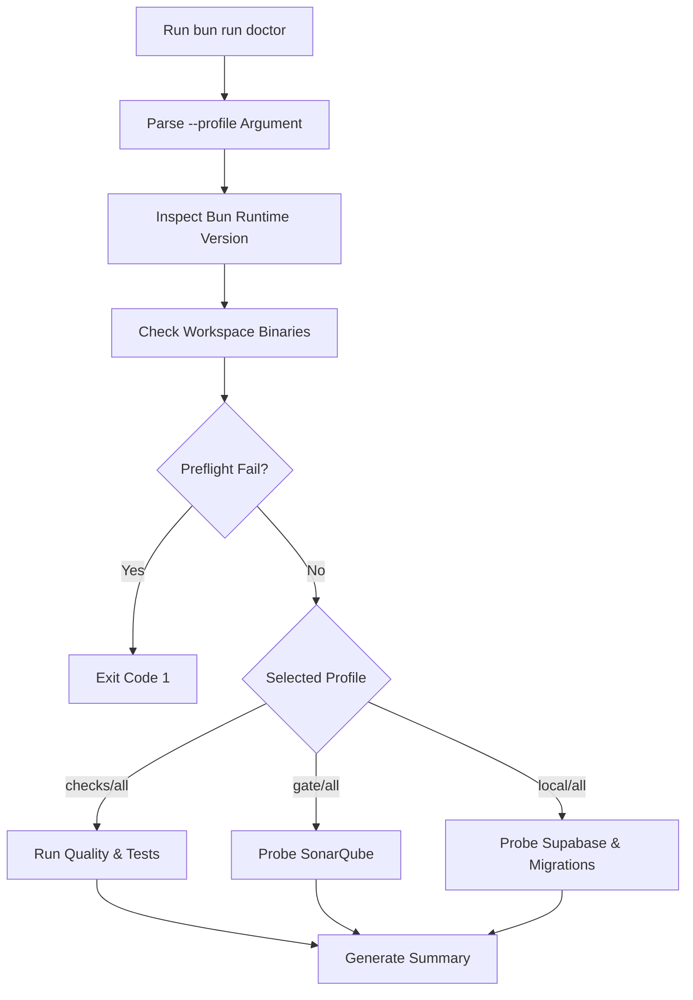
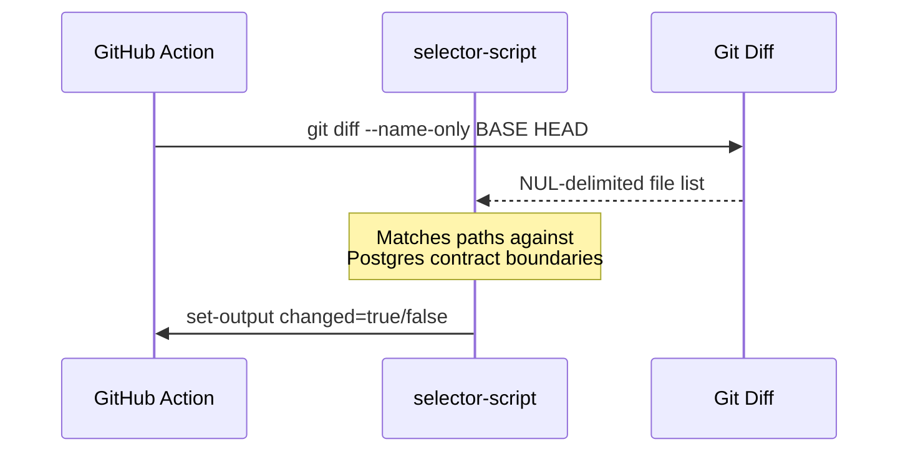

Relevant source files

The following files were used as context for generating this wiki page:

- [scripts/doctor.ts](../../../scripts/doctor.ts)
- [scripts/doctor.test.ts](../../../scripts/doctor.test.ts)
- [scripts/select-workflow-postgres-contract.ts](../../../scripts/select-workflow-postgres-contract.ts)
- [apps/web/tests/scripts/workflowPostgresCi.test.ts](../../../apps/web/tests/scripts/workflowPostgresCi.test.ts)
- [README.md](../../../README.md)
- [AGENTS.md](../../../AGENTS.md)
- [biome.json](../../../biome.json)

# CLI Tools & Diagnostics

Nous provides a robust suite of Command Line Interface (CLI) tools and diagnostic scripts designed to maintain system health, ensure code quality, and validate environmental configurations. These tools serve as the first line of defense for developers, offering automated checks for dependencies, service availability, and CI/CD workflow integrity.

The primary entry point for health monitoring is the `doctor` script, which performs observational diagnostics across multiple profiles, ranging from local dependency checks to full service probes. These tools are integrated into the project's [Testing and quality gates](02-p-testing-quality.md) to ensure that every change adheres to the project's technical standards before merging.
Sources: [AGENTS.md:124-142](../../../AGENTS.md#L124-L142)

## The Doctor Diagnostic Tool

The `doctor` script (`scripts/doctor.ts`) is a comprehensive diagnostic utility that validates the development environment and infrastructure services. It is strictly observational, meaning it reports statuses (`PASS`, `FAIL`, `WARN`, `SKIP`) without modifying configurations or starting services.

### Diagnostic Profiles
The tool supports four execution profiles to target specific layers of the application stack:

| Profile | Description |
| :--- | :--- |
| `checks` | Default profile. Runs service-free checks like Bun runtime, dependencies, and Fallow debt. |
| `gate` | Probes the loopback-only local SonarQube service. |
| `local` | Probes Supabase services (Auth, Data API, Storage, Realtime) and migration parity. |
| `all` | Executes every available check and service probe. |

Sources: [scripts/doctor.ts:46-52](../../../scripts/doctor.ts#L46-L52), [scripts/doctor.ts:79-100](../../../scripts/doctor.ts#L79-L100)

### Environmental Logic Flow
The diagnostic process begins by verifying the core runtime environment before proceeding to higher-level service checks.

The tool ensures the pinned Bun version in `package.json` matches the local runtime and the CI configuration in `.github/workflows/ci.yml`.
Sources: [scripts/doctor.ts:182-212](../../../scripts/doctor.ts#L182-L212), [scripts/doctor.ts:404-436](../../../scripts/doctor.ts#L404-L436)

## Workflow & CI Selectors

To optimize Continuous Integration, Nous utilizes specialized scripts to determine which tests are relevant based on changed files. The `select-workflow-postgres-contract.ts` script is used in GitHub Actions to detect changes affecting the PostgreSQL persistence layer.

### Contract Selection Logic
The selector identifies changes within specific ownership boundaries:
*  **Infrastructure**: `supabase/migrations/`, `supabase/config.toml`.
*  **Backend Logic**: `apps/backend/src/projects/postgresProjectStore.ts`, `apps/backend/src/workflows/postgresWorkflowStore.ts`.
*  **Shared Types**: `packages/shared-types/projectContract.ts`.
*  **CI Configuration**: `.github/workflows/ci.yml`.

Sources: [scripts/select-workflow-postgres-contract.test.ts:11-30](../../../scripts/select-workflow-postgres-contract.test.ts#L11-L30), [apps/web/tests/scripts/workflowPostgresCi.test.ts:38-55](../../../apps/web/tests/scripts/workflowPostgresCi.test.ts#L38-L55)

Sources: [apps/web/tests/scripts/workflowPostgresCi.test.ts:38-55](../../../apps/web/tests/scripts/workflowPostgresCi.test.ts#L38-L55)

## Service Health Probes

### Supabase Integration
The diagnostic tool verifies the availability of the local Supabase stack by probing specific health endpoints using loopback hostnames (`127.0.0.1`, `localhost`).

| Service | Health Endpoint |
| :--- | :--- |
| Supabase Auth | `/auth/v1/health` |
| Supabase Data API | `/rest/v1/` |
| Supabase Storage | `/storage/v1/status` |
| Supabase Realtime | `/realtime/v1/api/tenants/realtime-dev/health` |

Sources: [scripts/doctor.ts:31-40](../../../scripts/doctor.ts#L31-L40), [scripts/doctor.ts:303-333](../../../scripts/doctor.ts#L303-L333)

### Migration Drift Analysis
The CLI tools include logic to detect "drift" between local migration files and the state of the database. This is achieved by executing `supabase migration list --local --output-format json` and comparing the status of local vs. remote migrations.
Sources: [scripts/doctor.ts:139-156](../../../scripts/doctor.ts#L139-L156), [scripts/doctor.ts:358-386](../../../scripts/doctor.ts#L358-L386)

## Code Quality & Linting
Nous uses **Biome** for formatting and linting, governed by `biome.json`. The CLI tools integrate these checks via the `bun run quality` command.

### Biome Configuration Summary
*  **Formatter**: Uses spaces (width 2), line length 100, and single quotes for JavaScript.
*  **Linter**: Enables recommended rules with specific overrides for `noUnusedImports`, `noExplicitAny`, and `useConst` set to `warn`.
*  **VCS Integration**: Enabled with Git support to respect ignore files.

Sources: [biome.json:10-85](../../../biome.json#L10-L85)

## Validation Commands Reference
Developers use the following commands to interact with the diagnostic and quality systems:

| Command | Purpose |
| :--- | :--- |
| `bun run doctor` | Run observational health checks (default: `checks` profile). |
| `bun run quality` | Run TypeScript type checks and Biome linting. |
| `bun run gate` | Full local gate: quality + fallow regression + tests. |
| `bun run fix` | Automatically fix Biome linting, formatting, and import ordering. |
| `bun run test` | Execute the Vitest suite under the Bun runtime. |

Sources: [AGENTS.md:124-142](../../../AGENTS.md#L124-L142)

The diagnostic ecosystem ensures that the development environment is stable, services are reachable, and the codebase remains compliant with established architectural and quality standards.
