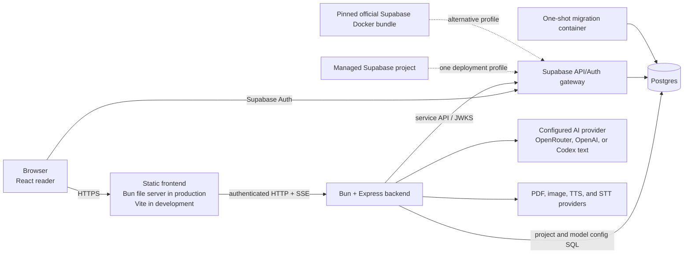

# Architecture and infrastructure audit

Status: current as of 2026-07-11. Code, Compose, and local templates remain authoritative when this report ages.

This audit records supported runtime paths and deletion decisions. It is not a second architecture manual: the stable code map remains [ARCHITECTURE.md](ARCHITECTURE.md), while deployment operations live only in [DEPLOYMENT.md](DEPLOYMENT.md).

## Runtime and data flow

The application artifact is identical for managed and self-hosted Supabase. The profile changes external endpoints and whether the wrapper starts the separate pinned official bundle; it does not enable another product storage implementation.

## Supported-path inventory

| Area | Entrypoint and implementation | State | Dependencies and configuration | Source of truth |
| --- | --- | --- | --- | --- |
| Browser frontend | `apps/web/App.tsx`, `apps/web/app/AppContent.tsx` | production | React; runtime public config only | [ARCHITECTURE.md](ARCHITECTURE.md) |
| Frontend serving | Vite through `bun run dev`; `scripts/serve-production-frontend.ts` in the image | development / production | Bun; `NOUS_*_PUBLIC_URL` | [README](../README.md), [DEPLOYMENT](DEPLOYMENT.md) |
| Backend | `apps/backend/src/server.ts` and Express `createApp()` | production | Bun, Express, provider SDKs | code and [ARCHITECTURE.md](ARCHITECTURE.md) |
| Authentication | Supabase Auth/JWKS; explicit local bypass only in tests or local-dev profile | production / test-only | public anon key in browser; service key/JWT material backend-only | `.env.example`, `deploy/.env.production.example` |
| Project persistence | `HttpProjectRepository` → `/api/projects` → `PostgresProjectStore` | production | `DATABASE_URL`; RLS/auth contract | `projectRepositoryFactory.ts`, `projectStore.ts` |
| SQLite | `SqliteProjectStore`, imported directly by backend route tests | test-only | `bun:sqlite`; no runtime env switch | backend route tests |
| Supabase | managed project or separate official Docker bundle pinned by `deploy/SUPABASE_VERSION` | production profiles | `SUPABASE_DEPLOYMENT`; same migrations and Auth/RLS contract | [DEPLOYMENT](DEPLOYMENT.md) |
| AI text | browser proxy client plus backend provider transports; the two-client boundary is intentional | production | request-scoped provider header; backend model config | [ADR 0001](adr/0001-two-ai-clients.md) |
| PDF/images/TTS/STT | authenticated backend routes and provider clients | production | backend secrets only; validated media/payload limits | code and [ARCHITECTURE.md](ARCHITECTURE.md) |
| Build and quality | root Bun workspace, root `bun.lock`, `bun run gate` | development / CI | Bun is canonical; dependency-cruiser, Biome, Vitest, fallow | `package.json`, CI workflow |
| Deployment | `Dockerfile`, `compose.yml`, two thin OS wrappers | production | Docker Engine/Desktop + Compose v2 only on host | [DEPLOYMENT](DEPLOYMENT.md) |
| Agent/generated output | `.codex`, `graphify-out`, scanner output, `.temp`, `node_modules` | local/generated | ignored; presence on disk is not repository debt | `.gitignore`, `.dockerignore` |
| Documentation | README onboarding, CONTEXT glossary, ARCHITECTURE code map, DEPLOYMENT runbook, ADR decisions | production support | Markdown links checked locally | README start-here list |

## Keep / remove / merge / archive matrix

| Candidate | Evidence of use | Cost / removal risk | Existing substitute and validation | Decision |
| --- | --- | --- | --- | --- |
| `PostgresProjectStore` | only store constructed at runtime | Core data path; removal is destructive | Supabase local contract test | **Keep — production** |
| `SqliteProjectStore` | directly imported by the full backend route suite; never selected by env | One implementation to maintain; removing it would make fast route tests require Postgres | Revisit when the same route suite runs cheaply and deterministically on disposable Postgres. Owner: backend persistence tests | **Keep — test-only**, with no runtime flag |
| Browser IndexedDB repository | no implementation or factory branch remains | Keeping documentation/config would create a false support promise | HTTP repository, import/export for manual migration | **Remove — completed** |
| `ProjectRepositoryMode` propagation | type is always literal `server` across controller/chat inputs | Low runtime risk but touches several public types | Direct `HttpProjectRepository`; run library/controller tests before removal | **Merge/remove in a focused follow-up**, not inside deployment work |
| `persistQueue.ts` | zero callers; bypassed revision preconditions | Unsafe alternate write path | repository autosave and revision-aware PATCH | **Remove — completed** |
| `apps/backend/bun.lock`, `pnpm-lock.yaml` | CI and Docker use root Bun workspace lock | Drift and ambiguous installs | root `bun.lock`; frozen Docker install | **Remove — completed** |
| `scripts/kill-dev-servers.ts` | predev previously killed listeners by port | Could terminate unrelated processes | scoped process lifetime from `concurrently`; Docker project-scoped operations | **Remove — completed** |
| `docs/README.md` | four-line duplicate with no inbound links | Two indexes drift | root README | **Remove — completed** |
| Old application-exercise RESUME/data-model plans | referred to obsolete worktrees, IndexedDB, and historical error counts | High misinformation, no runtime value | implemented historical design spec plus current code | **Archive through Git history / remove from tree — completed** |
| Implemented application-exercise design spec | explains non-obvious product decisions | Small terminology-drift risk | marked implemented and linked to current docs | **Keep as historical decision record** |
| Two AI clients | separate browser proxy composition and authoritative backend transports | Some duplicated validation; unification could couple distinct flows | ADR documents boundary; dependency tests guard it | **Keep**, merge only after measured drift |
| Official Supabase Docker bundle | downloaded at an exact commit, ignored, and operated separately | Operator patch/backup responsibility | upstream bundle and scripts, not a copied Compose | **Keep generated/untracked** |
| `graphify-out`, build output, scanner files | generated locally and ignored | No maintenance cost in Git | regeneration commands | **Keep ignored; never classify as tracked debt** |

## Contradictions found and resolution

| Previous contradiction | Evidence | Resolution |
| --- | --- | --- |
| `.env.example` advertised IndexedDB, LAN mode, and SQLite runtime while the frontend factory was server-only | HEAD template versus `projectRepositoryFactory.ts` | Removed repository/storage switches; templates now describe authenticated HTTP + Postgres only. |
| Backend allowed a local SQLite runtime branch but production docs claimed Postgres | former `PROJECT_STORAGE_DRIVER` branch | Runtime branch removed. SQLite is named explicitly as a test fixture in README, CONTEXT, and ARCHITECTURE. |
| CI/documentation mixed npm/pnpm/Bun and tracked three lockfiles | HEAD scripts and lockfiles | Root Bun workspace and one `bun.lock` are canonical; scripts, CI, and Docker use Bun/frozen install. |
| README, CONTEXT, and architecture disagreed on App/AppContent and storage responsibilities | stale prose | Each document now has one role: onboarding, glossary, or code map; duplicate index removed. |
| Deployment prose described managed/self-hosted but no validated profile existed | old template/wrappers | `SUPABASE_DEPLOYMENT=managed|self-hosted` is validated before Compose; self-hosted uses the pinned upstream bundle. |
| Self-host guidance required manual copying and secret handling | old DEPLOYMENT steps | Setup downloads the exact pin and invokes upstream key scripts with secret output suppressed. |

## Environment and dependency decisions

- Removed runtime switches: `PROJECT_REPOSITORY_MODE`, `VITE_PROJECT_REPOSITORY_MODE`, `PROJECT_STORAGE_DRIVER`, `PROJECT_SQLITE_PATH`, and the unused private-network CORS knob.
- Kept `LOCAL_AUTH_BYPASS` and `LOCAL_DEV_PROFILE` only because the auth implementation and tests enforce their explicit test/local boundary.
- Split public browser runtime values (`NOUS_SUPABASE_PUBLIC_URL`, anon/publishable key, backend URL) from server-only values (`DATABASE_URL`, service key, provider keys). `.dockerignore` excludes deployment secrets and the downloaded Supabase bundle.
- Direct dependency count is unchanged. Fallow/dependency-cruiser findings were manually checked: dynamic runtime assets and Remotion configuration are not removable merely because static reachability is incomplete.
- Bun is the sole package manager. The root workspace owns dependencies and the only lockfile; Docker uses `bun install --frozen-lockfile`.

## Explicit storage decisions

**IndexedDB:** removed as a supported path. Import/export remains a user-driven interchange mechanism, not persistence.

**SQLite:** retained only as a fast, deterministic implementation of the backend `ProjectStore` contract in route tests. It has no env variable, runtime factory branch, production directory, or operator support promise. The removal trigger is concrete: move the same route contract suite to disposable Postgres/Supabase with comparable speed and isolation, then delete the driver and `bun:sqlite` usage in one patch.

**Postgres/Supabase:** the only application persistence runtime. Managed and self-hosted are infrastructure profiles around the same schema, migrations, Auth/RLS contract, backend, and frontend artifact.

## Execution plan

| Patch | Scope | Risk | Gate | Status |
| --- | --- | --- | --- | --- |
| 1 | Freeze Bun, server HTTP, Postgres, and document roles | Low | link/env/command consistency | Completed |
| 2 | Remove false env switches, extra lockfiles, dead queue/script, duplicate/stale docs | Low–medium | narrow tests, quality, diff check | Completed |
| 3 | Preserve SQLite only as a named test fixture and keep canonical Auth/RLS integration | Low | backend routes + Supabase contract | Completed |
| 4 | Add reproducible managed/self-hosted deployment boundary | Medium | config unit tests, Compose config, image build, smoke | Implemented; live-host smoke remains operator/CI evidence |
| 5 | Remove the literal `ProjectRepositoryMode` plumbing | Medium | library/controller/chat suites | Proposed focused cleanup |
| 6 | Re-evaluate direct dependencies and the two AI clients only with usage/size measurements | Medium–high | fallow + dependency-cruiser + full gate | Deferred; no proven removal today |

Each patch has a natural Git rollback. Database migrations remain forward-only and are never rolled back implicitly with application code.

## Measured baseline

The “before” column is `HEAD` at audit start; “after” is the current version-controlled working-tree candidate set on 2026-07-11. Other issue work occurred concurrently, so whole-tree growth is reported rather than hidden and must not be attributed to the cleanup alone.

| Metric | Before | After | Interpretation |
| --- | ---: | ---: | --- |
| Version-controlled files present | 519 | 564 | +45 from product/deployment work across the session; not a simplification score |
| Production code files (`apps` excluding tests, backend `src`, `packages`, `scripts`, `deploy`) | 273 | 293 | deployment and provider capabilities added |
| Nonblank physical LOC in that production set | 55,029 | 61,364 | +6,335; recorded for honesty, not code-golf |
| Unique direct dependencies across root/backend | 56 | 56 | no unsupported dependency deletion claimed |
| Canonical lockfiles | 3 | 1 | root `bun.lock` only |
| Documented env keys across local/production templates | 20 | 39 | production contract is now explicit rather than implicit |
| Dead/contradictory storage env keys | 5 | 0 | IndexedDB/LAN/SQLite runtime switches removed |
| Advertised or implemented project-storage runtime paths | 3 | 1 | browser-local, SQLite runtime, Postgres → Postgres only |
| Known obsolete files in the audit set | 4 | 0 | dead queue, duplicate docs index, two obsolete execution plans |

The useful reduction is in ambiguity and supported paths: one package manager, one project persistence runtime, one operational deployment guide, and two explicitly validated Supabase infrastructure profiles.
